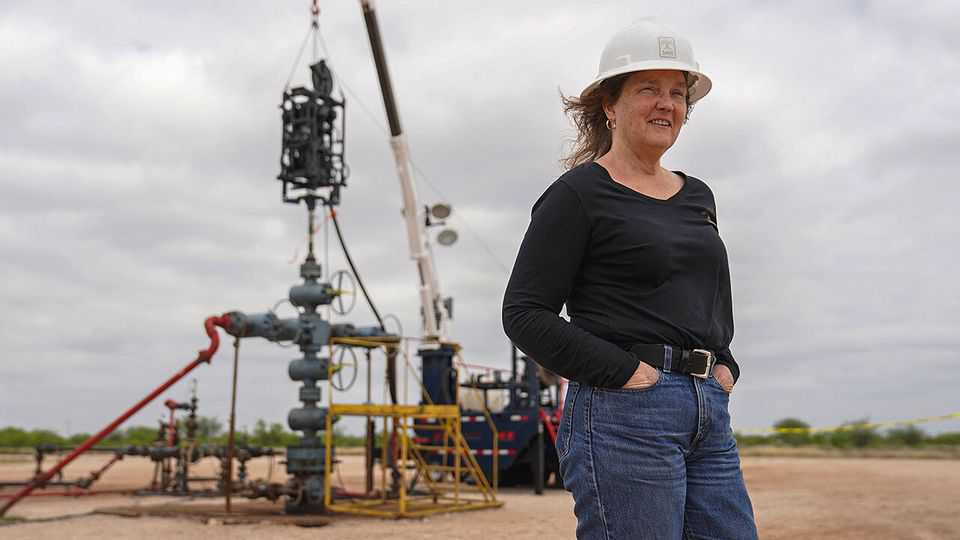
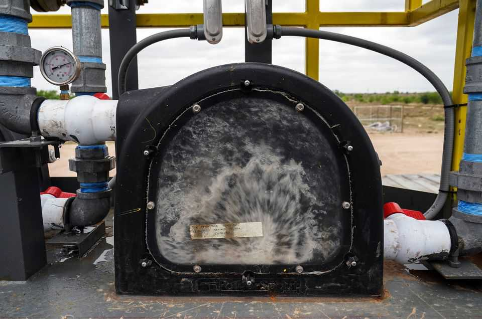

Science & technology | Energy storage
Geothermal kit can help make the power grid flexible
It is potentially cheaper and longer-lasting than lithium batteries
November 20th 2025

IF YOU do not mind chance encounters with alligators and feral hogs, the trip down the long gravelly track off a local road in Christine, Texas, is worth making. On a clearing in the bushes a firm based in nearby San Antonio with a deal to supply power to Meta’s data centres has built one of the world’s most intriguing batteries. The project has already demonstrated its ability to store and release 3MW of power to the Texas grid and is set for further expansion. Most of the world’s grid-scale energy storage comes in the form of pumped hydropower. Such systems consist of two reservoirs, one on higher ground than the other. Water is pumped up when electricity is cheap and is released

down, when needed, to turn turbines that make electrical power to feed back to the grid. These systems are expensive, slow to build and take up a lot of land.

SAGE Geosystems, a Texan enhanced geothermal systems (EGS) startup, has worked out a clever way to harness mechanical pressure to create a big underground storage system with several times the energy density of those pumped hydro plants. “It’s pretty much pumped hydro upside down,” explains Cindy Taff, SAGE’s chief executive and a former drilling boss at Shell (pictured).

The firm has drilled about 3km deep, and fractured the rock to create an underground reservoir. Through a drilled well, water is siphoned from a pool at the surface and stored under high pressure underground. When power is required the well is opened back up and, thanks to the rock’s natural inclination to close the fracture, the pressurised water moves to the surface. There it can turn a turbine to make electricity.

This “lung”, as the firm calls it, can store power for much longer than the lithium batteries that are often seen as the future of grid-scale storage. Because SAGE’s main hardware costs are fixed, unlike with battery blocks which are additive, the cost per unit of stored energy goes down the longer

the system is designed to run. By making electricity generation flexible, this kind of kit could even double the value of the power it stores, say, by storing solar power made at a time of plenty and selling it later at a period of scarcity for a higher price.

SAGE is not alone. Other EGS firms have also demonstrated the ability to produce flexibly, though none are pursuing it with as much imagination or vigour. HYSTORE, a European consortium involving utilities and research organisations, is exploring large scale underground thermal-energy storage in aquifers. Other researchers are looking at using boreholes. What the Texan pioneers have demonstrated, though, is that turning an old-fashioned idea on its head can produce pleasing results.■

Curious about the world? To enjoy our mind-expanding science coverage, sign up to Simply Science, our weekly subscriber-only newsletter.

This article was downloaded by zlibrary from https://www.economist.com//science-and-technology/2025/11/19/geothermal-kit-can- help-make-the-power-grid-flexible