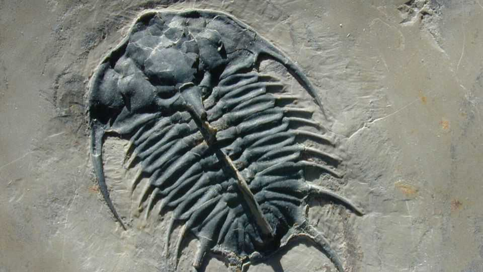

Science & technology | Is it life?
A better way to look for signs of ancient biology
It could also be useful in finding life on other planets
November 20th 2025

Identifying signs of life in ancient rocks is hard. It is not enough to find organic molecules—rocks of all sorts contain them but “organic” just means the molecules contain chains of carbon atoms. Some meteorites are stuffed with organic molecules that have no biological antecedents; industrial laboratories on Earth routinely make organic molecules that nature has never produced. Painstakingly analysing the carbon-bearing molecules in a sample can sometimes show that they are derived from something distinctively biological. But this approach has never worked on anything older than 1.6bn years old. Beyond that, scientists judge things according to the ratio of carbon isotopes in the sample (living things tend to prefer the lighter

isotope) and also whether the material contains the kinds of structures that usually make scientists think of microbes. But neither technique is infallible.

A new approach, described this week in the Proceedings of the National Academy of Sciences, has successfully applied machine learning to the problem. It is a technique that could not only help better identify ancient life on Earth, but could also be used to hunt for life in samples from Mars and farther afield. Instead of analysing rocks molecule by molecule, the new technique blasts samples into fragments and displays data on the frequencies and masses of the molecules within on a two dimensional grid. The output looks something like a mountain range—a pattern of peaks of various shapes. Each sample’s landscape is unique; but some share common features.

The researchers, led by Michael Wong, an astrobiologist, and Anirudh Prabhu, a machine-learning specialist, both at Carnegie Science (as the Carnegie Institution for Science now styles itself), trained a machine- learning algorithm to look for common themes in the landscapes from samples from living things, fossils, meteorites and industrial processes.

They built four models through which it could distinguish things with biological antecedents from things which lacked them. The oldest sample they identified as biological was 3.3bn years old—twice the age of the oldest sample to have been ruled biological by molecular means.

The next step, for which NASA is providing funding, is to develop a bigger training set that features a wider range of samples, including more fungi, more fossil animals and more samples that have been subjected to serious heat and pressure. That should allow the models to discriminate better—and prepare them for use on samples from other planets.

Unfortunately, the samples of most interest are stuck on Mars. The organic material gathered by NASA’s Perseverance rover is currently sitting on the surface of the planet they came from, as the agency lacks the nous and budget to get them home. But future missions could take a version of the new system along with them to analyse samples in situ. The organic material seen in the geysers of one of Saturn’s moons, Enceladus, would be an attractive target.

And there is another possibility. Living things, and their components, have functions; some of the scientists on the team, including Dr Wong, think this may be a fundamental way of distinguishing them from other stuff. It is possible that the landscapes which prove dispositive of life might turn out to share some other common property reflecting their origin in sets of molecules with specific functions, rather than one flung together by chance. If that is the case, a test for life might also be an insight into what makes it so special. ■

Curious about the world? To enjoy our mind-expanding science coverage, sign up to Simply Science, our weekly subscriber-only newsletter.

This article was downloaded by zlibrary from https://www.economist.com//science-and-technology/2025/11/19/a-better-way-to-look- for-signs-of-ancient-biology