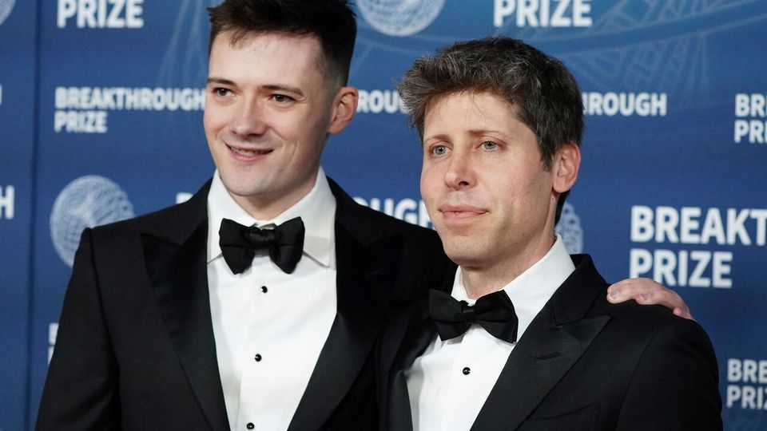

Science & technology | Taboo? What taboo?
Tech billionaires want to make gene-edited babies
Widespread bans don’t seem to be a hindrance
November 20th 2025

MOST STORIES about gene-edited children begin with He Jiankui, a rogue Chinese scientist who, in 2018, announced that he had created the world’s first such babies in secret. His reckless and illegal act may soon fade into the background, though, as new efforts to create gene-edited babies take off, this time promoted and funded by the billionaires of Silicon Valley. At the end of October a website appeared announcing Preventive, an American startup dedicated to altering human embryos using CRISPR, a gene-editing tool. In a post on X Lucas Harrington, the company’s founder, claimed to have raised $30m for the venture, which eventually turned out to have been sourced from America’s tech elite, including Brian Armstrong, head of Coinbase, a cryptocurrency exchange, and Oliver Mulherin

(pictured, left), an Australian software engineer and the husband of Sam Altman (pictured, right), boss of OpenAI.

On the company’s website, Dr Harrington says Preventive will at first focus on research to establish whether embryo editing is safe to do in humans, ultimately with the goal of preventing severe genetic diseases. It is not the only company in this area. Another is Manhattan Genomics, co-led by Cathy Tie, a serial biotech entrepreneur who was briefly in a relationship with Dr He. Yet another that has teased the idea is Bootstrap Bio, based in California. Though editing humans is one of the most controversial pursuits in medicine, the rise of these companies (and their rich, high-profile backers) reflects a countervailing belief: that the capability to edit embryos creates an obligation to use it.

CRISPR gene-editing technology lets scientists make precise changes to an organism’s DNA. Invented in 2012 by Jennifer Doudna and Emmanuelle Charpentier, biochemists who went on to win the Nobel prize in chemistry in 2020, the tool has transformed biology. Therapies are also starting to appear —Casgevy, the first licensed gene-editing treatment, cures people of sickle- cell disease.

These treatments have their challenges, however. Getting the therapy into the right part of the body is difficult. Casgevy requires a patient’s bone- marrow stem cells to be collected, sent to a lab for editing, and then transplanted back. It is gruelling and expensive. Vertex Pharmaceuticals and CRISPR Therapeutics, the drug’s makers, currently charge around $2m per dose.

In principle, editing an embryo could make things cheaper and also overcome some of those delivery problems. Deploying CRISPR to fix a genetic problem in a single-celled embryo, or even egg or sperm cells, should be relatively easy. And as the embryo grows, any genetic fixes will spread into the new tissues that are created. Dr Harrington estimates that it will reduce costs to $5,000 per embryo and, if the process is deemed safe, couples with genetic diseases might thus have the option of having their own children without fear of passing on their conditions.

That’s a big “if”. To work, CRISPR first breaks the DNA double helix in order for the cell to subsequently fix it. How well the repairs work in human embryos, however, is unclear—breaks might be left unmended or the ends of the DNA helix may pair up in unusual ways, causing new mutations. Many genes are also not understood well enough for scientists to guarantee that an edit meant to lower the risk of one disease does not inadvertently increase the risk of another. Edits made in embryos would also make it into the resulting person’s sperm or egg cells, which means the original edit would be passed on to future generations, with unpredictable consequences.

And then, of course, there is the question of designer babies. Dr Harrington has said that Preventive will focus on severe disease. Yet it is only a small leap from fixing a genetic mutation to engineering protective gene variants against cancer or dementia. Ultimately, some companies may promise edits aimed at a person’s appearance or intelligence.

Dr Harrington—a former student of Professor Doudna’s—says that the company will not attempt human trials if safety is found wanting. In any case it would be illegal for the Food and Drug Administration, America’s medical regulator, to consider applications for trials of embryo editing. Media reports have suggested that the United Arab Emirates is being considered as an alternative venue but Dr Harrington says it is “premature to consider any jurisdiction for clinical use” and that all the company’s work is based in America.

With the exception of Dr He, scientists have largely opposed the practice of editing human embryos. But that resistance might not hold for ever, suggests Robin Lovell-Badge, a developmental biologist at the Francis Crick Institute in London. The improved safety and efficiency of base editing, for example, which is a newer version of CRISPR that does not fully break the DNA helix, looks promising. Nevertheless, Professor Lovell-Badge is concerned by the interest from Silicon Valley. “People in the tech industry have often adopted this [attitude of], ‘let’s do it, and if it breaks, it doesn’t matter’,” he says. “Well, you can’t do that with humans.” ■

Curious about the world? To enjoy our mind-expanding science coverage, sign up to Simply Science, our weekly subscriber-only newsletter.

This article was downloaded by zlibrary from https://www.economist.com//science-and-technology/2025/11/19/tech-billionaires- want-to-make-gene-edited-babies