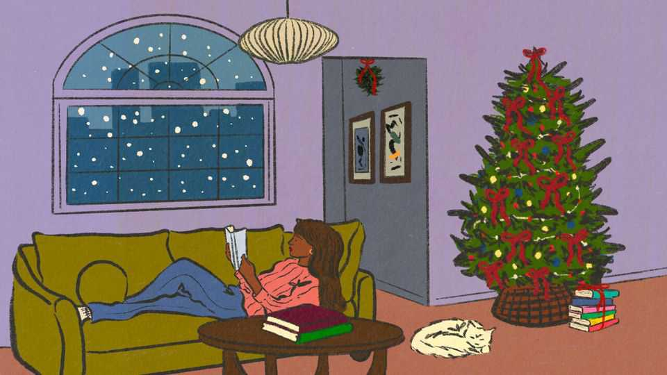
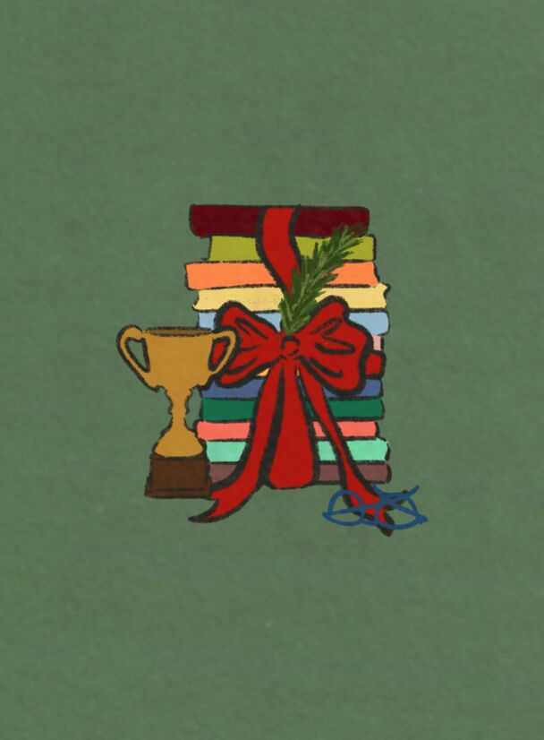
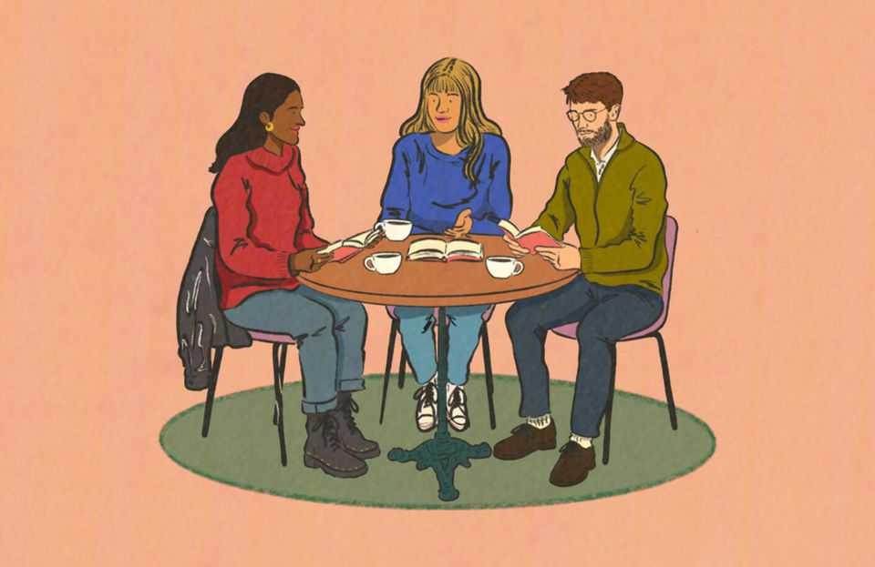
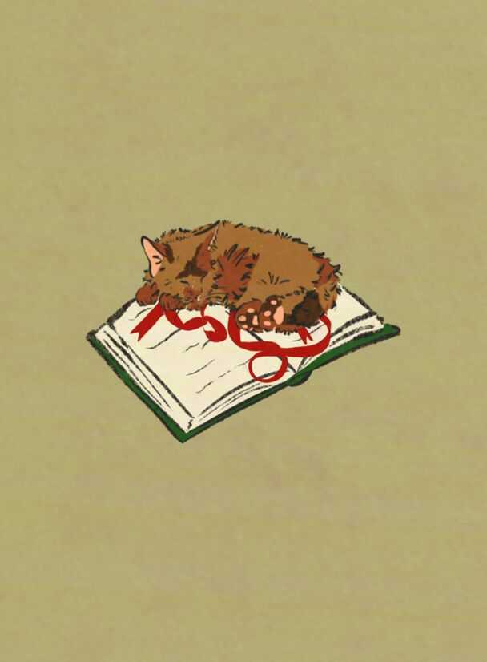

Culture | Bound to please
The best books of 2025
Gladiators and dictators, wolves and Beatles feature in our list this year
November 20th 2025

Buckley: The Life and the Revolution That Changed America. By Sam Tanenhaus. Random House; 1,040 pages; $40 and £33A superb biography of William F. Buckley, the most influential American journalist of the 20th century. For this book, more than a quarter of a century in the making, Sam Tanenhaus has judiciously curated the public and private record. Careless People. By Sarah Wynn-Williams. Flatiron Books; 400 pages; $32.99. Macmillan; £22A cracking corporate kiss-and-tell. Marketed as “the book Meta doesn’t want you to read”, this memoir portrays Mark Zuckerberg, the company’s founder and boss, as aloof and superficial.

Dark Renaissance: The Dangerous Times and Fatal Genius of Shakespeare’s Greatest Rival. By Stephen Greenblatt. W.W. Norton; 352 pages; $31.99. Bodley Head; £25Shoemaker’s son, scholar, playwright, spy: the outline of Christopher Marlowe’s life is dramatic. But the details—not least the reason for his fatal stabbing in 1593, aged 29—are sketchy. This evocative book offers a portrait of Elizabethan England: a time of paranoia, surveillance and violence, but also blistering creativity.

Electric Spark. By Frances Wilson. Farrar, Straus and Giroux; 432 pages; $35. Bloomsbury Circus; £25This brilliant book grapples with Muriel Spark, the author of “The Prime of Miss Jean Brodie”, “The Ballad of Peckham Rye” and 20 other novels. Her life is characterised by the same strange, stark abruptness as her prose.

How to End a Story: Collected Diaries. By Helen Garner. Pantheon; 832 pages; $40. W&N; £20An Australian novelist brings together 20 years of her diaries, in which she reflects on motherhood, her writing career and a disastrous marriage to a fellow novelist. Her prose is by turns dazzling, poignant and very, very funny; there is a delightful observation on every page.

Mother Mary Comes To Me. By Arundhati Roy. Scribner; 352 pages; $30. Hamish Hamilton; £20Where does Arundhati Roy, a Booker-prizewinning author and activist, get her fiercely independent streak? The clue is in the title. In this sparkling memoir Ms Roy explores her difficult relationship with her mother, who was a “dreamer, warrior, teacher”—and a terror.

Raising Hare. By Chloe Dalton. Pantheon; 304 pages; $27. Canongate; £18.99In this tale, joy and wonder come bundled in a four-legged, long- eared, skittish little package. Caring for the leveret opens the author’s eyes to the natural world; she is an elegant writer and sharp-eyed observer.

Storyteller: The Life of Robert Louis Stevenson. By Leo Damrosch. Yale University Press; 584 pages; $35 and £25With his wonderfully crafted books and mercurial, magnetic personality, Robert Louis Stevenson always inspired devotion. This meticulously researched biography avoids idolatry: it tells the reader not just what happens in Stevenson’s books, but why they should care.

Zbig. By Edward Luce. Avid Reader Press; 560 pages; $35. Bloomsbury; £30Was Zbigniew Brzezinski America’s most important foreign-policy guru? A fine biography makes a powerful case for an underappreciated man with a penetrating intelligence and remarkable foresight.

1929. By Andrew Ross Sorkin. Viking; 592 pages; $35. Allen Lane; £30The story of the seminal stockmarket and banking crash of modern history. The author wisely tells this sprawling story in a focused way, reconstructing how crucial figures experienced the ructions almost hour by hour.

Chokepoints. By Edward Fishman. Portfolio; 560 pages; $40. Elliott & Thompson; £25A riveting world tour of American sanctions. This book shows how economic weapons evolved through trial, error and political pressure, as Western officials were often too afraid of using them. It is also a ripping yarn.

The Corporation in the 21st Century: Why (Almost) Everything We Are Told About Business Is Wrong. By John Kay. Yale University Press; 448 pages; $35. Profile Books; £25The framework for thinking about business and capitalism is hopelessly outdated, argues one of Britain’s leading economists. This book offers a lively, lucid discussion of what companies are, and what they are for.

House of Huawei. By Eva Dou. Portfolio; 448 pages; $34. Abacus; £25Huawei has gone from making basic telephone switches nearly 40 years ago to designing some of the world’s most advanced semiconductors today. A reporter at the Washington Post tells the story of one of the world’s most controversial companies.

The Thinking Machine: Jensen Huang, Nvidia and the World’s Most Coveted Microchip. By Stephen Witt. Viking; 272 pages; $30. Bodley Head; £25An excellent biography of Jensen Huang, co-founder and CEO of Nvidia. Stephen Witt weaves together the story of the man, his company and the computer science that led to large language models such as ChatGPT, which brought generative AI to the masses in 2022.

Fatherhood: A History of Love and Power. By Augustine Sedgewick. Scribner; 320 pages; $30. Picador; £20An American scholar describes how

thinking about dads has changed over time. What is striking is the sheer variety of nonsense that people have believed; another common theme is cruelty. The best time to be a father may be now.

The Genius Myth. By Helen Lewis. Thesis; 320 pages; $30. Jonathan Cape; £22Books about geniuses tend to fall into predictable categories, from hagiography to takedowns to how-to manuals. This book is more original. This is the high age of the genius, readers may conclude—but not in a good way.

John & Paul: A Love Story in Songs. By Ian Leslie. Celadon Books; 448 pages; $32. Faber & Faber; £25The Beatles have been amply covered. But this book, which focuses on the relationship between John Lennon and Sir Paul McCartney, offers new insights. Ian Leslie listens as a musician, a fan and a literary critic.

Lone Wolf. By Adam Weymouth. Crown; 288 pages; $30. Hutchinson Heinemann; £18.99In 2011 Slavc, a wolf, set off from Slovenia and travelled 2,000 kilometres in search of a mate. For this original, lyrical travelogue, the author follows in his pawprints and reflects on rural life, migration and folklore. The wolf, it turns out, embodies many of Europe’s divides.

Why q needs u. By Danny Bate. Blink Publishing; 336 pages; £14.99This book offers a history of writing, a biography of English and an introduction to linguistics, all smuggled into 26 short and entertaining chapters. It is perfect for anyone who is baffled or enchanted by the eccentricities of the English language.

Archipelago of the Sun. By Tawada Yoko. Translated by Margaret Mitsutani. New Directions; 224 pages; $16.95. Granta Books; £12.99The final volume in an acclaimed trilogy, which follows a travelling band of eclectic multilingual friends. The author’s style is somehow both delightfully dreamlike and cuttingly sharp.

The Eleventh Hour. By Salman Rushdie. Random House; 272 pages; $29. Jonathan Cape; £18.99A luminous collection of short stories, which slyly mock a wide range of targets: religious bigots, political charlatans—and death itself.

Flashlight. By Susan Choi. Farrar, Straus and Giroux; 464 pages; $30. Jonathan Cape; £20While visiting Japan, ten-year-old Louisa and her father go for a walk on the beach. The next day she is found half-dead and her dad has vanished. A novel about identity and history that is full of twists.

Flesh. By David Szalay. Scribner; 368 pages; $28.99. Jonathan Cape; £18.99The winner of this year’s Booker prize is a deceptively complex novel which finds original ways to explore masculinity, intimacy, class and power struggles. The author’s elegant, stripped-back prose powers a narrative rich in pathos.

The Lack of Light: A Novel of Georgia. By Nino Haratischwili. Translated by Charlotte Collins and Ruth Martin. HarperVia; 736 pages; $29.99 and £20This immersive epic follows the lives of four female friends—Nene, Dina, Ira and Keto—as they navigate the tumultuous years before and after Georgia’s independence from the Soviet Union. A tale of resilience and redemption.

The Loneliness of Sonia and Sunny. By Kiran Desai. Hogarth; 688 pages; $32. Hamish Hamilton; £25Sonia is an aspiring novelist in Vermont; Sunny is a journalist in New York. They meet and fall in love, but the question is

whether they are able to stay together, find happiness and feel “life growing bigger”. This book is grand in sweep yet satisfyingly intimate.

Once the Deed Is Done. By Rachel Seiffert. Virago; 464 pages; £22A novel about trust and trauma. Set in Germany in 1945, this book looks at what happened to the millions of labourers brought in to prop up the Nazi regime. Its characters include a Red Cross worker, herself an exile, and a local child who cracks under the weight of secrets.

Perfection. By Vincenzo Latronico. Translated by Sophie Hughes. New York Review Books; 136 pages; $15.95. Fitzcarraldo Editions; £12.99A lucid and bitter portrait of millennial dreams and disillusionment. It traces the lives of Anna and Tom, a couple whose picture-perfect Instagram existence begins to crumble.

Vulture. By Phoebe Greenwood. Europa Editions; 288 pages; $27 and £16.99This scathing send-up of war reporting follows Sara, a young English freelance reporter, as she covers conflict in Gaza in 2012. A supremely accomplished debut novel full of wit and bite.

We Do Not Part. By Han Kang. Translated by e. yaewon and Paige Morris. Hogarth; 272 pages; $28. Hamish Hamilton; £18.99The Nobel-prizewinning novelist chronicles shameful episodes in South Korea’s history. The power of this narrative comes from Han Kang’s masterful fusion of the literary and the documentary.

What We Can Know. By Ian McEwan. Knopf; 320 pages; $30. Jonathan Cape; £22In the year 2119 an academic trawls through archives to track down a lost poem. His discovery yields an account of passion, murder and guilt. This is an inventive, exquisitely written book, which combines dystopia, romance and mystery.

Wild Dark Shore. By Charlotte McConaghy. Flatiron Books; 320 pages; $28.99. Castle Point Books; £24.99Dominic Salt lives on Shearwater, a fictional island near Antarctica, where he tends to a seed bank which is vital for food security. This taut thriller about battles for survival is enriched by its nature writing and treatment of climate change.

Caribe: A Caribbean Cookbook with History. By Keshia Sakarah. Quadrille; 320 pages; $45. Hardie Grant Books; £30A British food writer of Montserratian and Barbudan heritage explores the culinary culture of the Caribbean. This book takes each island in turn, looking at its colonial history and how this shaped its food, from Barbados’s pudding and souse to Dominica’s saltfish fritters.

Chesnok. By Polina Chesnakova. Hardie Grant Books; 240 pages; $35 and £26A personal tour through Soviet diaspora cooking. The author was born in Ukraine to a Russian mother and Armenian father who married in Georgia;

she explores the cuisine of all four countries and more. This is one of those rare cookbooks that is as much fun to read as cook from.

The Complete Illustrated Guide to Japanese Cooking: Techniques, Ingredients & Recipes. By Harada Sachiyo. Hardie Grant Books; 288 pages; $45 and £30An introduction to perhaps the world’s most sophisticated cuisine. Each technique or ingredient is explained through infographics; recipes include step-by-step photographs. Seasonal stews and various sushi styles are elucidated.

Fusão: Untraditional Recipes Inspired by Brazil. By Ixta Belfrage. Interlink Books; 288 pages; $35. Ebury Press; £28 This book looks at the indigenous, Portuguese and west African influences in Brazil’s culinary landscape, among others. (Fusão means fusion in Portuguese.) For Ixta Belfrage—who spent five years working for Yotam Ottolenghi—it is an exploration of her own heritage. Try the black beans stewed in chocolate.

Italopunk: 145 Recipes to Shock Your Nonna. By Vanja van der Leeden. Tra Publishing; 400 pages; $55 and £49.99In a year of great pasta cookbooks, “Italopunk” stands out. There is nothing starchy about this manifesto against Italian culinary dogmatism. The author, a Dutch-Indonesian chef, interviews Italian cooks about their struggles to reinvent food in a country obsessed with tradition.

Something from Nothing. By Alison Roman. Clarkson Potter; 320 pages; $37.99. Quadrille; £27A popular American cook and food writer offers an ode to pantry staples. “Casual” but “elegant” is often what she aims for: supermarket radishes with “very expensive butter” or potato crisps with caviar, which she serves up to impress guests without getting her hands dirty.

38 Londres Street: On Impunity, Pinochet in England and a Nazi in Patagonia. By Philippe Sands. Knopf; 480 pages; $35. W&N; £25This is the third book in a loose trilogy about Nazis, justice and impunity. The author shows how the long-rumoured friendship between Augusto Pinochet, a Chilean dictator, and Walter Rauff, a Nazi officer, was real.

Allies at War. By Tim Bouverie. Crown; 672 pages; $38. Bodley Head; £25A masterful diplomatic history of the second world war. The story of the

improbable alliance between “the Big Three” of Roosevelt, Churchill and Stalin is familiar, but packed with fresh detail and gossipy anecdotes.

The cia Book Club. By Charlie English. Random House; 384 pages; $35. William Collins; £25Tomes were smuggled on boats, trains and trucks. The CIA funnelled 10m books into the eastern bloc, including George Orwell’s “1984”, John le Carré’s spy thrillers and Virginia Woolf’s writing advice. This is the riveting story of “the best-kept secret of the cold war”.

The Gods of New York. By Jonathan Mahler. Random House; 464 pages; $32. Hutchinson Heinemann; £25Between 1986 and 1989, old New York died and a new one was born. Part of this book’s pleasure, especially for readers too young to remember the late 1980s, is that it chronicles a time when several important American political figures first strode onto the public stage.

The Illegals. By Shaun Walker. Knopf; 448 pages; $32. Profile Books; £22One of the most compelling and perceptive books on intelligence of the past decade. Shaun Walker combines the methods of the journalist and the historian, vividly describing how the KGB churned out deep-cover spies who often cracked under the pressure.

The Last Days of Budapest. By Adam LeBor. PublicAffairs; 512 pages; $35. Apollo; £27.99This outstanding book chronicles the transformation of one of Europe’s finest cosmopolitan capitals during the second world war. Adam LeBor tells the story of how Budapest became a centre of wartime intrigue and espionage, drawing on an impressive range of sources.

Peak Human. By Johan Norberg. Atlantic Books; 400 pages; $32.99 and £22A historian explains how golden ages really start—and end. Some of the periods Johan Norberg describes will be familiar to readers, but he deftly punctures popular misconceptions and adds fresh details and provocative arguments.

The Revolutionists. By Jason Burke. Knopf; 768 pages; $40. Bodley Head; £30A deeply researched account of hijackings, hostage-takings and other terrorist activity in the 1970s, told with verve by the Guardian’s international security correspondent. It offers portraits of leftist freedom fighters such as

Ilich Ramírez Sánchez (aka Carlos the Jackal) and documents the rise of Islamist extremism.

Strangers and Intimates: The Rise and Fall of Private Life. By Tiffany Jenkins. Picador; 464 pages; $28.99 and £20A fascinating look at how thinking about privacy has evolved over time. One of those rare works that changes how you see the world, with an insight on every page.

The Third Reich of Dreams: The Nightmares of a Nation. By Charlotte Beradt. Translated by Damion Searls. Princeton University Press; 152 pages; $24.95 and £20This collection shows that, even in sleep, Germany’s fascist regime occupied the minds of its subjects. This remarkable work of journalism, newly translated into English, shows how authoritarianism warps the subconscious.

Those Who Are About To Die. By Harry Sidebottom. Knopf; 416 pages; $35. Hutchinson Heinemann; £25A historian explains what gladiator shows were really like. To those who think that the Romans—with their businesslike haircuts and underfloor heating—were much like ourselves, this vivid, gripping book offers many correctives.

The Traitors Circle. By Jonathan Freedland. Harper; 480 pages; $32. John Murray; £25The thrilling story of a group of anti-Nazi activists in wartime Berlin, including a countess who hid her Jewish lover in a sofa when the Gestapo raided her flat. Betrayed by an informer, several paid an awful price for their defiance. At bottom the book is an inquiry into how, in the direst circumstances, some people find the immense courage to do what is right.

Arctic Passages: Ice, Exploration and the Battle for Power at the Top of the World. By Kieran Mulvaney. Island Press; 240 pages; $30 and £24Before long, the Arctic Ocean could be free of ice in summer. That is opening up passages for commercial vessels: in this splendid book a journalist looks at each passage in turn, combining reportage with details of his own voyages.

Daughters of the Bamboo Grove. By Barbara Demick. Random House; 352 pages; $32. Granta Books; £20Based on extensive reporting in China and America, this book uncovers how China’s one-child policy also led to the widespread seizure of children for international adoption. The author focuses

on the abduction of a twin girl in 2002 and her adoption in America; an emotional reunion with her sister in 2019 is movingly described.

The Highest Exam: How the Gaokao Shapes China. By Ruixue Jia and Hongbin Li with Claire Cousineau. Belknap Press; 256 pages; $29.95 and £24.95The gaokao—China’s university entrance exam—shapes much of the country’s society, from pay to politics. Read this thoughtful book to learn how the test is the first of many tournaments in which the Chinese have to compete over the course of their lives.

The Finest Hotel in Kabul: A People’s History of Afghanistan. By Lyse Doucet. Allen Lane; 448 pages; $29. Hutchinson Heinemann; £25A chronicle of Afghanistan’s history since 1969, as it was seen from the Hotel InterContinental Kabul. Lyse Doucet, the BBC’s chief international correspondent, writes in a novelistic way; she is a humane narrator who conveys the suffering and resilience of the hotel’s staff.

The Hour of the Predator: Encounters with the Autocrats and Tech Billionaires Taking Over the World. By Giuliano da Empoli. Translated by Sam Taylor. Pushkin Press; 160 pages; $16.95 and £12.99An Italian-Swiss writer spent years in the corridors of power observing what he sees as the emergence of a new cadre of strongmen in politics and technology, who feed off each other and share a love of disruption. He skewers them with sardonic humour.

I Deliver Parcels in Beijing. By Hu Anyan. Translated by Jack Hargreaves. Astra House; 336 pages; $27. Allen Lane; £20A bestseller in China recently translated into English. Hu Anyan’s straightforward prose and keen eye for detail capture the drudgery of gruelling low-wage work and the personal toll it takes.

In Covid’s Wake: How Our Politics Failed Us. By Stephen Macedo and Frances Lee. Princeton University Press; 392 pages; $29.95 and £25This insightful book looks at the far-reaching and unexpected consequences of covid-19. The pandemic fed a global surge in inflation, a breakdown of trust in experts and an aggravation of political polarisation.

The Party’s Interests Come First: The Life of Xi Zhongxun, Father of Xi Jinping. By Joseph Torigian. Stanford University Press; 718 pages; $50 and £40This biography of Xi Zhongxun, Xi Jinping’s father, draws on a decade of research using Chinese, English and Russian sources. The book is valuable not only for its portrait of its subject, but also for its insights into his progeny, now the supreme leader.

Righting Wrongs: Three Decades on the Front Lines Battling Abusive Governments. By Kenneth Roth. Knopf; 448 pages; $30. Allen Lane; £30A leading human-rights campaigner explains how to curb the cruelty of the world’s worst regimes. The key to shaming powerful wrongdoers is to avoid name-calling and “stigmatise with facts”.

Russia’s Man of War: The Extraordinary Viktor Bout. By Cathy Scott-Clark. Hurst; 424 pages; $34.99 and £25In 2022 Viktor Bout, a Russian arms dealer, was swapped for Brittney Griner, an American basketball player, after 15 years in American custody. This richly reported biography of Mr Bout benefits from rare interviews with him—though an arms trafficker is perhaps not the most reliable narrator.

We the People: A History of the US Constitution. By Jill Lepore. Liveright; 720 pages; $39.99. John Murray; £30Contrary to the Founding Fathers’ wishes, America’s constitution is too hard to change, argues a professor at Harvard University and writer for the New Yorker. This book offers an arresting chronicle of Americans striving—if sometimes failing—to remake their republic.

When Everyone Knows That Everyone Knows... By Steven Pinker. Scribner; 384 pages; $30. Allen Lane; £25Common knowledge—knowing that others know something, and that they know we know—is powerful. Thinking about it “illuminates many enigmas of our public affairs and personal lives”, a Harvard polymath argues in this fizzing, erudite book.

Why Nothing Works: Who Killed Progress―and How to Bring It Back. By Marc Dunkelman. PublicAffairs; 416 pages; $32.50 and £28This absorbing book argues that excessive regulation, diffuse power and plentiful vetoes have hurt America by blocking housebuilding, infrastructure and effective governance. It crystalises ideas that have been swirling around newspaper columns, think-tanks and social media.

The Age of Diagnosis. By Suzanne O’Sullivan. Thesis; 320 pages; $32. Hodder Press; £22 A neurologist asks whether doctors’ dogged pursuit of diagnoses is actually beneficial to patients. Many normal conditions are pathologised; with early screenings, people end up being treated for ailments that might resolve on their own. “We are not getting sicker,” the author writes in this even-handed book, but “we are attributing more to sickness.”

Collisions: A Physicist’s Journey from Hiroshima to the Death of the Dinosaurs. By Alec Nevala-Lee. W.W. Norton; 352 pages; $31.99 and

£23.99Luis Walter Alvarez won the Nobel prize in 1968 for his work on particle physics. He was also “the world’s foremost scientific detective”, this enlightening book argues. The list of mysteries on which he consulted, from assassinations to UFOs, would have raised even Sherlock Holmes’s eyebrows.

Crick: A Mind in Motion. By Matthew Cobb. Basic Books; 608 pages; $36. Profile Books; £30A biography of one of the 20th century’s greatest scientists. The man who, along with James Watson, determined the structure of DNA, was curious and combative. Most important, he was unafraid to be wrong and abided by a “don’t worry method” of trial and error.

Empire of ai. By Karen Hao. Penguin Press; 496 pages; $32 and £25This book reveals disturbing traits about Sam Altman, the co-founder and chief executive of OpenAI, and the culture of Silicon Valley that are useful to bear in mind amid the hype about generative artificial intelligence.

Ends of the Earth: Journeys to the Polar Regions in Search of Life, the Cosmos and our Future. By Neil Shubin. Dutton; 288 pages; $32. Oneworld; £22This book is full of great facts. An American fossil-hunter corrals the latest science to describe what sets the polar regions apart—and their vital role for the planet. The author sets out the possible consequences of global warming, including the release of hundreds of frozen ancient viruses.

Fair Doses: An Insider’s Story of the Pandemic and the Global Fight for Vaccine Equity. By Seth Berkley. University of California Press; 408 pages; $29.95 and £25The story of vaccines, as told by an infectious disease epidemiologist. During the covid-19 pandemic, Seth Berkley fought against political resistance and nationalism to help distribute 2bn vaccines across the world.

Food Intelligence: The Science of How Food Both Nourishes and Harms Us. By Julia Belluz and Kevin Hall. Avery; 352 pages; $30. Wildfire; £22A journalist and a respected nutrition scientist explain why the diet wars waged over carbohydrates, fats and protein do not have a clear winner. They parse the biology of human metabolism as well as the gimmicks of the junk-food industry, nutrition hype and ultra-processed foods.

Is a River Alive? By Robert Macfarlane. W.W. Norton; 384 pages; $31.99. Hamish Hamilton; £25The author has a pragmatic agenda embedded in his powerful prose: to make an environmental, ethical and aesthetic case for rivers being living subjects that must be endowed with rights. Everyone who has ever found something to love in a river should find something to love in this book. It is a masterpiece.

The Lost Orchid: A Story of Victorian Plunder and Obsession. By Sarah Bilston. Harvard University Press; 400 pages; $29.95 and £24.95When orchidomania swept Europe in the 19th century, the flowers were status symbols akin to a Birkin bag or sports car today. Horticulturists and economists alike will enjoy this colourful tale of the orchid and its multifarious meanings.

The Web Beneath The Waves: The Fragile Cables that Connect our World. By Samanth Subramanian. Columbia Global Reports; 128 pages; $18 and £12.99This brief, lyrical survey of the internet’s underwater infrastructure and the people who maintain it offers a timely reminder of the extent to which the modern world depends on a fragile filigree of subsea cables—and of the many ways in which the supposedly disembodied online world is vulnerable to physical, commercial and geopolitical interference. ■

All the books on the list were published in America or Britain this year.

For more on the latest books, films, TV shows, albums and controversies, sign up to Plot Twist, our weekly subscriber-only newsletter

This article was downloaded by zlibrary from [https://www.economist.com//culture/2025/11/20/the-best-books-of-2025](https://www.economist.com//culture/2025/11/20/the-best-books-of-2025)