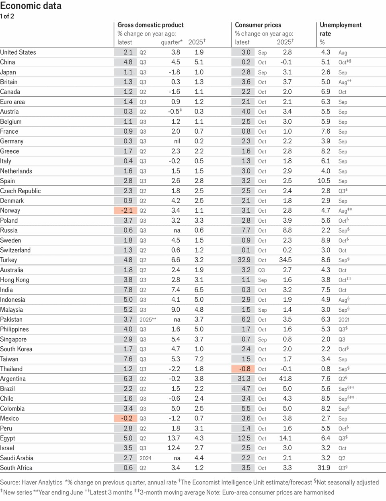
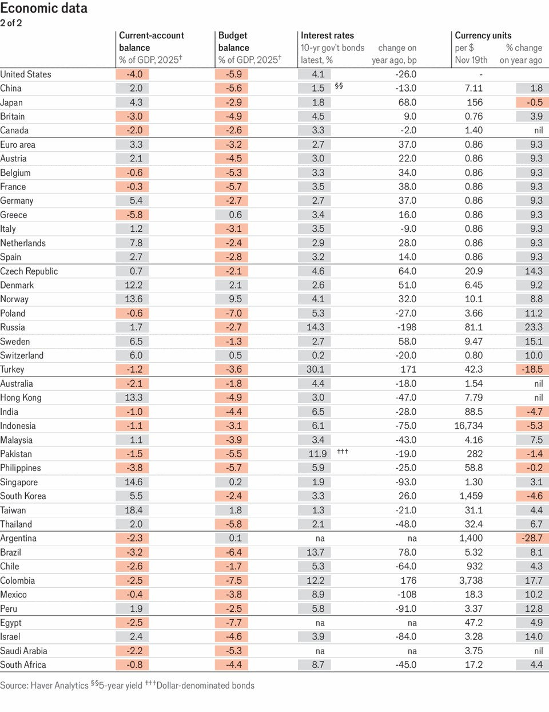
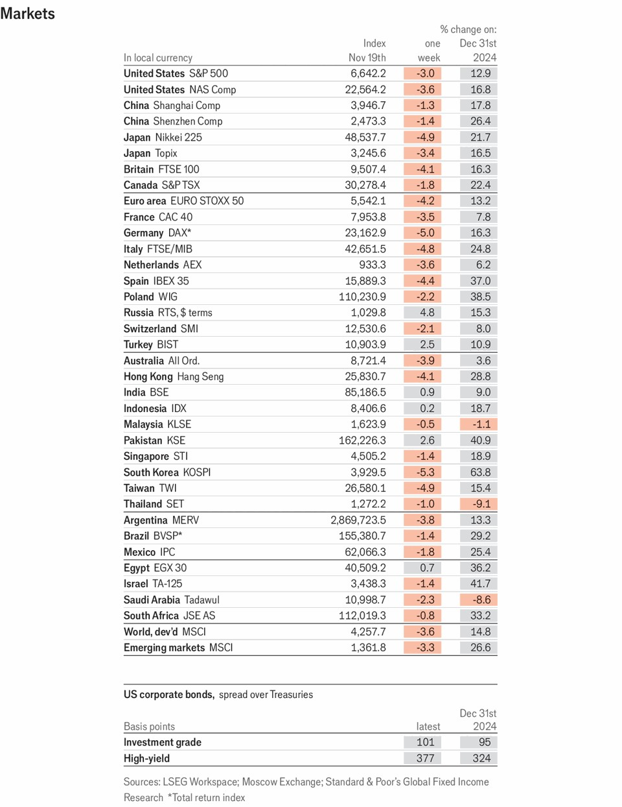
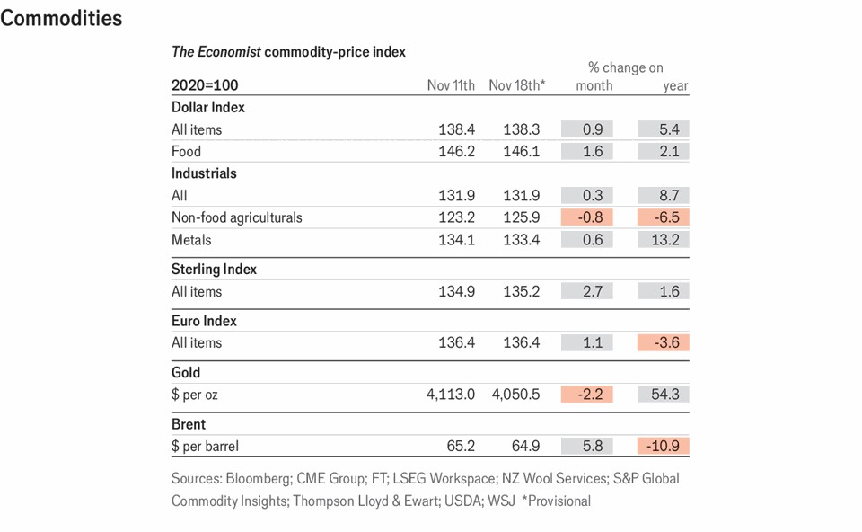

Economic & financial indicators | Indicators
Econonic data, commodites and markets
November 20th 2025

This article was downloaded by zlibrary from https://www.economist.com//economic-and-financial-indicators/2025/11/20/econonic- data-commodites-and-markets

Obituary

Gillian Tindall revelled in the past of ordinary lives