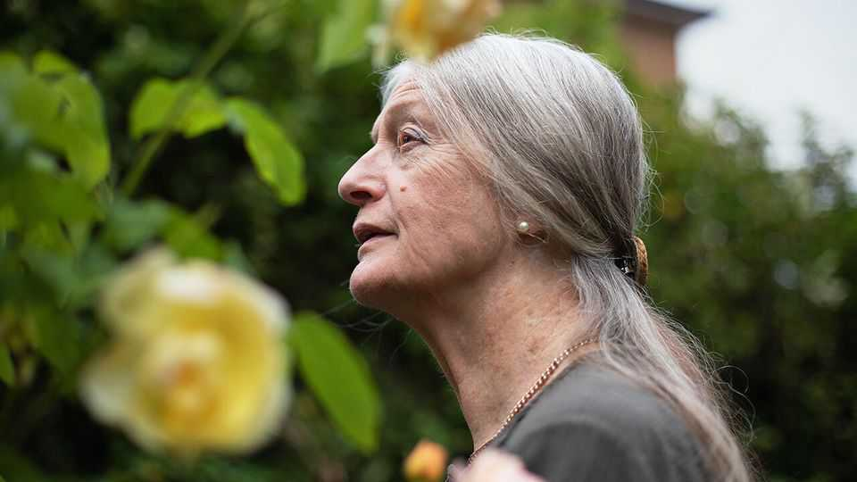
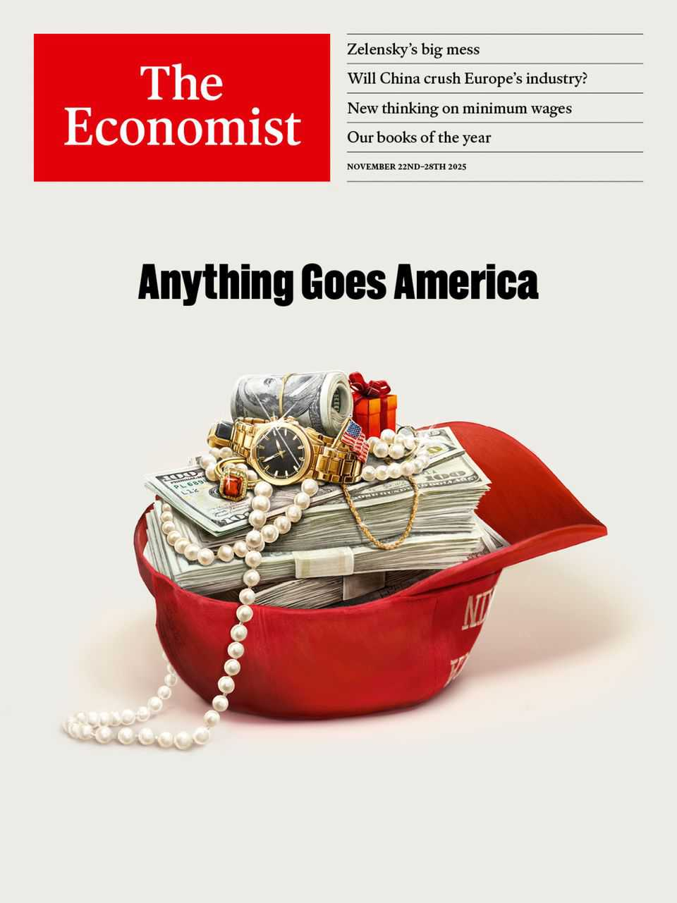

Obituary | The fields beneath
Gillian Tindall revelled in the past of ordinary lives
The historian of houses and unknown people died on October 1st, aged 87
November 20th 2025

As you cross London’s Millennium Bridge from the North Bank to the South, a curious run of houses faces you. Squeezed between the new Globe theatre and the Tate Modern are three small, old houses, two of red brick and one, taller, of three storeys faced with white stucco. It sits beside Cardinal Cap Alley, one of the city’s narrowest, and its address is 49 Bankside. The two houses beside it were reconstructed after bombing, but 49 Bankside is the genuine article. It was rebuilt in 1710, in the graceful proportions of the age, and now draws covetous looks. Who would not dream of living in this little leftover house and gazing, from the front windows, straight at the dome of St Paul’s?

Gillian Tindall did more than dream. She contacted the owners and, in “The House by the Thames”, told the whole history of the house and the neighbourhood. Before Number 49 there was a medieval inn, the Cardinal’s Hat, and Bankside was a place of stinking tanneries, Flemish whores and price-gouging bargemen. The house had its own ups and downs: at first elegantly middle-class, with lavish wood panelling; in the next century, a house for wharf-hands and rabbit-skinners, surrounded by coal-heaps; then, by 1901, the dwelling of three struggling families, including in the tiny attic a crippled young woman called Marion, cooking sweets for sale over a stove.

Miss Tindall could not walk any street, or visit any house, without sensing the layers beneath. Towns were palimpsests, where the past was never quite scratched away. The earth of London was not just clay and gravel but also the dust of houses and people gone before. In her own battered patch of north London, Kentish Town, roads followed now-entombed rivers and old hedgerow lines. In Sainsbury’s she stood on the burial ground of a vanished chapel of ease, and therefore on the bones of people who, like her, bought milk and bread. After several novels, her first non-fiction book, “The Fields Beneath”, took its title from words on the lintel of a local house. Ever after, idylls of pastures, cows and a silvery Fleet river gained a certain hold on the neighbourhood.

Her own house had been built as a rural retreat in 1828, with a garden still long enough for an orchard. Inside she shared space with all those who, like her, had put their hand on just the same opportune spot on the turn of the banister when going up to bed. She was haunted by the Pikes, 19th-century residents who had left, under the floorboards and between the joists, hundreds of Temperance tracts. They had also warred crazily with their neighbours, and she conjectured that a deep scar on the banister rail might be something to do with them.

People like the Pikes, or like Marion at 49 Bankside, especially drew her attention: the overlooked characters of history, the unconsulted, who nevertheless had as many anxieties, passions and hopes as the famous. That interest had started when she first went to London’s East End in 1963, a wide-eyed girl not long out of Oxford, arriving to interview aged widows in run-down but solid houses that were about to be swept away. Under the

Greater London Plan, they told her, “It’s all coming down round here, dear.” Over tea with tinned milk they remembered markets, celebrations, neighbourliness, thriving shops: all disappearing.

As for her, she developed a lifelong hatred of planners. Those of the 1960s were outright Stalinists who, in the name of some Brave New Future, simply bulldozed communities away. Matters gradually improved, but she still spent long hours at meetings of the London and Middlesex Archaeological Society, examining planning applications. She also co-founded the Camden History Society, and wrote pointed opinion pieces for the Guardian and the Observer, to keep the pressure up. She did not object to big projects on principle: Crossrail gave her fodder for another book, and even HS2 was tolerable in theory. But she could not forget that Kentish Town had been despoiled for ever not only by London’s sprawl, but by the coming in the 1860s of the Midland Railway.

Her hunger for evidence and exactitude made archives her natural home. She revelled in Census records, vestry ledgers and yellowing, discursive old newspapers. But maps gave her the greatest joy of all. She would pore over them so intently that she almost willed them to draw her right in, revealing every brick, tree, step and stone. She treasured the little figures on ancient maps, playing, fighting, conversing or loading boats; living.

The most intriguing documents she ever found, though, were not in an archive, but in a small cardboard case left on the mantelshelf of a house which she and her husband Richard bought in 1973 in Chassignolles, in central France. These, neatly folded, were marriage proposals from six different men written in the 1860s to Célestine Chaumette, the daughter of a village innkeeper. Some were polished, some endearingly clumsy, from young men not used to spelling. “Before anything else I would like to know if I suit you,” one began. Each suitor was rejected. This cried out for another book, not merely about Célestine but about the village and the huge social changes there between 1844 and 1933, the span of Célestine’s life. At its beginning, Chassignolles was a place isolated in oak woods and spectre- haunted hills, where the chief trade was clog-making. At its end cars, telephones, and again a nearby railway all forced the modern world in.

As its chronicler, she missed hearing the clatter of clogs in its streets. But she could revive them. Similarly, on the shores of the Thames, she missed the coarse banter of the ferrymen and the smell of open drains, but she could bring them back. The past never entirely went away. One night, baby- watching, she heard her small son Harry singing “London Bridge is Falling Down”. She hoped that children would still be singing about London Bridge, and that 49 Bankside would still be standing, long after she had joined the crowds walking into the unknown. ■

This article was downloaded by zlibrary from https://www.economist.com//obituary/2025/11/20/gillian-tindall-revelled-in-the- past-of-ordinary-lives

Table of Contents

The world this week Politics Business The weekly cartoon Leaders Welcome to Anything Goes America To avoid crushing change, Europe must take control of its destiny Why governments should stop raising the minimum wage Don’t let a scandal undermine the defence of Ukraine Mortgage lending in America is seizing up. How to revive it Letters Does universal child care harm children? By Invitation María Corina Machado on why time is running out for Maduro in Venezuela Briefing Chinese regulations and competition are panicking European manufacturers United States In Washington, everything appears to be for sale Marjorie Taylor Greene’s big MAGA break-up Can Donald Trump deploy the National Guard whenever he likes? How to lower America’s soaring health-care costs Release the Epstein files! AI is accelerating a tech backlash in American classrooms How Donald Trump is turning into Joe Biden The Americas Cuba is heading for disaster, unless its regime changes drastically How to save the Galápagos from its visitors Is Donald Trump preparing to strike Venezuela or lining up a deal? Asia How will Japan’s defences evolve under its hawkish new leader? The politicians protecting huge criminal networks Where being antediluvian pays

To glimpse Indonesia’s future, look to its president’s view of the past China China has too many university grads and too few jobs for them The charts that show how much money China lends to the rich world China and Japan are in a vicious game of chicken over Taiwan Europe sees China as a rival. China sees Europe as a has-been Middle East & Africa Muhammad bin Salman takes a victory lap in Washington Israel may not be popular, but its weapons are For Israel a psychological reckoning is the cost of bloody victory Africa’s other debt crisis A fuel blockade shows the frightening power of Mali’s jihadists Europe A huge corruption scandal threatens Ukraine’s government Russian bombing leaves no time to search for keepsakes Vineyards are disappearing in France Russia’s militant bloggers are clashing with their own regime Young MPs are fed up with Germany’s pension burdens Can Europe’s deregulation drive actually deregulate anything? Britain Will Britain copy asylum policy from a place with poor integration? Britain’s new effort to balance human rights and deportations Britons are becoming less spendthrift Quantum computing is getting real—and Britain wants to lead Britain struggles to distinguish between protest and terrorism Britain’s controversial experiment in regulating the internet The panic over a male crisis in Britain is overblown International How Chinese underground banks became the world’s biggest money- launderers The loneliness of America’s model ally Business Donald Trump and the rise of “insider capitalism” Shut up, or suck up? How CEOs are dealing with Donald Trump Private equity is reshaping American child care Indians are getting more fashionable Cracks are appearing in OpenAI’s dominant façade

When companies lose their way How do you replace a CEO like Tim Cook or Warren Buffett? Finance & economics Crypto got everything it wanted. Now it’s sinking Economists get cold feet about high minimum wages Visa restrictions are bad for Indians—but maybe not for India America’s huge mortgage market is slowly dying Is this the end of the scorching gold rally? Can the Chinese economy match Aruba’s? Science & technology Geothermal’s time has finally come Geothermal kit can help make the power grid flexible A better way to look for signs of ancient biology The use of a rare wood pits violinists against environmentalists Tech billionaires want to make gene-edited babies Do women need testosterone supplements? Culture The best books of 2025 Books published by The Economist’s journalists in 2025 Economic & financial indicators Econonic data, commodites and markets Obituary Gillian Tindall revelled in the past of ordinary lives