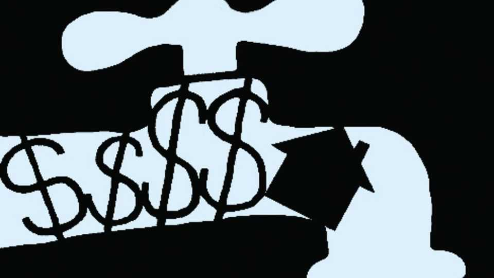

Leaders | The incredible shrinking market
Mortgage lending in America is seizing up. How to revive it
Some rules introduced after the financial crisis have gone too far
November 20th 2025 
 

The American mortgage market is shrinking. After years of rising house prices and dwindling lending, the value of mortgage debt as a share of the housing stock is at its lowest in 60 years. To those who remember the global financial crisis, when troubled housing loans blew up the banks, this may sound like good news. In fact, it is a cause for concern. Many families are being needlessly locked out of homeownership. Labour mobility has slowed, as homeowners stay put. And because modest, single-family homes have fewer prospective buyers, fewer of those properties are being built. America's mortgage market needs unclogging. 

备注

- <strong><em>mortgage</em></strong>：/[ˈmɔːɡɪdʒ]/ "抵押贷款"；文中用来表达抵押贷款市场，强调美国房地产金融的核心；指抵押贷款或按揭。 
- <strong><em>dwindling</em></strong>：/[ˈdwɪndlɪŋ]/ "减少的、萎缩的"；文中用来表达贷款减少，强调市场萎缩；动词原形是dwindle（减少）。 
- <strong><em>debt</em></strong>：/[det]/ "债务"；文中用来表达抵押债务，强调债务占住房存量的比例；指债务或欠款。 
- <strong><em>housing stock</em></strong>：/[ˈhaʊzɪŋ stɒk]/ "住房存量"；文中用来表达住房存量，强调债务与存量的比例；housing指住房，stock指存量。 
- <strong><em>homeownership</em></strong>：/[ˈhəʊməʊnəʃɪp]/ "房屋所有权"；文中用来表达房屋所有权，强调许多家庭被排除在外；由home（家）和ownership（所有权）构成。 
- <strong><em>mobility</em></strong>：/[məʊˈbɪlɪti]/ "流动性、移动性"；文中用来表达劳动力流动性，强调市场萎缩的影响；由mobile（流动的）加-ity构成。 
- <strong><em>stay put</em></strong>：/[steɪ pʊt]/ "留在原地"；文中用来表达房主留在原地，强调流动性降低；固定短语，指留在原地。 
- <strong><em>prospective</em></strong>：/[prəˈspektɪv]/ "潜在的"；文中用来表达潜在买家，强调市场萎缩的影响；指潜在的或预期的。 
- <strong><em>unclogging</em></strong>：/[ʌnˈklɒɡɪŋ]/ "疏通、清理"；文中用来表达需要疏通，强调市场需要恢复；由un-（不）和clog（堵塞）加-ing构成。 
 
The surging interest rates of recent years are partly to blame. During the pandemic homeowners rushed to refinance at record-low interest rates. Now that rates are higher—the 30-year mortgage rate stands at 6.2%, compared with 2.7% in early 2021—they are loth to move. The Federal Housing Finance Agency (FHFA) has found that the lock-in caused by higher rates cut house sales by 1.7m between mid-2022 and mid-2024. 

备注

- <strong><em>surging</em></strong>：/[ˈsɜːdʒɪŋ]/ "飙升的"；文中用来表达飙升的利率，强调利率上升；动词原形是surge（飙升）。 
- <strong><em>refinance</em></strong>：/[ˌriːfaɪˈnæns]/ "再融资"；文中用来表达再融资，强调疫情期间房主的行为；由re-（重新）和finance（融资）构成。 
- <strong><em>loth</em></strong>：/[ləʊθ]/ "不愿意的"；文中用来表达不愿意搬家，强调高利率的影响；指不愿意的或勉强的。 
- <strong><em>lock-in</em></strong>：/[lɒk ɪn]/ "锁定"；文中用来表达锁定效应，强调高利率导致房主不愿搬家；固定短语，指锁定效应。 
 
That is not the whole story. Mortgage activity was depressed long before rates began to rise, because of post-crisis regulation, especially for smaller loans and borrowers with average or below-average credit scores. Mortgage lending to those with credit scores of 760 and higher, above the average of 705, now accounts for two-thirds of the total, more than twice the prevailing share of just over two decades ago. 

备注

- <strong><em>depressed</em></strong>：/[dɪˈprest]/ "低迷的"；文中用来表达抵押活动低迷，强调危机后监管的影响；动词原形是depress（使低迷）。 
- <strong><em>post-crisis</em></strong>：/[pəʊst ˈkraɪsɪs]/ "危机后的"；文中用来表达危机后监管，强调2008年金融危机后的规则；由post-（后）和crisis（危机）构成。 
- <strong><em>borrowers</em></strong>：/[ˈbɒrəʊəz]/ "借款人"；文中用来表达借款人，强调信用评分的影响；由borrower（借款人）加-s构成。 
- <strong><em>credit scores</em></strong>：/[ˈkredɪt skɔːz]/ "信用评分"；文中用来表达信用评分，强调贷款标准；credit指信用，scores指分数。 
- <strong><em>prevailing</em></strong>：/[prɪˈveɪlɪŋ]/ "流行的、占主导的"；文中用来表达占主导的份额，强调与过去的对比；动词原形是prevail（占主导）。 
 
In response to the drought, the Trump administration has floated various ideas. One of them is a side-show. The president and Bill Pulte, the head of the fhfa, have both enthused about 50-year mortgages. But ultra-long loans would leave homebuyers paying off mortgages into retirement, and would worsen the lock-in effect when interest rates rise, gumming up the housing market further. 

备注

- <strong><em>drought</em></strong>：/[draʊt]/ "干旱、短缺"；文中用来表达贷款短缺，强调市场问题；指干旱或短缺。 
- <strong><em>floated</em></strong>：/[fləʊtɪd]/ "提出、提出建议"；文中用来表达提出各种想法，强调政府的应对；动词原形是float（提出）。 
- <strong><em>side-show</em></strong>：/[saɪd ʃəʊ]/ "次要的、无关紧要的"；文中用来表达次要的，强调50年抵押贷款不是重点；固定短语，指次要的或无关紧要的。 
- <strong><em>enthused</em></strong>：/[ɪnˈθjuːzd]/ "热衷的"；文中用来表达热衷，强调总统和Pulte的态度；动词原形是enthuse（热衷）。 
- <strong><em>ultra-long</em></strong>：/[ˈʌltrə lɒŋ]/ "超长的"；文中用来表达超长贷款，强调50年贷款的期限；由ultra-（超）和long（长的）构成。 
- <strong><em>gumming up</em></strong>：/[ɡʌmɪŋ ʌp]/ "堵塞、阻碍"；文中用来表达进一步阻碍，强调超长贷款的问题；固定短语，指堵塞或阻碍。 
 
Mr Pulte also says the administration is studying portable mortgages, which are a better idea. Portable loans, which are common in countries including Britain and Canada, allow homeowners to take their mortgages with them when they move house. It could help ease the part of the problem caused by high interest rates, and boost mobility again. 

备注

- <strong><em>portable</em></strong>：/[ˈpɔːtəbəl]/ "可携带的"；文中用来表达可携带的抵押贷款，强调这个想法的优势；指可携带的或可移动的。 
 
More is needed to revive the market. After the financial crisis, lenders' fees were capped, and standards for assessing a borrower's ability to repay were tightened to the point that issuing loans would often be unprofitable. Many borrowers with less regular forms of income, such as freelance workers, are now locked out of the market. Even credit unions—hardly the ravenous capitalists of Wall Street—are calling for rules to be changed for loans below $100,000, which are now all but impossible to make. 

备注

- <strong><em>capped</em></strong>：/[kæpt]/ "限制、封顶"；文中用来表达费用被限制，强调危机后的监管；动词原形是cap（限制）。 
- <strong><em>assessing</em></strong>：/[əˈsesɪŋ]/ "评估"；文中用来表达评估借款人能力，强调贷款标准；动词原形是assess（评估）。 
- <strong><em>unprofitable</em></strong>：/[ʌnˈprɒfɪtəbəl]/ "无利可图的"；文中用来表达无利可图，强调贷款标准过严；由un-（不）和profitable（有利可图的）构成。 
- <strong><em>freelance</em></strong>：/[ˈfriːlɑːns]/ "自由职业的"；文中用来表达自由职业者，强调被排除在外的借款人；指自由职业的或独立的。 
- <strong><em>credit unions</em></strong>：/[ˈkredɪt ˈjuːnjənz]/ "信用合作社"；文中用来表达信用合作社，强调即使是这些机构也呼吁改变；credit指信用，unions指合作社。 
- <strong><em>ravenous</em></strong>：/[ˈrævənəs]/ "贪婪的"；文中用来表达贪婪的资本家，强调信用合作社不是贪婪的；指贪婪的或饥饿的。 
- <strong><em>all but</em></strong>：/[ɔːl bʌt]/ "几乎"；文中用来表达几乎不可能，强调小额贷款的困难；固定短语，指几乎。 
 
At the same time, owner-friendly rules at the federal and state level mean that it now takes a lender 608 days to foreclose on a home, up from less than 200 in 2007. In some states such as New York the average repossession 
takes over five years. Built-in waiting periods, lengthy court proceedings and mandated mediation have all helped struggling homeowners hang on to their properties for longer. But if lenders cannot repossess homes, they will treat mortgage debt as if it is unsecured, shutting many potential borrowers out of the market. 

备注

- <strong><em>foreclose</em></strong>：/[fɔːˈkləʊz]/ "取消抵押品赎回权"；文中用来表达取消抵押品赎回权，强调收回房屋的过程；指取消抵押品赎回权。 
- <strong><em>repossession</em></strong>：/[ˌriːpəˈzeʃən]/ "收回、重新占有"；文中用来表达收回，强调收回房屋的时间；由re-（重新）和possession（占有）构成。 
- <strong><em>proceedings</em></strong>：/[prəˈsiːdɪŋz]/ "诉讼程序"；文中用来表达法院程序，强调收回房屋的复杂性；由proceeding（程序）加-s构成。 
- <strong><em>mandated</em></strong>：/[ˈmændeɪtɪd]/ "强制的"；文中用来表达强制调解，强调保护房主的规则；动词原形是mandate（强制）。 
- <strong><em>mediation</em></strong>：/[ˌmiːdiˈeɪʃən]/ "调解"；文中用来表达调解，强调保护房主的程序；由mediate（调解）加-ion构成。 
- <strong><em>unsecured</em></strong>：/[ˌʌnsɪˈkjʊəd]/ "无担保的"；文中用来表达无担保债务，强调贷款人会将抵押贷款视为无担保；由un-（无）和secured（有担保的）构成。 
 
Ordinary borrowers with middling credit did little to cause the crash in 2007-09. But the rules introduced in its aftermath are punishing them, without making the financial system any safer. As the mortgage market shrinks ever further, now is the time to correct past mistakes. ■ 

备注

- <strong><em>middling</em></strong>：/[ˈmɪdlɪŋ]/ "中等的"；文中用来表达中等信用，强调普通借款人；指中等的或普通的。 
- <strong><em>crash</em></strong>：/[kræʃ]/ "崩溃、危机"；文中用来表达2007-09年的崩溃，强调金融危机；指崩溃或危机。 
- <strong><em>aftermath</em></strong>：/[ˈɑːftəmæθ]/ "后果、余波"；文中用来表达后果，强调危机后的规则；指后果或余波。 
- <strong><em>punishing</em></strong>：/[ˈpʌnɪʃɪŋ]/ "惩罚的"；文中用来表达惩罚他们，强调规则对普通借款人的影响；动词原形是punish（惩罚）。 
 
Subscribers to The Economist can sign up to our Opinion newsletter, which brings together the best of our leaders, columns, guest essays and reader correspondence. 
This article was downloaded by zlibrary from https://www.economist.com//leaders/2025/11/20/mortgage-lending-in-america-is- seizing-up-how-to-revive-it 
