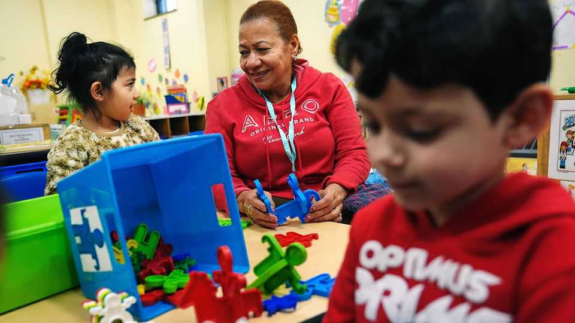

Business | Pay to play
Private equity is reshaping American child care
It is introducing scale and efficiency, but raising questions about quality
November 20th 2025 
 

 
A SPOT AT Little Friends, an independent child-care centre in Greenwich, Connecticut, is highly sought-after. Parent testimonials are glowing. The waiting list is years long. Yet the competition for enrolment may not be as fierce as the competition to buy it. Verna Esposito, who founded and runs the centre, has watched for years as private-equity firms have snapped up struggling rivals. They would gladly add her centre to their ranks. "They email, they call—they even sent me a Christmas gift," she says. "It's relentless." As the covid-19 pandemic disrupted the child-care industry, large firms acquired small providers at low valuations. Firms run by private-equity shops now control 10-12% of America's child-care market, measured by 
total capacity. Eight of the 11 largest child-care providers are owned by private equity. 

备注

- <strong><em>sought-after</em></strong>：/[sɔːt ˈɑːftə]/ "抢手的"；文中用来表达Little Friends托儿中心的位置非常抢手，强调其受欢迎程度；固定短语，指抢手的或受欢迎的。 
- <strong><em>testimonials</em></strong>：/[ˌtestɪˈməʊniəlz]/ "推荐信、证言"；文中用来表达家长的推荐信，强调托儿中心的好评；由testimonial（推荐信）加-s构成。 
- <strong><em>glowing</em></strong>：/[ˈɡləʊɪŋ]/ "热烈的、赞美的"；文中用来表达推荐信是热烈的赞美，强调家长对托儿中心的满意；由glow（发光）加-ing构成。 
- <strong><em>enrolment</em></strong>：/[ɪnˈrəʊlmənt]/ "注册、入学"；文中用来表达注册的竞争，强调托儿中心的受欢迎程度；由enrol（注册）加-ment构成。 
- <strong><em>snapped up</em></strong>：/[snæpt ʌp]/ "抢购、收购"；文中用来表达私募股权公司抢购陷入困境的竞争对手，强调收购的迅速；固定短语，指抢购或收购。 
- <strong><em>relentless</em></strong>：/[rɪˈlentləs]/ "不懈的、持续的"；文中用来表达收购努力是不懈的，强调私募股权公司的坚持；由relent（放松）加-less构成。 
- <strong><em>disrupted</em></strong>：/[dɪsˈrʌptɪd]/ "扰乱、中断"；文中用来表达疫情扰乱了托儿行业，强调这是收购的背景；动词原形是disrupt（扰乱）。 
- <strong><em>valuations</em></strong>：/[ˌvæljuˈeɪʃənz]/ "估值"；文中用来表达以低估值收购小型提供商，强调收购的时机；由valuation（估值）加-s构成。 
- <strong><em>capacity</em></strong>：/[kəˈpæsɪti]/ "容量、能力"；文中用来表达总容量，强调这是衡量市场份额的方式；指容量或能力。 
 
Private equity's bet is two-pronged. First, there will be economies of scale. Child care is a fragmented industry, mostly made up of independent providers. Consolidating such businesses is a hallmark strategy of private equity. Big chains can centralise procurement and use technology to streamline administration. Second, they can charge more. Enrolment fees at the Primrose School, a private-equity-owned chain, can be about 50% higher than those of independent centres nearby. That parents would pay was not certain—on average, spending on child care makes up 9-16% of median family income. But it seems to be working. Chains enjoy operating margins of 15-20%, say insiders. 

备注

- <strong><em>two-pronged</em></strong>：/[tuː prɒŋd]/ "双管齐下的"；文中用来表达私募股权的赌注是双管齐下的，强调策略的两个方面；由two（两）和pronged（分叉的）构成。 
- <strong><em>economies of scale</em></strong>：/[ɪˈkɒnəmiz ɒv skeɪl]/ "规模经济"；文中用来表达规模经济，强调这是私募股权的第一个策略；固定短语，指规模经济。 
- <strong><em>fragmented</em></strong>：/[fræɡˈmentɪd]/ "分散的"；文中用来表达托儿行业是分散的，强调行业的现状；动词原形是fragment（分散）。 
- <strong><em>Consolidating</em></strong>：/[kənˈsɒlɪdeɪtɪŋ]/ "整合"；文中用来表达整合这些业务，强调这是私募股权的标志性策略；动词原形是consolidate（整合）。 
- <strong><em>hallmark</em></strong>：/[ˈhɔːlmɑːk]/ "标志、特征"；文中用来表达标志性策略，强调这是私募股权的典型做法；由hall（大厅）和mark（标记）构成。 
- <strong><em>centralise</em></strong>：/[ˈsentrəlaɪz]/ "集中"；文中用来表达集中采购，强调大型连锁的优势；由central（中心的）加-ise构成。 
- <strong><em>procurement</em></strong>：/[prəˈkjʊəmənt]/ "采购"；文中用来表达采购，强调大型连锁可以集中采购；由procure（采购）加-ment构成。 
- <strong><em>streamline</em></strong>：/[ˈstriːmlaɪn]/ "简化、优化"；文中用来表达优化管理，强调技术的使用；由stream（流）和line（线）构成。 
- <strong><em>margins</em></strong>：/[ˈmɑːdʒɪnz]/ "利润率"；文中用来表达运营利润率，强调连锁的盈利能力；由margin（利润率）加-s构成。 
- <strong><em>insiders</em></strong>：/[ɪnˈsaɪdəz]/ "内部人士"；文中用来表达内部人士的说法，强调这是行业信息；由insider（内部人士）加-s构成。 
 
It is easy to see the appeal of large chains. Parents find it hard to judge the quality of independent centres. Chain facilities often look shiny, new and clean. Scale makes it easier to offer flashy technologies, like apps that update parents on milk consumption and naps. If a child at a centre is neglected the entire business suffers, encouraging high standards. Opting for a chain may therefore seem less risky. 

备注

- <strong><em>appeal</em></strong>：/[əˈpiːl]/ "吸引力"；文中用来表达大型连锁的吸引力，强调其优势；指吸引力或魅力。 
- <strong><em>flashy</em></strong>：/[ˈflæʃi]/ "花哨的、炫目的"；文中用来表达花哨的技术，强调大型连锁提供的技术；由flash（闪光）加-y构成。 
- <strong><em>consumption</em></strong>：/[kənˈsʌmpʃən]/ "消费、消耗"；文中用来表达牛奶消耗，强调应用程序的功能；由consume（消耗）加-tion构成。 
- <strong><em>neglected</em></strong>：/[nɪˈɡlektɪd]/ "被忽视的"；文中用来表达如果孩子被忽视，强调质量的重要性；动词原形是neglect（忽视）。 
 
Yet child-care centres cater to two customers: parents and the child. Parents may be mollified by shiny facilities and apps—but babies tend to do best when paid lots of attention by trusted caregivers. It is less clear that private- equity backed chains provide this. They tend to pay staff poorly. In Connecticut, teachers at KinderCare earn $16.49 an hour; those at Little Friends get $21.50 an hour, plus benefits. A former director at a chain backed by private equity says hiring good teachers at such low wages was nearly impossible, forcing her to retain staff unfit to care for children. In forums, day-care workers moan about chains operating "at ratio", meaning they must care for the maximum number of children state rules allow. Such tactics make bathroom breaks a logistical nightmare. 

备注

- <strong><em>cater to</em></strong>：/[ˈkeɪtə tuː]/ "迎合、满足"；文中用来表达托儿中心迎合两个客户，强调服务的对象；固定短语，指迎合或满足。 
- <strong><em>mollified</em></strong>：/[ˈmɒlɪfaɪd]/ "安抚、平息"；文中用来表达家长可能被闪亮的设施和应用程序安抚，强调表面的吸引力；动词原形是mollify（安抚）。 
- <strong><em>caregivers</em></strong>：/[ˈkeəɡɪvəz]/ "照顾者"；文中用来表达值得信赖的照顾者，强调婴儿需要关注；由care（照顾）和giver（给予者）加-s构成。 
- <strong><em>retain</em></strong>：/[rɪˈteɪn]/ "保留、留住"；文中用来表达被迫留住不适合照顾孩子的员工，强调低工资的问题；指保留或留住。 
- <strong><em>unfit</em></strong>：/[ʌnˈfɪt]/ "不适合的"；文中用来表达不适合照顾孩子的员工，强调质量问题的严重性；由un-（不）和fit（适合）构成。 
- <strong><em>forums</em></strong>：/[ˈfɔːrəmz]/ "论坛"；文中用来表达在论坛中，强调日托工作者的抱怨；由forum（论坛）加-s构成。 
- <strong><em>moan</em></strong>：/[məʊn]/ "抱怨、呻吟"；文中用来表达日托工作者抱怨，强调他们对连锁的不满；指抱怨或呻吟。 
- <strong><em>tactics</em></strong>：/[ˈtæktɪks]/ "策略、手段"；文中用来表达这些策略，强调连锁的做法；由tactic（策略）加-s构成。 
- <strong><em>logistical</em></strong>：/[ləˈdʒɪstɪkəl]/ "后勤的"；文中用来表达后勤噩梦，强调这些策略带来的问题；由logistics（后勤）加-al构成。 
 
Lawmakers are worried. In 2024 Massachusetts passed a bill that limits how much public funding large for-profit chains can claim, which will hurt private-equity operations. Vermont capped tuition-fee rises for publicly funded providers after Little Sprouts, a French chain backed by private 
equity, acquired local centres. Yet the government is rarely adept at setting prices or pay. Looking after children could be about to get even messier. ■ 

备注

- <strong><em>lawmakers</em></strong>：/[ˈlɔːmeɪkəz]/ "立法者"；文中用来表达立法者担心，强调政府对问题的关注；由law（法律）和maker（制定者）加-s构成。 
- <strong><em>funding</em></strong>：/[ˈfʌndɪŋ]/ "资金、资助"；文中用来表达公共资金，强调政府对大型营利连锁的限制；由fund（资助）加-ing构成。 
- <strong><em>capped</em></strong>：/[kæpt]/ "限制、封顶"；文中用来表达限制学费上涨，强调佛蒙特州的政策；动词原形是cap（限制）。 
- <strong><em>tuition-fee</em></strong>：/[tjuˈɪʃən fiː]/ "学费"；文中用来表达学费，强调政府对学费上涨的限制；tuition指学费，fee指费用。 
- <strong><em>adept</em></strong>：/[əˈdept]/ "熟练的、擅长的"；文中用来表达政府很少擅长设定价格或工资，强调政府能力的限制；指熟练的或擅长的。 
- <strong><em>messier</em></strong>：/[ˈmesiə]/ "更混乱的"；文中用来表达照顾孩子可能变得更混乱，强调问题的严重性；由messy（混乱的）加-er构成。 
 
To stay on top of the biggest stories in business and technology, sign up to the Bottom Line, our weekly subscriber-only newsletter. 
This article was downloaded by zlibrary from https://www.economist.com//business/2025/11/20/private-equity-is-reshaping- american-child-care 
