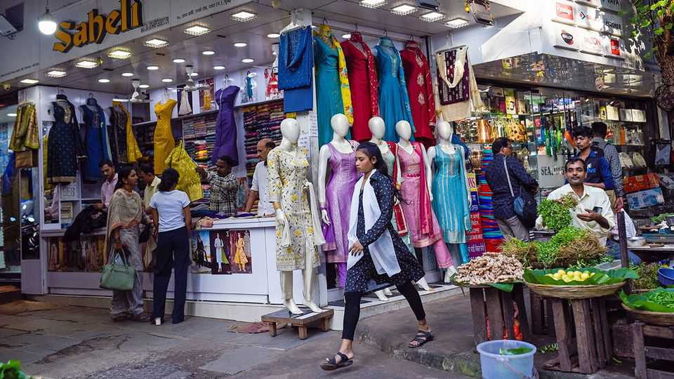

Business | New markets
Indians are getting more fashionable
Cheap data, cheaper clothes and improving logistics have made trends more accessible
November 20th 2025 
 

IT WOULD BE a stretch ever to describe Mumbai's Hill Road as deserted. But the shopping street does look a bit less packed lately. Business has not been the same since the pandemic, says Sheikh Aziz, who along with his brother runs a pair of shops selling children's and women's garments for between 250 and 350 rupees ($3-4). They blame the internet. "Why should people spend money on a rickshaw to come here when they get whatever they want sitting at home?" he says. Every Indian city has at least one district dedicated to inexpensive, unbranded clothing, filled with small traders like Mr Aziz, who form the backbone of Indian markets. Four-fifths of India's $1trn in retail spending 
last year—and three-fifths of the $100bn spent on fashion—took place in shops and stalls like his. 

备注

- <strong><em>stretch</em></strong>：/[stretʃ]/ "夸张、延伸"；文中用来表达夸张，强调很难说Hill Road是荒凉的；指夸张或延伸。 
- <strong><em>deserted</em></strong>：/[dɪˈzɜːtɪd]/ "荒凉的、空无一人的"；文中用来表达荒凉的，强调Hill Road并不荒凉；动词原形是desert（遗弃）。 
- <strong><em>garments</em></strong>：/[ˈɡɑːmənts]/ "服装"；文中用来表达服装，强调阿齐兹兄弟销售的物品；由garment（服装）加-s构成。 
- <strong><em>rickshaw</em></strong>：/[ˈrɪkʃɔː]/ "人力车"；文中用来表达人力车，强调人们不需要花钱坐车来购物；指人力车或三轮车。 
- <strong><em>inexpensive</em></strong>：/[ˌɪnɪkˈspensɪv]/ "便宜的"；文中用来表达便宜的服装，强调这些地区的特色；由in-（不）和expensive（昂贵的）构成。 
- <strong><em>unbranded</em></strong>：/[ʌnˈbrændɪd]/ "无品牌的"；文中用来表达无品牌服装，强调这些地区的特色；由un-（无）和branded（品牌的）构成。 
- <strong><em>backbone</em></strong>：/[ˈbækbəʊn]/ "支柱、骨干"；文中用来表达市场的支柱，强调小商贩的重要性；由back（背）和bone（骨头）构成。 
- <strong><em>stalls</em></strong>：/[stɔːlz]/ "摊位"；文中用来表达摊位，强调传统零售形式；由stall（摊位）加-s构成。 
 
That started to change with the pandemic. A mobile-broadband boom some years earlier had caused the price of data to plummet; so a bored country used its spare time to explore online shopping. E-commerce platforms doubled their share of the fashion market to nearly 15% between 2019 and 2024, according to HSBC, a bank. That is still well below China and America, where 40% of fashion is purchased online. But it is growing fast. 

备注

- <strong><em>broadband</em></strong>：/[ˈbrɔːdbænd]/ "宽带"；文中用来表达移动宽带，强调数据价格的下降；由broad（宽的）和band（带）构成。 
- <strong><em>plummet</em></strong>：/[ˈplʌmɪt]/ "暴跌、急剧下降"；文中用来表达数据价格暴跌，强调价格下降的幅度；指暴跌或急剧下降。 
- <strong><em>spare time</em></strong>：/[speə taɪm]/ "空闲时间"；文中用来表达空闲时间，强调疫情期间人们有时间探索网购；固定短语，指空闲时间。 
- <strong><em>E-commerce</em></strong>：/[iː ˈkɒmɜːs]/ "电子商务"；文中用来表达电子商务平台，强调在线购物；由e-（电子）和commerce（商业）构成。 
 
Driving the shift are companies like Meesho, an e-commerce platform backed by SoftBank, a Japanese tech investor. The number of people buying goods on the platform in the past 12 months hit 199m this year, up from 2m in 2020. Last month the company filed paperwork to go public at a hoped- for valuation of $7bn-8bn. Though it is just one of several platforms dedicated to fashion, which include Walmart-owned Myntra, it is the one that competes most directly with Mr Aziz. Shoppers can get hold of a sari at the rock-bottom price of 266 rupees—including delivery. 

备注

- <strong><em>backed</em></strong>：/[bækt]/ "支持的、投资的"；文中用来表达由软银支持的，强调Meesho的投资者；动词原形是back（支持）。 
- <strong><em>filed</em></strong>：/[faɪld]/ "提交"；文中用来表达提交文件，强调Meesho准备上市；动词原形是file（提交）。 
- <strong><em>paperwork</em></strong>：/[ˈpeɪpəwɜːk]/ "文件、文书工作"；文中用来表达文件，强调上市所需的文件；由paper（纸）和work（工作）构成。 
- <strong><em>valuation</em></strong>：/[ˌvæljuˈeɪʃən]/ "估值"；文中用来表达估值，强调Meesho的期望市值；由value（价值）加-ation构成。 
- <strong><em>dedicated</em></strong>：/[ˈdedɪkeɪtɪd]/ "专门的、专注的"；文中用来表达专门从事时尚的平台，强调这些平台的定位；动词原形是dedicate（致力于）。 
- <strong><em>sari</em></strong>：/[ˈsɑːri]/ "纱丽"；文中用来表达纱丽，强调这是印度传统服装；指印度传统女性服装。 
- <strong><em>rock-bottom</em></strong>：/[rɒk ˈbɒtəm]/ "最低的"；文中用来表达最低价格，强调Meesho的价格优势；固定短语，指最低的。 
 
The three-dollar sari illustrates two big shifts occurring in the Indian marketplace. The first is structural. Platforms like Meesho are dragging small Indian businesses—which is most of them—away from the inefficient, unorganised market and into the formal economy. Five years ago 85% of Indian retail was informal. By 2030 the share is likely to fall to around 66- 68%, according to Meesho's prospectus. 

备注

- <strong><em>illustrates</em></strong>：/[ˈɪləstreɪts]/ "说明、展示"；文中用来表达说明两个大转变，强调三美元纱丽的象征意义；动词原形是illustrate（说明）。 
- <strong><em>marketplace</em></strong>：/[ˈmɑːkɪtpleɪs]/ "市场"；文中用来表达印度市场，强调这些转变发生的地方；由market（市场）和place（地方）构成。 
- <strong><em>structural</em></strong>：/[ˈstrʌktʃərəl]/ "结构的"；文中用来表达结构性的转变，强调这是第一个转变；由structure（结构）加-al构成。 
- <strong><em>unorganised</em></strong>：/[ʌnˈɔːɡənaɪzd]/ "无组织的"；文中用来表达无组织的市场，强调传统市场的特点；由un-（无）和organised（有组织的）构成。 
- <strong><em>formal economy</em></strong>：/[ˈfɔːməl ɪˈkɒnəmi]/ "正规经济"；文中用来表达正规经济，强调小企业进入正规经济；formal指正规的，economy指经济。 
- <strong><em>prospectus</em></strong>：/[prəˈspektəs]/ "招股说明书"；文中用来表达招股说明书，强调这是Meesho的数据来源；指招股说明书或计划书。 
 
The second shift has to do with market size. E-commerce platforms open up new opportunities for vendors, expanding their horizons from a neighbourhood to the entire country. Amazon and Myntra mostly cater to big cities. But at Meesho's prices, says an analyst, the market is in effect "unlimited". Meesho is attractive to small sellers because it does not take a commission and instead charges fees for delivery and advertising. That allows it to keep costs low and take market share from street vendors, rather than competing with e-commerce rivals. Amazon and Myntra have recently launched low-cost fashion arms. 

备注

- <strong><em>vendors</em></strong>：/[ˈvendəz]/ "供应商、卖家"；文中用来表达供应商，强调电商平台为卖家提供机会；由vendor（供应商）加-s构成。 
- <strong><em>horizons</em></strong>：/[həˈraɪzənz]/ "视野、范围"；文中用来表达视野，强调从邻里扩展到全国；由horizon（视野）加-s构成。 
- <strong><em>cater to</em></strong>：/[ˈkeɪtə tuː]/ "迎合、服务"；文中用来表达主要服务大城市，强调Amazon和Myntra的定位；固定短语，指迎合或服务。 
- <strong><em>commission</em></strong>：/[kəˈmɪʃən]/ "佣金"；文中用来表达不收取佣金，强调Meesho的商业模式；指佣金或手续费。 
- <strong><em>rivals</em></strong>：/[ˈraɪvəlz]/ "竞争对手"；文中用来表达电商竞争对手，强调Meesho的竞争策略；由rival（竞争对手）加-s构成。 
 
The corollary of a bigger market for sellers is an expansion in customer choice. "What has changed in the past four-five years is access," says Joseph 
Sebastian of Blume, a venture-capital firm. Back then shoppers had to travel to urban centres or market towns "because there was nothing around you where you can spend", says Avi Mehta of Macquarie, a bank. India's unreliable postal system and incomprehensible addresses made e-commerce delivery uneconomic. But the rise of startups such as Delhivery, a firm built around a weak pun, as well as the in-house logistics arms of the big e- commerce platforms, has made it possible to send goods to the most remote parts of India. Nine in ten of Meesho's shoppers live outside of the country's eight biggest cities. 

备注

- <strong><em>corollary</em></strong>：/[kəˈrɒləri]/ "必然结果、推论"；文中用来表达必然结果，强调更大的市场带来更多选择；指必然结果或推论。 
- <strong><em>venture-capital</em></strong>：/[ˈventʃə ˈkæpɪtəl]/ "风险投资"；文中用来表达风险投资公司，强调Blume的性质；venture指风险，capital指资本。 
- <strong><em>unreliable</em></strong>：/[ˌʌnrɪˈlaɪəbəl]/ "不可靠的"；文中用来表达不可靠的邮政系统，强调印度物流的挑战；由un-（不）和reliable（可靠的）构成。 
- <strong><em>incomprehensible</em></strong>：/[ɪnˌkɒmprɪˈhensəbəl]/ "难以理解的"；文中用来表达难以理解的地址，强调印度地址系统的复杂性；由in-（不）和comprehensible（可理解的）构成。 
- <strong><em>uneconomic</em></strong>：/[ˌʌniːkəˈnɒmɪk]/ "不经济的"；文中用来表达不经济的配送，强调电商配送的困难；由un-（不）和economic（经济的）构成。 
- <strong><em>startups</em></strong>：/[ˈstɑːtʌps]/ "初创公司"；文中用来表达初创公司，强调Delhivery等公司的作用；由startup（初创公司）加-s构成。 
- <strong><em>pun</em></strong>：/[pʌn]/ "双关语"；文中用来表达弱双关语，强调Delhivery公司名称的文字游戏；指双关语或文字游戏。 
- <strong><em>in-house</em></strong>：/[ɪn haʊs]/ "内部的"；文中用来表达内部物流部门，强调大电商平台的物流能力；固定短语，指内部的。 
- <strong><em>logistics</em></strong>：/[ləˈdʒɪstɪks]/ "物流"；文中用来表达物流，强调配送能力；指物流或后勤。 
- <strong><em>remote</em></strong>：/[rɪˈməʊt]/ "偏远的"；文中用来表达最偏远的地区，强调配送范围的扩大；指偏远的或遥远的。 
 
Taken together, these shifts hint at a change that transcends business and transforms society more broadly. Social media and e-commerce have boosted the aspirations and consumption of small towns. Mr Sebastian, who grew up in a small town in Kerala called Kattappana and now lives in Bangalore, says he can see the change when he returns. In his youth big-city trends would reach his town years later. Now, he says, "young people there look a lot like young people in Koramanagala," a hip corner of Bangalore. ■ 

备注

- <strong><em>transcends</em></strong>：/[trænˈsendz]/ "超越"；文中用来表达超越商业，强调这些转变的影响范围；动词原形是transcend（超越）。 
- <strong><em>aspirations</em></strong>：/[ˌæspɪˈreɪʃənz]/ "愿望、抱负"；文中用来表达愿望和消费，强调小城镇的变化；由aspiration（愿望）加-s构成。 
- <strong><em>hip</em></strong>：/[hɪp]/ "时尚的、潮流的"；文中用来表达时尚的角落，强调Koramanagala的时尚；指时尚的或潮流的。 
 
To stay on top of the biggest stories in business and technology, sign up to the Bottom Line, our weekly subscriber-only newsletter. 
This article was downloaded by zlibrary from [https://www.economist.com//business/2025/11/20/indians-are-getting-more-fashionable](https://www.economist.com//business/2025/11/20/indians-are-getting-more-fashionable)
