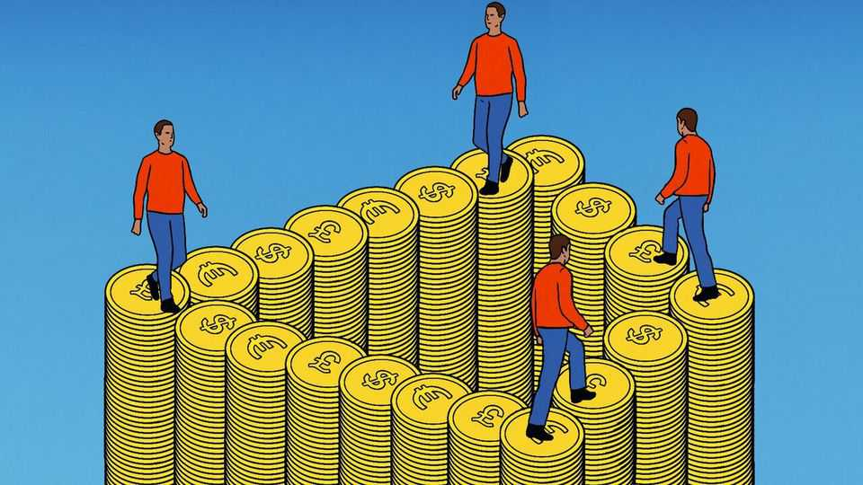
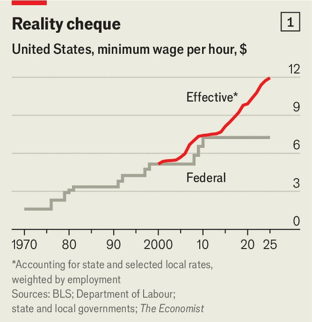
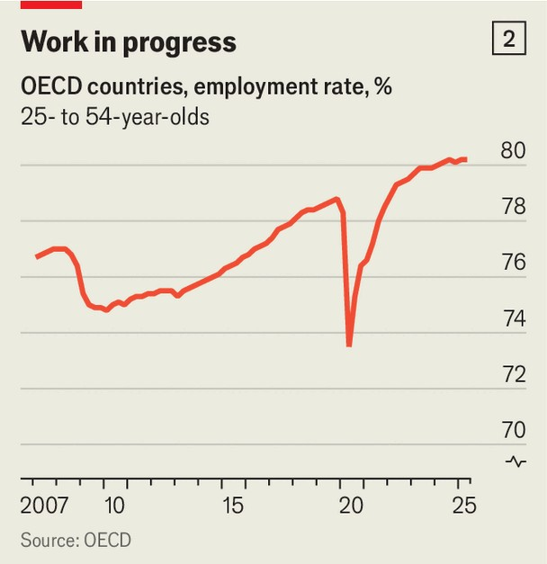

Finance & economics | How high is too high?
Economists get cold feet about high minimum wages
Governments are pushing the policy to its limits
November 20th 2025 
 

IN THE BARRIO of Iztapalapa, on Mexico City's eastern flank, the pavements stay busy even in the punishing afternoon sun. Street vendors hawk snacks from metal carts; waiters from corner taquerías weave between tables and traffic; cashiers in the ubiquitous convenience stores ring up a steady stream of small purchases. Young adults in knock-off sportswear mingle with stooped, gap-toothed old folk. Outside a private-security firm, a sun-bleached façade is plastered with notices advertising for security guards at the legal minimum rate of 278.8 pesos ($15.20) per day. Life in Iztapalapa can be hard. But for many workers it might have been worse without the striking recent increases in the minimum wage. Between 
2014 and 2024 it doubled relative to median pay, from 37% of the middle income to 74%. It is the most extreme example of a worldwide trend, encompassing places far richer than Mexico. Over the same period Britain has increased its minimum wage from 47% to 61% of median earnings. South Korea's ratio has followed a similar trajectory. Germany introduced its first minimum wage in 2015; it is now worth 51% of median pay. New Zealand's pay floor is almost at Mexican levels, relative to its much higher incomes. 

备注

- <strong><em>barrio</em></strong>：/[ˈbæriəʊ]/ "社区、街区"；文中用来表达Iztapalapa社区，强调这是墨西哥城的一个区域；指社区或街区（西班牙语）。 
- <strong><em>flank</em></strong>：/[flæŋk]/ "侧翼、侧面"；文中用来表达东侧，强调Iztapalapa的位置；指侧翼或侧面。 
- <strong><em>pavements</em></strong>：/[ˈpeɪvmənts]/ "人行道"；文中用来表达人行道，强调街道的繁忙；由pavement（人行道）加-s构成。 
- <strong><em>punishing</em></strong>：/[ˈpʌnɪʃɪŋ]/ "严酷的"；文中用来表达严酷的下午阳光，强调天气炎热；动词原形是punish（惩罚）。 
- <strong><em>vendors</em></strong>：/[ˈvendəz]/ "小贩"；文中用来表达街头小贩，强调街道的繁忙；由vendor（小贩）加-s构成。 
- <strong><em>hawk</em></strong>：/[hɔːk]/ "叫卖"；文中用来表达叫卖零食，强调小贩的行为；指叫卖或兜售。 
- <strong><em>taquerías</em></strong>：/[tɑːkəˈriːəz]/ "墨西哥卷饼店"；文中用来表达墨西哥卷饼店，强调墨西哥的特色；指墨西哥卷饼店（西班牙语）。 
- <strong><em>ubiquitous</em></strong>：/[juːˈbɪkwɪtəs]/ "无处不在的"；文中用来表达无处不在的便利店，强调便利店的普遍；指无处不在的或普遍存在的。 
- <strong><em>knock-off</em></strong>：/[nɒk ɒf]/ "仿冒的"；文中用来表达仿冒的运动服，强调年轻人的穿着；固定短语，指仿冒的或廉价的。 
- <strong><em>stooped</em></strong>：/[stuːpt]/ "驼背的"；文中用来表达驼背的老人，强调老人的特征；动词原形是stoop（弯腰）。 
- <strong><em>gap-toothed</em></strong>：/[ɡæp tuːθt]/ "牙齿有缝隙的"；文中用来表达牙齿有缝隙的，强调老人的特征；由gap（缝隙）和toothed（有牙齿的）构成。 
- <strong><em>façade</em></strong>：/[fəˈsɑːd]/ "外观、立面"；文中用来表达被阳光漂白的外观，强调建筑物的外观；指外观或立面。 
- <strong><em>plastered</em></strong>：/[ˈplɑːstəd]/ "贴满的"；文中用来表达贴满通知，强调外观上的通知；动词原形是plaster（贴）。 
- <strong><em>striking</em></strong>：/[ˈstraɪkɪŋ]/ "显著的"；文中用来表达显著的增加，强调最低工资的增长；动词原形是strike（打击）。 
- <strong><em>median</em></strong>：/[ˈmiːdiən]/ "中位数"；文中用来表达中位数工资，强调最低工资与中位数工资的比例；指中位数或中间值。 
- <strong><em>encompassing</em></strong>：/[ɪnˈkʌmpəsɪŋ]/ "包括"；文中用来表达包括，强调这个趋势的范围；动词原形是encompass（包括）。 
- <strong><em>trajectory</em></strong>：/[trəˈdʒektəri]/ "轨迹、路径"；文中用来表达类似的轨迹，强调韩国的趋势；指轨迹或路径。 
- <strong><em>pay floor</em></strong>：/[peɪ flɔː]/ "工资底限"；文中用来表达工资底限，强调最低工资；pay指工资，floor指底限。 
 
America's federal minimum wage, of $7.25 an hour, was last changed in 2009. Yet state and local legislators in Democratic areas have repeatedly raised local pay floors. California's is now $16.50 an hour, nearly double what it was a decade ago. In Emeryville, a small city that is home to Pixar, an animation studio, the local minimum is $19.90 an hour. All these initiatives make the federal minimum irrelevant, with less than 1% of workers across the country receiving it. Compiling data from a range of sources, we estimate that America's "effective minimum wage"—the wage floor covering the average worker—has reached around $12 an hour (see chart 1). It will rise even higher if Zohran Mamdani, New York's mayor- elect, follows through on a pledge to raise the city's minimum wage from $16.50 today to $30 by 2030. 

备注

- <strong><em>legislators</em></strong>：/[ˈledʒɪsleɪtəz]/ "立法者"；文中用来表达州和地方立法者，强调提高最低工资的决策者；由legislator（立法者）加-s构成。 
- <strong><em>initiatives</em></strong>：/[ɪˈnɪʃətɪvz]/ "倡议、措施"；文中用来表达这些措施，强调地方提高最低工资的行动；由initiative（倡议）加-s构成。 
- <strong><em>irrelevant</em></strong>：/[ɪˈreləvənt]/ "无关的、不重要的"；文中用来表达无关紧要，强调联邦最低工资的作用下降；由ir-（不）和relevant（相关的）构成。 
- <strong><em>Compiling</em></strong>：/[kəmˈpaɪlɪŋ]/ "编译、汇总"；文中用来表达汇总数据，强调估计的方法；动词原形是compile（编译）。 
- <strong><em>effective</em></strong>：/[ɪˈfektɪv]/ "有效的、实际的"；文中用来表达实际最低工资，强调覆盖平均工人的工资底限；指有效的或实际的。 
- <strong><em>mayor-elect</em></strong>：/[meə ɪˈlekt]/ "当选市长"；文中用来表达当选市长，强调Mamdani的身份；mayor指市长，elect指当选的。 
- <strong><em>pledge</em></strong>：/[pledʒ]/ "承诺、誓言"；文中用来表达承诺，强调Mamdani的计划；指承诺或誓言。 

 

Governments' embrace of high minimum wages is not a fad. It reflects the favourable attitude of many economists towards the policy since the turn of the century. Unfortunately, just as minimum wages are reaching new heights, the scholarly tide is turning again. The latest research suggests minimum wages may have nasty side-effects after all. 

备注

- <strong><em>embrace</em></strong>：/[ɪmˈbreɪs]/ "拥抱、接受"；文中用来表达接受高最低工资，强调政府的政策；指拥抱或接受。 
- <strong><em>fad</em></strong>：/[fæd]/ "时尚、潮流"；文中用来表达不是时尚，强调政策的持续性；指时尚或短暂的潮流。 
- <strong><em>favourable</em></strong>：/[ˈfeɪvərəbəl]/ "有利的、支持的"；文中用来表达有利的态度，强调经济学家对政策的支持；指有利的或支持的。 
- <strong><em>scholarly</em></strong>：/[ˈskɒləli]/ "学术的"；文中用来表达学术潮流，强调研究趋势的变化；由scholar（学者）加-ly构成。 
- <strong><em>nasty</em></strong>：/[ˈnɑːsti]/ "严重的、令人不快的"；文中用来表达严重的副作用，强调最新研究的发现；指严重的或令人不快的。 
 
Economists had traditionally disliked minimum wages on the basis of simple supply and demand: compulsory high pay destroys jobs and pushes workers to the informal sector. In 1994 the OECD cautioned against the policy, favouring "direct" redistribution. But the same year landmark research by David Card and Alan Krueger, two American economists, was published, finding that a minimum-wage increase in New Jersey had not affected fast- food employment compared with neighbouring Pennsylvania. Others devised similar studies. Most found that minimum wages reduced employment, but only by a little. 

备注

- <strong><em>compulsory</em></strong>：/[kəmˈpʌlsəri]/ "强制的"；文中用来表达强制高工资，强调最低工资的性质；指强制的或义务的。 
- <strong><em>informal sector</em></strong>：/[ɪnˈfɔːməl ˈsektə]/ "非正规部门"；文中用来表达非正规部门，强调工人被推向非正规就业；informal指非正规的，sector指部门。 
- <strong><em>cautioned</em></strong>：/[ˈkɔːʃənd]/ "警告、提醒"；文中用来表达警告，强调OECD对政策的谨慎；动词原形是caution（警告）。 
- <strong><em>redistribution</em></strong>：/[ˌriːdɪstrɪˈbjuːʃən]/ "再分配"；文中用来表达直接再分配，强调OECD偏好的政策；由re-（重新）和distribution（分配）构成。 
- <strong><em>landmark</em></strong>：/[ˈlændmɑːk]/ "里程碑式的"；文中用来表达里程碑式的研究，强调Card和Krueger研究的重要性；由land（土地）和mark（标记）构成。 
- <strong><em>devised</em></strong>：/[dɪˈvaɪzd]/ "设计、制定"；文中用来表达设计类似研究，强调其他研究者的工作；动词原形是devise（设计）。 
 
That "little" got smaller and smaller over time—as a database of research maintained by Arindrajit Dube of the University of Massachusetts, Amherst and Ben Zipperer of the Economic Policy Institute, a think-tank, demonstrates. In the early 2000s the literature indicated that a 1% increase in wages caused by a higher minimum wage would lead to a 0.5% decline in employment. By the late 2010s the effect had fallen to around zero. 

备注

- <strong><em>maintained</em></strong>：/[meɪnˈteɪnd]/ "维护、保持"；文中用来表达维护数据库，强调Dube和Zipperer的工作；动词原形是maintain（维护）。 
- <strong><em>think-tank</em></strong>：/[θɪŋk tæŋk]/ "智库"；文中用来表达智库，强调经济政策研究所的性质；固定短语，指智库或智囊团。 
- <strong><em>literature</em></strong>：/[ˈlɪtərɪtʃə]/ "文献"；文中用来表达文献，强调研究文献的发现；指文献或文学作品。 
- <strong><em>decline</em></strong>：/[dɪˈklaɪn]/ "下降"；文中用来表达就业下降，强调最低工资的影响；指下降或衰退。 

 

Sceptics disputed the "new" literature, claiming it was statistically flawed. "There is no consensus on the employment effects of the minimum wage," summarised Alan Manning of the London School of Economics in 2021, even if the effect is "elusive". (One earlier study found that support for minimum wages rose with physical distance from Chicago, the home of free-market economics.) But the pro-minimum-wage group had the ear of policymakers, who jumped at the chance to fight inequality without spending money. A review for the British government, written in 2019 by Mr Dube, concluded that "research from...developed countries points to a very muted effect of minimum wages on employment". Sure enough, the higher minimum wages of the 2010s coincided with a jobs boom in which the employment rates of prime-age workers in the rich world hit all-time highs (see chart 2). 

备注

- <strong><em>Sceptics</em></strong>：/[ˈskeptɪks]/ "怀疑者"；文中用来表达怀疑者，强调对"新"文献的质疑；由sceptic（怀疑者）加-s构成。 
- <strong><em>disputed</em></strong>：/[dɪˈspjuːtɪd]/ "质疑、争论"；文中用来表达质疑，强调怀疑者的观点；动词原形是dispute（质疑）。 
- <strong><em>statistically</em></strong>：/[stəˈtɪstɪkli]/ "统计上"；文中用来表达统计上有缺陷，强调怀疑者的批评；由statistical（统计的）加-ly构成。 
- <strong><em>flawed</em></strong>：/[flɔːd]/ "有缺陷的"；文中用来表达有缺陷的，强调怀疑者的批评；动词原形是flaw（使有缺陷）。 
- <strong><em>consensus</em></strong>：/[kənˈsensəs]/ "共识"；文中用来表达没有共识，强调对就业影响的争议；指共识或一致意见。 
- <strong><em>elusive</em></strong>：/[ɪˈluːsɪv]/ "难以捉摸的"；文中用来表达难以捉摸的，强调影响的不确定性；指难以捉摸的或难以理解的。 
- <strong><em>pro-minimum-wage</em></strong>：/[prəʊ ˈmɪnɪməm weɪdʒ]/ "支持最低工资的"；文中用来表达支持最低工资的群体，强调他们的影响力；由pro-（支持）和minimum wage（最低工资）构成。 
- <strong><em>policymakers</em></strong>：/[ˈpɒlɪsimeɪkəz]/ "政策制定者"；文中用来表达政策制定者，强调他们听取了支持最低工资的群体；由policy（政策）和maker（制定者）加-s构成。 
- <strong><em>jumped at</em></strong>：/[dʒʌmpt æt]/ "抓住、利用"；文中用来表达抓住机会，强调政策制定者的行动；固定短语，指抓住或利用机会。 
- <strong><em>inequality</em></strong>：/[ˌɪnɪˈkwɒlɪti]/ "不平等"；文中用来表达不平等，强调最低工资的目标；由in-（不）和equality（平等）构成。 
- <strong><em>muted</em></strong>：/[ˈmjuːtɪd]/ "微弱的"；文中用来表达微弱的影响，强调Dube的结论；动词原形是mute（减弱）。 
- <strong><em>coincided</em></strong>：/[ˌkəʊɪnˈsaɪdɪd]/ "同时发生"；文中用来表达同时发生，强调最低工资与就业繁荣的巧合；动词原形是coincide（同时发生）。 
- <strong><em>prime-age</em></strong>：/[praɪm eɪdʒ]/ "黄金年龄的"；文中用来表达黄金年龄工人，强调就业率高的群体；prime指主要的，age指年龄。 
 
A counter-revolution was brewing, however. It first stirred in a study of minimum-wage hikes in Seattle in 2015 and 2016. Eventually published in 2022, the research tracking low-paid workers found that the policy caused a modest fall in their hours worked, even though they kept their jobs (and their pay rose overall). And although low-wage workers, on average, were not turfed out of work, the hiring of them slowed. By the third quarter of 2016 Seattle had 7.4% fewer low-paid jobs than a modelled counterfactual. This effect was lost in the overall employment figures because the city's highly paid professionals were in such high demand. 

备注

- <strong><em>counter-revolution</em></strong>：/[ˈkaʊntə ˌrevəˈluːʃən]/ "反革命、反向革命"；文中用来表达反向革命，强调研究趋势的转变；由counter-（反向）和revolution（革命）构成。 
- <strong><em>brewing</em></strong>：/[bruːɪŋ]/ "酝酿"；文中用来表达正在酝酿，强调趋势的转变；动词原形是brew（酝酿）。 
- <strong><em>stirred</em></strong>：/[stɜːd]/ "激起、引发"；文中用来表达引发，强调西雅图研究的作用；动词原形是stir（激起）。 
- <strong><em>hikes</em></strong>：/[haɪks]/ "提高、上涨"；文中用来表达最低工资提高，强调西雅图的政策；由hike（提高）加-s构成。 
- <strong><em>modest</em></strong>：/[ˈmɒdɪst]/ "适度的"；文中用来表达适度的下降，强调工作时间减少的程度；指适度的或谦虚的。 
- <strong><em>turfed out</em></strong>：/[tɜːft aʊt]/ "被解雇、被赶出"；文中用来表达没有被解雇，强调工人保住了工作；固定短语，指被解雇或被赶出。 
- <strong><em>counterfactual</em></strong>：/[ˌkaʊntəˈfæktʃuəl]/ "反事实的"；文中用来表达反事实模型，强调对比基准；指反事实的或假设的。 
 
The same year a working paper by Erik Hurst of the University of Chicago and three co-authors argued that it takes time for the costs of minimum wages to show up, as firms adjust their business models. But eventually a large increase "reduces the employment, income and welfare of precisely the low-income workers it is meant to help". Modest rises in the minimum wage might also create false confidence. Offsetting the market power of big employers, which might otherwise suppress wages by hiring too little, means that modest minimum wages create jobs. But as the pay floor rises too high, employment suffers after all. The threshold beyond which a blanket minimum wage distorts the American economy is below $8 per hour, according to research published in June by David Berger of Duke University and two co-authors. One problem they find is that pay floors are one-size- fits-all: "A minimum wage that eliminates [market] power at one firm causes severe rationing at another." 

备注

- <strong><em>working paper</em></strong>：/[ˈwɜːkɪŋ ˈpeɪpə]/ "工作论文"；文中用来表达工作论文，强调Hurst的研究；working指工作的，paper指论文。 
- <strong><em>co-authors</em></strong>：/[kəʊ ˈɔːθəz]/ "合著者"；文中用来表达合著者，强调Hurst的合作伙伴；由co-（共同）和author（作者）加-s构成。 
- <strong><em>welfare</em></strong>：/[ˈwelfeə]/ "福利"；文中用来表达福利，强调最低工资对低收入工人的负面影响；指福利或福祉。 
- <strong><em>false confidence</em></strong>：/[fɔːls ˈkɒnfɪdəns]/ "虚假信心"；文中用来表达虚假信心，强调适度提高可能产生的问题；false指虚假的，confidence指信心。 
- <strong><em>Offsetting</em></strong>：/[ˈɒfsetɪŋ]/ "抵消"；文中用来表达抵消，强调适度最低工资的作用；动词原形是offset（抵消）。 
- <strong><em>suppress</em></strong>：/[səˈpres]/ "抑制"；文中用来表达抑制工资，强调大雇主的市场力量；指抑制或压制。 
- <strong><em>threshold</em></strong>：/[ˈθreʃhəʊld]/ "门槛、临界点"；文中用来表达临界点，强调最低工资的限度；指门槛或临界点。 
- <strong><em>blanket</em></strong>：/[ˈblæŋkɪt]/ "全面的、统一的"；文中用来表达统一的最低工资，强调政策的性质；指全面的或统一的。 
- <strong><em>distorts</em></strong>：/[dɪˈstɔːts]/ "扭曲"；文中用来表达扭曲经济，强调最低工资过高的问题；动词原形是distort（扭曲）。 
- <strong><em>one-size-fits-all</em></strong>：/[wʌn saɪz fɪts ɔːl]/ "一刀切的"；文中用来表达一刀切的，强调最低工资的问题；固定短语，指一刀切的或通用的。 
- <strong><em>rationing</em></strong>：/[ˈræʃənɪŋ]/ "配给、限制"；文中用来表达严重配给，强调最低工资的问题；由ration（配给）加-ing构成。 
 
Other research sets out the distortions minimum wages can cause that do not show up in raw employment numbers. Big increases in the wage floor lead employers to make working schedules less predictable, according to a recent working paper by Hannah Farkas of Columbia University, in effect making the job worse as it pays more. They lead to more workplace injuries, according to a paper published in 2024 by Qing Liu of Renmin University of China and his colleagues, perhaps because bosses push their workers harder. And they can cause firms to reduce their investment, according to a recent working paper by DuckKi Cho of the University of Sydney—a finding that will disappoint those who speculate that high minimum wages have the benefit of forcing companies to focus on raising productivity. 

备注

- <strong><em>raw</em></strong>：/[rɔː]/ "原始的、未经处理的"；文中用来表达原始就业数字，强调这些数字可能不反映全部影响；指原始的或未经处理的。 
- <strong><em>predictable</em></strong>：/[prɪˈdɪktəbəl]/ "可预测的"；文中用来表达不可预测，强调工作时间表的问题；由predict（预测）加-able构成。 
- <strong><em>workplace injuries</em></strong>：/[ˈwɜːkpleɪs ˈɪndʒəriz]/ "工作场所伤害"；文中用来表达工作场所伤害，强调最低工资的负面影响；workplace指工作场所，injuries指伤害。 
- <strong><em>speculate</em></strong>：/[ˈspekjʊleɪt]/ "推测、猜测"；文中用来表达推测，强调一些人的期望；指推测或猜测。 
- <strong><em>productivity</em></strong>：/[ˌprɒdʌkˈtɪvɪti]/ "生产力"；文中用来表达提高生产力，强调一些人的期望；由productive（生产的）加-ity构成。 
 
Governments might tolerate a distorted economy in pursuit of higher pay. After all, minimum wages can be transformative. In Mexico income poverty fell from 50% to 35% between 2018 and 2024, meaning some 15.8m people had climbed above the poverty line. Although the law covers only the roughly 45% of workers who toil in the formal economy, it is believed to have dragged up pay in informal jobs too. 

备注

- <strong><em>tolerate</em></strong>：/[ˈtɒləreɪt]/ "容忍"；文中用来表达容忍扭曲的经济，强调政府可能接受代价；指容忍或忍受。 
- <strong><em>transformative</em></strong>：/[trænsˈfɔːmətɪv]/ "变革性的"；文中用来表达变革性的，强调最低工资的影响；由transform（变革）加-ive构成。 
- <strong><em>poverty line</em></strong>：/[ˈpɒvəti laɪn]/ "贫困线"；文中用来表达贫困线，强调墨西哥的成就；poverty指贫困，line指线。 
- <strong><em>toil</em></strong>：/[tɔɪl]/ "辛苦工作"；文中用来表达在正规经济中辛苦工作，强调工人的工作；指辛苦工作或劳动。 
- <strong><em>dragged up</em></strong>：/[dræɡd ʌp]/ "拉高"；文中用来表达拉高工资，强调最低工资对非正规工作的影响；固定短语，指拉高或提升。 
 
Yet minimum wages are a relatively wasteful way to redistribute cash. Many low-paid workers live in middle- or high-earning households which are in less need of help—think of a part-time second earner, or a rich kid with a holiday job. And when minimum wages rise, prices often go up in tandem. This disproportionately harms those on low incomes, according to Thomas MaCurdy of Stanford University, who in work published in 2015 found that the effect on prices in America was more regressive than a typical state sales tax. That effect is especially relevant today, with voters unhappy about high prices. 

备注

- <strong><em>wasteful</em></strong>：/[ˈweɪstfʊl]/ "浪费的"；文中用来表达相对浪费的方式，强调最低工资的效率问题；由waste（浪费）加-ful构成。 
- <strong><em>redistribute</em></strong>：/[ˌriːdɪˈstrɪbjuːt]/ "再分配"；文中用来表达再分配现金，强调最低工资的作用；由re-（重新）和distribute（分配）构成。 
- <strong><em>tandem</em></strong>：/[ˈtændəm]/ "同时、一起"；文中用来表达同时上涨，强调价格与最低工资的关系；指同时或一起。 
- <strong><em>disproportionately</em></strong>：/[ˌdɪsprəˈpɔːʃənətli]/ "不成比例地"；文中用来表达不成比例地伤害，强调对低收入者的影响；由disproportionate（不成比例的）加-ly构成。 
- <strong><em>regressive</em></strong>：/[rɪˈɡresɪv]/ "累退的"；文中用来表达更累退的，强调对价格的影响；由regress（倒退）加-ive构成。 
- <strong><em>sales tax</em></strong>：/[seɪlz tæks]/ "销售税"；文中用来表达州销售税，强调对比基准；sales指销售，tax指税。 
 
Even the correction of market power may benefit higher earners the most. Minimum wages cause a chain reaction of greater bargaining power that goes up the wage distribution, according to a recent working paper by Mark Bils of the University of Rochester and two co-authors, using data from Brazil. High earners gain most because it is specialised professionals over whom companies tend to have the most market power. For example, an ageing computer programmer who knows his own firms' systems backwards might struggle to find a comparable job, whereas a burger-flipper can move easily from McDonald's to Wendy's. When the effect of minimum wages 
cascades through the labour market, the programmer sees his next-best option improve a lot, and can therefore negotiate a big pay bump. The burger-flipper might just lose his job. 

备注

- <strong><em>chain reaction</em></strong>：/[tʃeɪn rɪˈækʃən]/ "连锁反应"；文中用来表达连锁反应，强调最低工资的影响；chain指链条，reaction指反应。 
- <strong><em>bargaining power</em></strong>：/[ˈbɑːɡənɪŋ ˈpaʊə]/ "议价能力"；文中用来表达议价能力，强调工人的谈判能力；bargaining指议价，power指能力。 
- <strong><em>distribution</em></strong>：/[ˌdɪstrɪˈbjuːʃən]/ "分布"；文中用来表达工资分布，强调影响向上传播；指分布或分配。 
- <strong><em>specialised</em></strong>：/[ˈspeʃəlaɪzd]/ "专业的"；文中用来表达专业专业人士，强调高收入者的特征；动词原形是specialise（专业化）。 
- <strong><em>comparable</em></strong>：/[ˈkɒmpərəbəl]/ "可比较的"；文中用来表达可比较的工作，强调程序员的困难；由compare（比较）加-able构成。 
- <strong><em>burger-flipper</em></strong>：/[ˈbɜːɡə ˈflɪpə]/ "汉堡翻面工"；文中用来表达汉堡翻面工，强调低技能工人的例子；由burger（汉堡）和flipper（翻面工）构成。 
- <strong><em>cascades</em></strong>：/[kæsˈkeɪdz]/ "级联、传播"；文中用来表达级联传播，强调最低工资的影响；动词原形是cascade（级联）。 
- <strong><em>negotiate</em></strong>：/[nɪˈɡəʊʃieɪt]/ "谈判"；文中用来表达谈判，强调程序员的优势；指谈判或协商。 
- <strong><em>pay bump</em></strong>：/[peɪ bʌmp]/ "工资增长"；文中用来表达工资增长，强调程序员的收益；pay指工资，bump指增长。 
 
Does the new body of research chime with reality? For all that minimum wages have reduced poverty and inequality, they have failed to defuse the left-wing populism of the likes of Mr Mamdani. Employment may have boomed, but there is still widespread discontent over weak economic growth. And wonks are getting nervous. 

备注

- <strong><em>chime with</em></strong>：/[tʃaɪm wɪð]/ "与...一致"；文中用来表达与现实一致，强调研究的准确性；固定短语，指与...一致。 
- <strong><em>defuse</em></strong>：/[diːˈfjuːz]/ "化解、消除"；文中用来表达化解，强调最低工资未能消除民粹主义；指化解或消除。 
- <strong><em>populism</em></strong>：/[ˈpɒpjʊlɪzəm]/ "民粹主义"；文中用来表达左翼民粹主义，强调Mamdani等人的观点；指民粹主义或平民主义。 
- <strong><em>discontent</em></strong>：/[ˌdɪskənˈtent]/ "不满"；文中用来表达广泛不满，强调对经济增长的不满；由dis-（不）和content（满意）构成。 
- <strong><em>wonks</em></strong>：/[wɒŋks]/ "政策专家"；文中用来表达政策专家，强调他们变得紧张；指政策专家或书呆子。 
 
In Mexico, the government promises continued double-digit annual increases. It is a popular policy; one Iztapalapa cashier says life on the current minimum wage is "very difficult". Yet economists fret that the minimum is as high as it should go. Britain is planning to scrap a lower rate for 18- to 20-year-olds, leading even the country's most prominent left- leaning think-tank, the Resolution Foundation, to warn the government that it should "tread carefully". After years of incautious rises in the minimum wage, that is sound advice for policymakers everywhere. ■ 

备注

- <strong><em>double-digit</em></strong>：/[ˈdʌbəl ˈdɪdʒɪt]/ "两位数的"；文中用来表达两位数增长，强调墨西哥的承诺；由double（双）和digit（数字）构成。 
- <strong><em>fret</em></strong>：/[fret]/ "担心、焦虑"；文中用来表达担心，强调经济学家的担忧；指担心或焦虑。 
- <strong><em>scrap</em></strong>：/[skræp]/ "废除、取消"；文中用来表达取消，强调英国的计划；指废除或取消。 
- <strong><em>prominent</em></strong>：/[ˈprɒmɪnənt]/ "著名的、突出的"；文中用来表达最著名的，强调Resolution Foundation的地位；指著名的或突出的。 
- <strong><em>left-leaning</em></strong>：/[left ˈliːnɪŋ]/ "左倾的"；文中用来表达左倾的，强调智库的政治倾向；由left（左）和leaning（倾向）构成。 
- <strong><em>tread carefully</em></strong>：/[tred ˈkeəfəli]/ "谨慎行事"；文中用来表达谨慎行事，强调Resolution Foundation的警告；固定短语，指谨慎行事。 
- <strong><em>incautious</em></strong>：/[ɪnˈkɔːʃəs]/ "不谨慎的"；文中用来表达不谨慎的提高，强调过去的问题；由in-（不）和cautious（谨慎的）构成。 
- <strong><em>sound</em></strong>：/[saʊnd]/ "合理的、可靠的"；文中用来表达合理的建议，强调这是好建议；指合理的或可靠的。 
 
For more expert analysis of the biggest stories in economics, finance and markets, sign up to Money Talks, our weekly subscriber-only newsletter. 
This article was downloaded by zlibrary from https://www.economist.com//finance-and-economics/2025/11/20/economists-get-cold- feet-about-high-minimum-wages 
