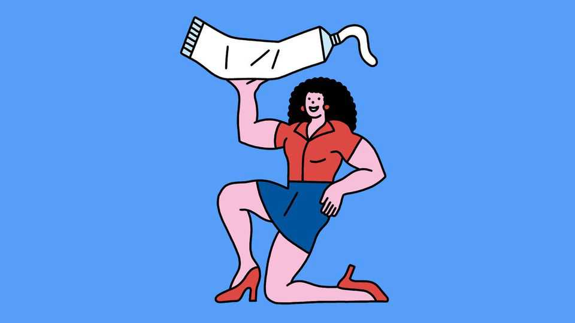

Science & technology | Well informed
Do women need testosterone supplements?
It can be helpful in some cases, but it's no fountain of youth
November 20th 2025 
 

Of the many health trends on social media, female demand for testosterone as a performance-enhancing drug is one of the strangest. It is a "powerhouse hormone", proclaims one influencer, who goes on to recommend it for "energy, mood, muscle tone, libido and overall vitality". Some women even have slow-dissolving testosterone pellets injected into their buttocks. Although commonly thought of as a "male" hormone, testosterone is essential for women too—it contributes to libido, sexual arousal and orgasm by increasing dopamine levels in the central nervous system. Since the 1940s doctors had been prescribing the hormone to their female patients to address problems such as low libido. But this ended when a scare around hormone-replacement therapy (HRT) emerged at the turn of the millennium. 

备注

- <strong><em>performance-enhancing</em></strong>：/[pəˈfɔːməns ɪnˈhɑːnsɪŋ]/ "提高表现的"；文中用来表达提高表现的药物，强调睾酮被用作增强剂；performance指表现，enhancing指提高的。 
- <strong><em>powerhouse</em></strong>：/[ˈpaʊəhaʊs]/ "强大的"；文中用来表达强大的激素，强调影响者的宣传；由power（力量）和house（房子）构成。 
- <strong><em>proclaims</em></strong>：/[prəˈkleɪmz]/ "宣称、宣布"；文中用来表达影响者宣称，强调社交媒体上的宣传；动词原形是proclaim（宣称）。 
- <strong><em>influencer</em></strong>：/[ˈɪnflʊənsə]/ "影响者"；文中用来表达影响者，强调社交媒体上的意见领袖；由influence（影响）加-er构成。 
- <strong><em>muscle tone</em></strong>：/[ˈmʌsəl təʊn]/ "肌肉张力"；文中用来表达肌肉张力，强调睾酮的声称好处；muscle指肌肉，tone指张力。 
- <strong><em>libido</em></strong>：/[lɪˈbiːdəʊ]/ "性欲"；文中用来表达性欲，强调睾酮对女性的作用；指性欲或性冲动。 
- <strong><em>vitality</em></strong>：/[vaɪˈtælɪti]/ "活力"；文中用来表达整体活力，强调影响者声称的好处；由vital（有活力的）加-ity构成。 
- <strong><em>pellets</em></strong>：/[ˈpelɪts]/ "小丸、颗粒"；文中用来表达缓慢溶解的睾酮颗粒，强调一些女性的使用方式；由pellet（小丸）加-s构成。 
- <strong><em>injected</em></strong>：/[ɪnˈdʒektɪd]/ "注射的"；文中用来表达注射到臀部，强调使用方式；动词原形是inject（注射）。 
- <strong><em>buttocks</em></strong>：/[ˈbʌtəks]/ "臀部"；文中用来表达臀部，强调注射部位；指臀部或屁股。 
- <strong><em>arousal</em></strong>：/[əˈraʊzəl]/ "唤醒、兴奋"；文中用来表达性兴奋，强调睾酮的作用；由arouse（唤醒）加-al构成。 
- <strong><em>orgasm</em></strong>：/[ˈɔːɡæzəm]/ "性高潮"；文中用来表达性高潮，强调睾酮的作用；指性高潮。 
- <strong><em>dopamine</em></strong>：/[ˈdəʊpəmiːn]/ "多巴胺"；文中用来表达多巴胺水平，强调睾酮的作用机制；指多巴胺（神经递质）。 
- <strong><em>prescribing</em></strong>：/[prɪˈskraɪbɪŋ]/ "开处方"；文中用来表达医生开处方，强调历史使用；动词原形是prescribe（开处方）。 
- <strong><em>hormone-replacement therapy</em></strong>：/[ˈhɔːməʊn rɪˈpleɪsmənt ˈθerəpi]/ "激素替代疗法"；文中用来表达激素替代疗法，强调2000年左右的恐慌；hormone指激素，replacement指替代，therapy指疗法。 
- <strong><em>millennium</em></strong>：/[mɪˈleniəm]/ "千年"；文中用来表达千年之交，强调恐慌发生的时间；指千年或千禧年。 
 
Although the concern centred on oestrogen and progesterone, testosterone also got caught up in the mix. Doctors became worried about a shortage of evidence-based research to support its use. 

备注

- <strong><em>oestrogen</em></strong>：/[ˈiːstrədʒən]/ "雌激素"；文中用来表达雌激素，强调恐慌的中心；指雌激素。 
- <strong><em>progesterone</em></strong>：/[prəʊˈdʒestərəʊn]/ "孕激素"；文中用来表达孕激素，强调恐慌的中心；指孕激素。 
- <strong><em>evidence-based</em></strong>：/[ˈevɪdəns beɪst]/ "基于证据的"；文中用来表达基于证据的研究，强调医生担心缺乏研究支持；evidence指证据，based指基于的。 
 
As concerns about the use of HRT have fallen away, however, women have started reconsidering testosterone, says Caroline Messer, a doctor at Fifth Avenue Endocrinology, a clinic in New York. Since 2019 the hormone has been offered for low libido, now called hypoactive sexual desire disorder (HSDD). In America, between 2013 and 2023, prescriptions increased by almost 50%; in Britain they rose ten-fold between 2015 and 2022. 

备注

- <strong><em>Endocrinology</em></strong>：/[ˌendəʊkrɪˈnɒlədʒi]/ "内分泌学"；文中用来表达内分泌诊所，强调Messer医生的专业；指内分泌学。 
- <strong><em>hypoactive</em></strong>：/[ˌhaɪpəʊˈæktɪv]/ "低活跃的"；文中用来表达低活跃性欲障碍，强调现在的医学术语；由hypo-（低）和active（活跃的）构成。 
- <strong><em>sexual desire disorder</em></strong>：/[ˈsekʃuəl dɪˈzaɪə dɪsˈɔːdə]/ "性欲障碍"；文中用来表达性欲障碍，强调HSDD的完整名称；sexual指性的，desire指欲望，disorder指障碍。 
- <strong><em>prescriptions</em></strong>：/[prɪˈskrɪpʃənz]/ "处方"；文中用来表达处方，强调使用量的增加；由prescription（处方）加-s构成。 
 
Testosterone peaks in a woman's 20s; by menopause, blood levels are about a quarter of that peak. The goal of therapy for HSDD is to get women roughly to their pre-menopausal levels, using products applied to the skin. Dr Messer avoids injectable pellets—she says that women can get too much testosterone this way. Too much hormone comes with side-effects including acne, unwanted body hair, mood swings or a permanent deepening of the voice. 

备注

- <strong><em>peaks</em></strong>：/[piːks]/ "达到峰值"；文中用来表达在20多岁时达到峰值，强调睾酮水平的变化；动词原形是peak（达到峰值）。 
- <strong><em>menopause</em></strong>：/[ˈmenəpɔːz]/ "更年期"；文中用来表达更年期，强调睾酮水平下降的时期；指更年期或绝经期。 
- <strong><em>pre-menopausal</em></strong>：/[priː menəˈpɔːzəl]/ "更年期前的"；文中用来表达更年期前的水平，强调治疗目标；由pre-（前）和menopausal（更年期的）构成。 
- <strong><em>injectable</em></strong>：/[ɪnˈdʒektəbəl]/ "可注射的"；文中用来表达可注射的颗粒，强调Messer医生避免的方式；由inject（注射）加-able构成。 
- <strong><em>acne</em></strong>：/[ˈækni]/ "痤疮"；文中用来表达痤疮，强调副作用之一；指痤疮或粉刺。 
- <strong><em>mood swings</em></strong>：/[muːd swɪŋz]/ "情绪波动"；文中用来表达情绪波动，强调副作用之一；mood指情绪，swings指波动。 
- <strong><em>deepening</em></strong>：/[ˈdiːpənɪŋ]/ "加深"；文中用来表达声音永久加深，强调副作用之一；动词原形是deepen（加深）。 
 
Testosterone may also be useful during menopause for reasons other than sexual dysfunction. Women in menopause frequently complain of "brain fog"—with symptoms including fatigue, difficulty concentrating, poor memory, reduced verbal fluency and reduced ability to multitask. Enone McKenzie, a consultant psychiatrist specialising in women's hormonal mental health at The Soke, a clinic in London, says peri-menopausal women who have been prescribed testosterone for low libido report improvements in mood and say they remember things better and have less decision fatigue. A few studies also suggest improvements in mood and cognition in post- menopausal women treated with testosterone. 

备注

- <strong><em>dysfunction</em></strong>：/[dɪsˈfʌŋkʃən]/ "功能障碍"；文中用来表达性功能障碍，强调睾酮的其他用途；由dys-（不良）和function（功能）构成。 
- <strong><em>brain fog</em></strong>：/[breɪn fɒɡ]/ "脑雾"；文中用来表达脑雾，强调更年期女性的常见抱怨；固定短语，指脑雾或思维模糊。 
- <strong><em>fatigue</em></strong>：/[fəˈtiːɡ]/ "疲劳"；文中用来表达疲劳，强调脑雾的症状之一；指疲劳或疲倦。 
- <strong><em>concentrating</em></strong>：/[ˈkɒnsəntreɪtɪŋ]/ "集中注意力"；文中用来表达集中注意力困难，强调脑雾的症状；动词原形是concentrate（集中注意力）。 
- <strong><em>verbal fluency</em></strong>：/[ˈvɜːbəl ˈfluːənsi]/ "语言流畅性"；文中用来表达语言流畅性降低，强调脑雾的症状；verbal指语言的，fluency指流畅性。 
- <strong><em>multitask</em></strong>：/[ˈmʌltɪtɑːsk]/ "多任务处理"；文中用来表达多任务处理能力降低，强调脑雾的症状；由multi-（多）和task（任务）构成。 
- <strong><em>consultant psychiatrist</em></strong>：/[kənˈsʌltənt saɪˈkaɪətrɪst]/ "顾问精神科医生"；文中用来表达顾问精神科医生，强调McKenzie的专业；consultant指顾问，psychiatrist指精神科医生。 
- <strong><em>hormonal</em></strong>：/[hɔːˈməʊnəl]/ "激素的"；文中用来表达激素心理健康，强调McKenzie的专业领域；由hormone（激素）加-al构成。 
- <strong><em>peri-menopausal</em></strong>：/[ˌperɪ menəˈpɔːzəl]/ "围绝经期的"；文中用来表达围绝经期女性，强调使用睾酮的女性群体；由peri-（周围）和menopausal（更年期的）构成。 
- <strong><em>decision fatigue</em></strong>：/[dɪˈsɪʒən fəˈtiːɡ]/ "决策疲劳"；文中用来表达决策疲劳减少，强调睾酮的好处；decision指决策，fatigue指疲劳。 
- <strong><em>cognition</em></strong>：/[kɒɡˈnɪʃən]/ "认知"；文中用来表达认知改善，强调睾酮的好处；指认知或认识。 
- <strong><em>post-menopausal</em></strong>：/[pəʊst menəˈpɔːzəl]/ "绝经后的"；文中用来表达绝经后女性，强调研究对象；由post-（后）和menopausal（更年期的）构成。 
 
However, there is no good evidence from well designed trials for the long- term efficacy and safety of testosterone used this way. That leaves such therapies in a medical grey area. For younger women who have no medical need for testosterone, its use to improve mood or performance is therefore terra incognita. The use of high doses for muscle-building or performance, equivalent to the way male bodybuilders might use the hormone, is deemed unsafe by experts. 

备注

- <strong><em>trials</em></strong>：/[ˈtraɪəlz]/ "试验"；文中用来表达设计良好的试验，强调缺乏证据；由trial（试验）加-s构成。 
- <strong><em>efficacy</em></strong>：/[ˈefɪkəsi]/ "有效性"；文中用来表达长期有效性，强调缺乏证据；指有效性或功效。 
- <strong><em>grey area</em></strong>：/[ɡreɪ ˈeəriə]/ "灰色地带"；文中用来表达医学灰色地带，强调这些疗法的地位；固定短语，指灰色地带或不确定区域。 
- <strong><em>terra incognita</em></strong>：/[ˈterə ɪnˈkɒɡnɪtə]/ "未知领域"；文中用来表达未知领域，强调对年轻女性的使用缺乏了解；拉丁语，指未知领域。 
- <strong><em>bodybuilders</em></strong>：/[ˈbɒdɪbɪldəz]/ "健美运动员"；文中用来表达男性健美运动员，强调高剂量使用的类比；由bodybuilder（健美运动员）加-s构成。 
- <strong><em>deemed</em></strong>：/[diːmd]/ "被认为"；文中用来表达被认为不安全，强调专家的观点；动词原形是deem（认为）。 
 
For women with medical needs, testosterone supplements, at sensible doses, can be invaluable. But for everyone else, says Dr Messer, this is another "hormone du jour" needlessly offered up by influencers on social media. ■ 

备注

- <strong><em>supplements</em></strong>：/[ˈsʌplɪmənts]/ "补充剂"；文中用来表达睾酮补充剂，强调对医疗需求女性的价值；由supplement（补充剂）加-s构成。 
- <strong><em>sensible</em></strong>：/[ˈsensəbəl]/ "合理的"；文中用来表达合理剂量，强调使用条件；指合理的或明智的。 
- <strong><em>invaluable</em></strong>：/[ɪnˈvæljʊəbəl]/ "无价的、非常宝贵的"；文中用来表达非常宝贵，强调对医疗需求女性的价值；由in-（不）和valuable（有价值的）构成。 
- <strong><em>hormone du jour</em></strong>：/[ˈhɔːməʊn duː ʒʊə]/ "当红激素"；文中用来表达当红激素，强调社交媒体上的流行趋势；法语短语，指当红的或流行的。 
- <strong><em>needlessly</em></strong>：/[ˈniːdləsli]/ "不必要地"；文中用来表达不必要地提供，强调Messer医生的批评；由needless（不必要的）加-ly构成。 
 
Curious about the world? To enjoy our mind-expanding science coverage, sign up to Simply Science, our weekly subscriber-only newsletter. 
This article was downloaded by zlibrary from https://www.economist.com//science-and-technology/2025/11/14/do-women-need- testosterone-supplements 
