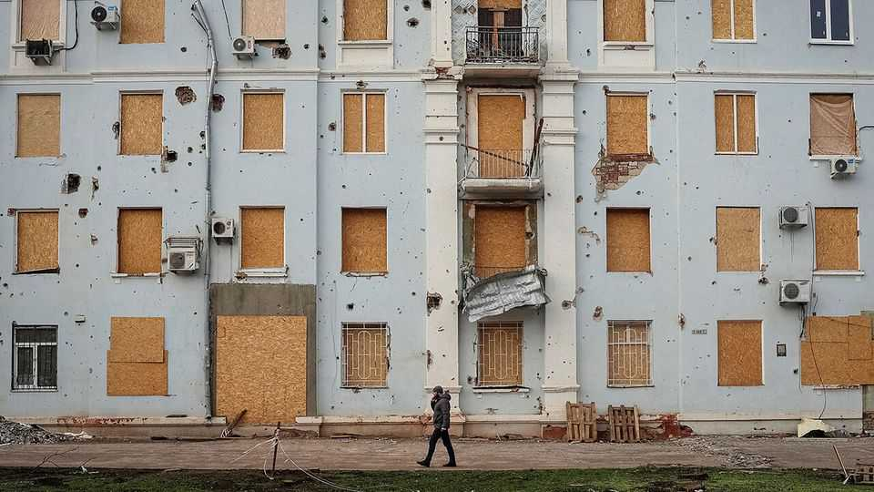
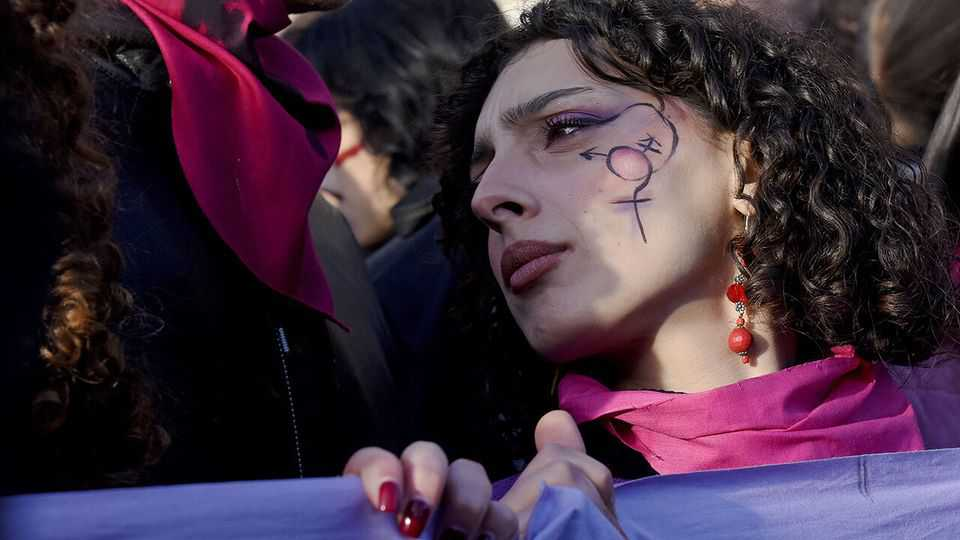

The world this week
Politics
November 27th 2025

President Donald Trump said that “tremendous progress” had been made in negotiations between Ukraine and Russia. A controversial 28-point peace proposal drafted with Russia was revised during a meeting between American, Ukrainian and European officials in Geneva. Ukraine’s president, Volodymyr Zelensky, said he was ready to discuss “sensitive” issues, which include territorial concessions and his country reducing its armed forces. A judge in Georgia dismissed the racketeering case against Mr Trump and others, ending the criminal jeopardy of the president for allegedly trying to overturn the 2020 election. Three other criminal cases against Mr Trump have been dismissed or put aside since he was returned to office.

Mr Trump called the shooting of two National Guard members near the White House in Washington an “act of terror”. The guardsmen were in critical condition. The suspected attacker, 29-year-old Rahmanullah Lakanwal, is believed to have arrived from Afghanistan in 2021, prompting Mr Trump to vow a crackdown on unvetted immigration.

Mr Trump will visit Beijing in April. The president accepted an invitation from his Chinese counterpart, Xi Jinping, during a phone conversation in which they discussed trade and global security. A reciprocal visit is planned for later in 2026.

Marjorie Taylor Greene said she would resign from America’s House of Representatives following a public feud with Mr Trump. The president had called the congresswoman from Georgia, once a staunch ally, a “traitor” for her calls to publish files related to Jeffrey Epstein, a dead sex offender.

COP 30 in Brazil ended with a disappointing lack of new promises to phase out fossil fuels. Roughly 80 delegations, including the European Union and Britain, had been pressing for quicker climate action, but large oil-producers opposed any stricter resolution. Next year’s conference will be held in Turkey after Australia dropped its hosting bid.

Jair Bolsonaro began his 27-year prison sentence for plotting a coup after losing the 2022 election. Brazil’s former president had been under house arrest since August but was recently taken into police custody for tampering with his ankle monitor. He denied attempting to flee and blamed medicine-induced “paranoia”.

China escalated its dispute with Japan at the United Nations. In a letter to the UN’s secretary-general, António Guterres, its representative accused Japan of “a grave violation of international law” when Takaichi Sanae, the prime minister, suggested her country would provide military assistance to Taiwan in the event of a Chinese invasion. Meanwhile Taiwan’s president, Lai Ching-te, said that the country would boost defence spending by $40bn to fend off “intensifying” Chinese threats.

Several South-East Asian countries faced catastrophic floods. Some 2.7m people battled the deluge in southern Thailand; the city of Hat Yai recorded its heaviest rainfall in 300 years. The army deployed ships and helicopters to

deliver aid. At least 30 people were killed by landslides on Java, Indonesia’s most populous island. In Vietnam a bus was swept off the road. Malaysia evacuated some 21,000 people.

At least 55 people were killed and hundreds were missing after a fire engulfed seven high-rise apartment blocks in Hong Kong’s Tai Po district. As firefighters quelled the blaze, there were mounting questions over accountability. Police arrested three construction-company employees for suspected manslaughter.

Spain’s attorney-general, Álvaro García Ortiz, resigned in anticipation of a supreme-court ruling that found him guilty of leaking details of a tax probe involving the partner of a prominent conservative politician. It is a blow to the socialist government of Pedro Sánchez, who appointed the chief prosecutor in 2022 and defended his innocence.

Italy’s parliament voted unanimously to make femicide—the murder of a woman because of her gender—a crime punishable by life imprisonment. The law is a response to several high-profile cases of violence against women and includes harsher measures against stalking and revenge porn.

Ukraine attacked the Shatura power station in Russia, which provides 6% of the electricity to nearby Moscow, the capital. The drone strike damaged three transformers. Ukraine also killed three people and injured several others in a large drone strike on Novorossiysk, a Russian port city. Russia continued to pummel Kyiv, Ukraine’s capital.

The EU’s top court ruled that Poland must recognise the marriage of a same- sex couple, despite Polish law not allowing such unions. It said the two men, who had been married in Germany, would thus preserve their freedom of movement and the “right to respect” for family life. Poland’s government said it would comply with the verdict.

Israel killed Hizbullah’s top military chief, Haytham Ali Tabatabai, in Beirut. The second major strike on Lebanon’s capital since an American-brokered ceasefire a year ago highlights the fragility of truces in the region. Israel also launched its biggest raid in the West Bank since the start of its truce with Hamas in October, with hundreds of soldiers entering Tubas, a town near the city of Nablus.

The Gaza Humanitarian Foundation closed. The aid group, which was supported by Israel and America, had been criticised for endangering Palestinians, many of whom were killed attempting to get food from its distribution centres (the group denied anyone died at its centres). Since October more aid has entered the Gaza Strip.

Gunmen abducted 303 schoolchildren and 12 teachers from a Catholic school in Nigeria’s Niger state, with dozens managing to escape. Separately, 24 girls who had earlier been abducted from a boarding school in Kebbi state were freed; another had escaped on her own. Nigeria has closed schools nationwide as kidnappings have intensified in recent weeks.

A group of soldiers seized power in Guinea-Bissau, a narco-state in west Africa, and detained the president. The apparent coup follows a disputed presidential election in which both the incumbent, Umaro Sissoco Embaló, and his main opponent claimed victory before formal results. The putschists claimed that they acted to counter attempts to destabilise the country.

This article was downloaded by zlibrary from https://www.economist.com//the-world-this- week/2025/11/27/politics