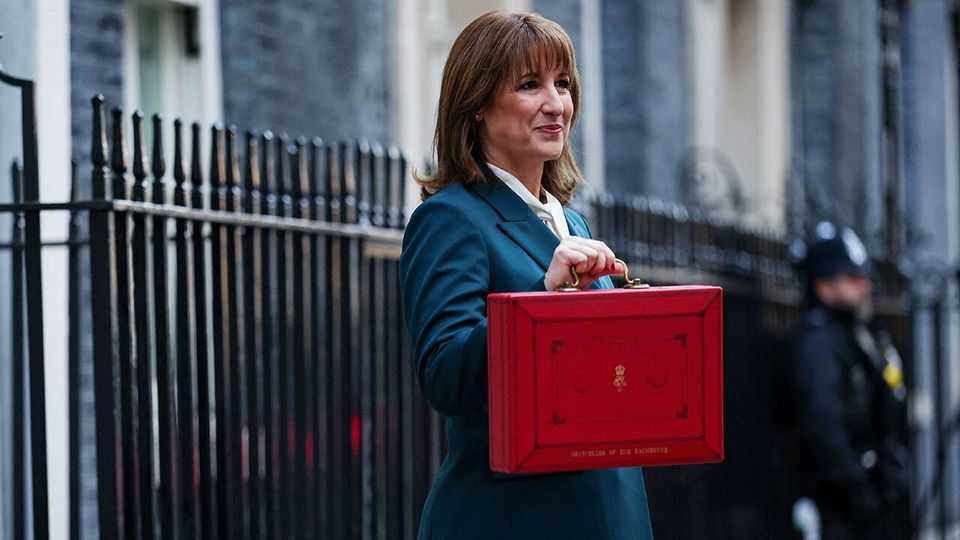

The world this week
Business
November 27th 2025

Rachel Reeves, Britain’s chancellor, delivered her second budget, which by 2029-30 will increase yearly spending by £11bn ($14.5bn) and taxes by £26bn. The extra spending starts now, but taxes will rise only gradually, so the government will need to borrow more than planned over the next four years. It has made no serious attempt to cut its ballooning welfare bill. Markets nevertheless reacted positively: government-borrowing costs fell, especially for long-dated debt, and the pound strengthened. Meanwhile, France’s National Assembly rejected parts of a budget draft put forward by Sébastien Lecornu, the country’s third prime minister in 12 months. Both of Mr Lecornu’s immediate predecessors left office after failing to pass their own budgets.

The IMF agreed a new four-year funding programme with Ukraine, worth $8.2bn. It will be used to help stabilise the country’s economy and meet the mounting costs of its war with Russia. Ukrainian officials believe the facility will help them obtain funding from others, which is badly needed to shore up the public finances.

Tech stocks staged a recovery after a difficult few weeks. America’s NASDAQ 100 index fell by 8% between late October and November 20th, but has since risen by 5%. Investors’ hopes were buoyed by comments from Mary Daly and Chris Waller, two attendees of the Federal Reserve’s monetary- policy meetings, suggesting the central bank will cut interest rates in December. Traders now put the probability of such a cut at over 80%.

Yet the share price of Nvidia slid further. Reports on November 24th suggested that Meta, one of Nvidia’s biggest clients, is considering buying chips from Google instead. The next day Nvidia lost over $100bn, or 3%, of its market value. It has fallen by 13% since its peak. The same day the share price of AMD, Nvidia’s main rival, dropped by 4%. That of Alphabet, Google’s parent, has soared.

Owners of bitcoin are suffering badly: its price has plunged by 27% since October. Many “crypto treasury” firms, which exist to hold digital assets and give shareholders exposure to them, have done far worse. Some have reportedly started selling their stockpiles as a result, raising fears of a self- reinforcing doom loop.

Chinese “open” artificial-intelligence models, which are free to download and tweak, are overtaking American ones. A study by the Massachusetts Institute of Technology found that Chinese models’ share of downloads over the year to August was 17%, compared with 16% for American models.

Robinhood said it intends to launch a futures and derivatives exchange, together with Susquehanna. The retail broker and marketmaker are partnering up to offer a range of prediction contracts linked to events such as sports matches and elections.

BHP abandoned its takeover bid for Anglo American, a smaller mining rival. Anglo American is instead merging with Teck Resources, and has turned down bids from BHP twice in the past 18 months. The two merging

companies run neighbouring copper mines in Chile, and once joined will rank among the top five producers of the metal globally.

Decades after it started investing in China, Volkswagen now says it can build electric cars made entirely in the country. Compared with production costs in Germany, those in China are around 50% lower for some models. Europe’s largest carmaker plans to release about 30 types of electric vehicle in China over the next five years. It has also been trying to cut the number of workers it employs in Germany by 35,000. This year, progress has slowed, as far fewer people have quit voluntarily.

Investors are increasingly betting that nuclear energy will power artificial intelligence. X-energy, a company backed by Amazon, has raised $700m to build nearly 150 small modular reactors in America and Britain. Valar Atomics and Aalo Atomics, two rival nuclear-reactor builders, have also raised funds recently.

A potential treatment for Alzheimer’s, developed by Novo Nordisk and already used as a diabetes drug, failed a late-stage trial. The pharmaceutical giant’s share price dropped sharply in response, continuing a long slide. Meanwhile Eli Lilly, one of Novo Nordisk’s rivals, became the first health- care firm to reach a market value above $1trn.

“Wicked: For Good”, the second part of a film based on the hit Broadway musical, pulled in $150m in American ticket sales on its opening weekend. Its performance was the second-best of the year so far, behind “A Minecraft Movie”.

This article was downloaded by zlibrary from https://www.economist.com//the-world-this- week/2025/11/27/business