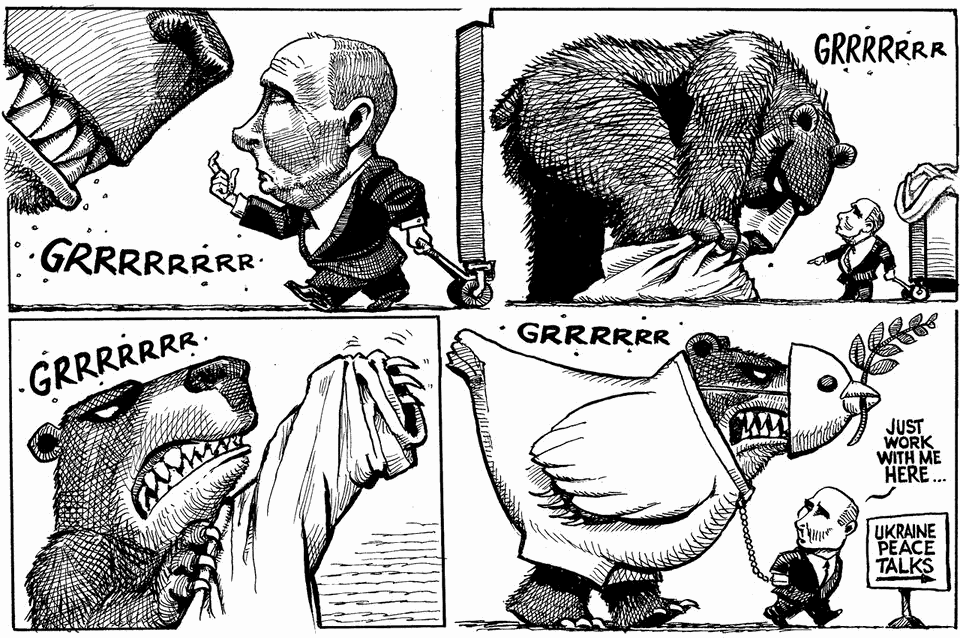

The world this week
The weekly cartoon
November 27th 2025

Dig deeper into the subject of this week’s cartoon: How to avoid an unjust peace in UkraineUkraine may be a step closer to peace, or to destructionIf the fighting ends in Ukraine, the infighting in Europe will begin The editorial cartoon appears weekly in The Economist. You can see last week’s here. This article was downloaded by zlibrary from https://www.economist.com//the-world-this- week/2025/11/27/the-weekly-cartoon

Leaders

What China will dominate next This bodge-it budget does not give Britain what it needs How to avoid an unjust peace in Ukraine Japan’s big-spending Takaichinomics is ten years out of date Iran’s reformists extend a hand