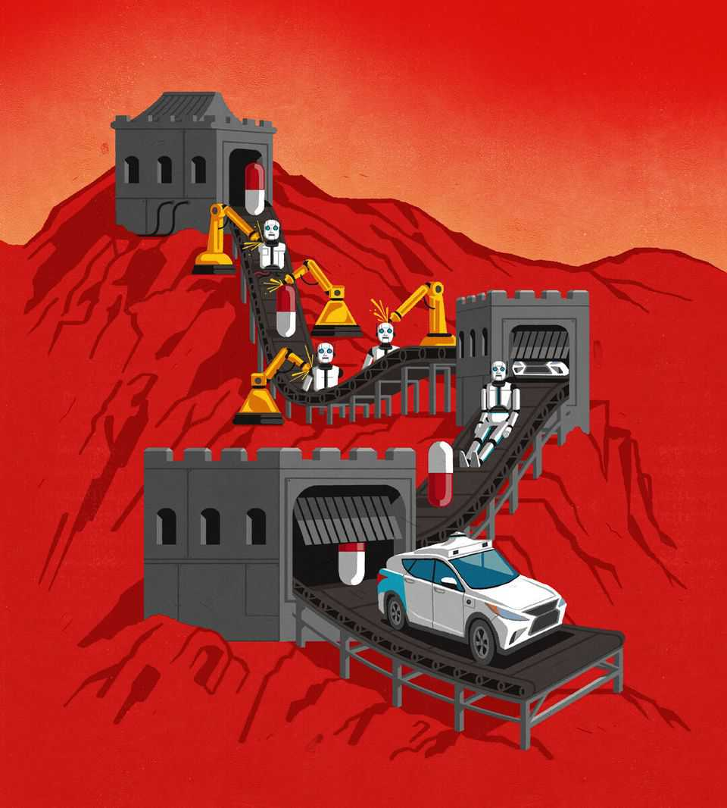

Leaders | Frontier technologies
What China will dominate next
The country’s high-speed innovation holds lessons for the world
November 27th 2025

ThOSE WHO worry about how to cope with China’s leadership in technology —and there are plenty of them—think hard about electric vehicles (EVs), solar panels and open-source artificial intelligence. For such people, we have some bad news. This week we report how China is rapidly pressing ahead in two other frontier technologies, autonomous vehicles and new drugs. As these

industries spread around the world, they will exemplify the power of Chinese innovation.

China’s progress in each of these important areas has been staggering. A robotaxi revolution is gathering pace, which could reshape transport, logistics and everyday urban life. The country’s autonomous taxis, constructed for a third of the cost of Waymo’s in America, are racking up millions of kilometres of driving and are forging partnerships in Europe and the Middle East. In medicine, meanwhile, China has turned itself from a copycat maker of generics into the world’s second-largest developer of new drugs, including those tackling cancer. Western rivals are licensing its firms’ wares. The day when a pharma giant emerges from China no longer seems so remote.

The rise of both industries says much about how Chinese innovation works. A deep pool of talent, a broad manufacturing base and huge scale combine to propel it rapidly up the value chain. The production of robotaxis has piggybacked on mass ev manufacturing and a dominance in the supply of lidars and the other sensors needed for self-driving; scale has also helped bring down costs. Armies of patients enlisted in clinical trials and profits from generic drugmaking have speeded up pharma innovation.

A more surprising ingredient of China’s success is its nimble and permissive regulators. As in other industries, local governments have offered firms cheap credit and other help. But it is agile rulemaking that has really turbo-charged progress. Soon after political leaders set out their ambition for China to become a “biotechnology superpower” in 2016, the country implemented a number of reforms. The drug regulator’s workforce quadrupled between 2015 and 2018, and a backlog of 20,000 new drug applications was cleared in just two years. The time taken to secure approval for human trials shrank from 501 days to 87. Last year firms in the country ran a third of the world’s clinical trials.

Likewise, China was early to experiment with robotaxis. Local officials, keen to attract talent and investment, approved pilots at a rapid clip and installed sensors and other digital infrastructure to help guide self-driving vehicles; trials have run in over 50 cities. Many have experimented, too, with laws on liabilities and guidelines for testing. Though accidents have sometimes caused a hiatus, pilot schemes have helped engineers and policymakers understand the new technology.

Cut-throat competition at home imposes harsh conditions on individual companies, but the survivors are conditioned into becoming hypercompetitive export champions. China’s robotaxi operators compete with each other and with cheap human-driven taxis in an economy gripped by deflation. New technologies receive subsidies that ultimately come out of the pockets of its underpaid people. Many lossmaking enterprises will not survive the resulting price wars. But those that do will look overseas to make money.

A new wave of Chinese low-cost innovation will therefore wash around the world. It will do so in different ways. China’s cheap medicines could bring benefits, and particularly to the developing world. But for its companies America’s lucrative market, which is the source of 70% of global pharma profits, is the juiciest prize. And China’s importance for the pipelines of Western drugmakers means that the relationship could even be symbiotic. Robotaxis, by contrast, are likely to follow the more usual path for China’s tech exports. They are blocked by America, which has its own industry and acute security concerns, but will probably gain a foothold in other places, where domestic efforts at autonomy lag far behind.

How should the rest of the world respond? The competition risks hollowing out Western economies. Where there is evidence of Chinese dumping and subsidies, counter-measures against Chinese exports are justified and necessary. Where there are security risks action is justified, too. The data collected by robotaxis could pose a surveillance threat; Chinese pharma has suffered corruption scandals. Yet knee-jerk protectionism in the name of security or safety would be a mistake. Blocking or limiting the fruits of Chinese innovation would deprive consumers of the benefits of cheaper and better drugs and transport at a time when voters worry about affordability.

That is why it would be better for Western economies to rethink how innovation works at home. It is tempting to be fatalistic about China’s rise—to conclude that its dominance over the technologies of the future can be achieved only through authoritarian diktats and wasteful handouts, and that democracies therefore cannot follow in its footsteps. But the inventiveness of China’s private sector and agility of its regulators have been crucial ingredients, too. Here, alas, the West is going in the wrong direction.

America has scale and the deep pockets to compete. But in many states, particularly Democratic ones, regulators are blocking or stalling autonomous

vehicles. The government is waging war on universities and cutting funding for basic research. As in other Western countries, it is hostile to immigrants, including gifted ones. In drugs, as China’s share of clinical trials has risen, Europe is losing ground. Its economies desperately need to integrate further so that they can finance and develop new technologies. There too, regulators often prize safety at the expense of risk-taking and experiment.

Nothing says that China must own the future. But if the West wants to compete in self-driving cars and medicine, let alone EVs, solar power and other vital technologies, it must learn the right lessons from China’s rise. ■

For subscribers only: to see how we design each week’s cover, sign up to our weekly Cover Story newsletter.

This article was downloaded by zlibrary from [https://www.economist.com//leaders/2025/11/27/what-china-will-dominate-next](https://www.economist.com//leaders/2025/11/27/what-china-will-dominate-next)