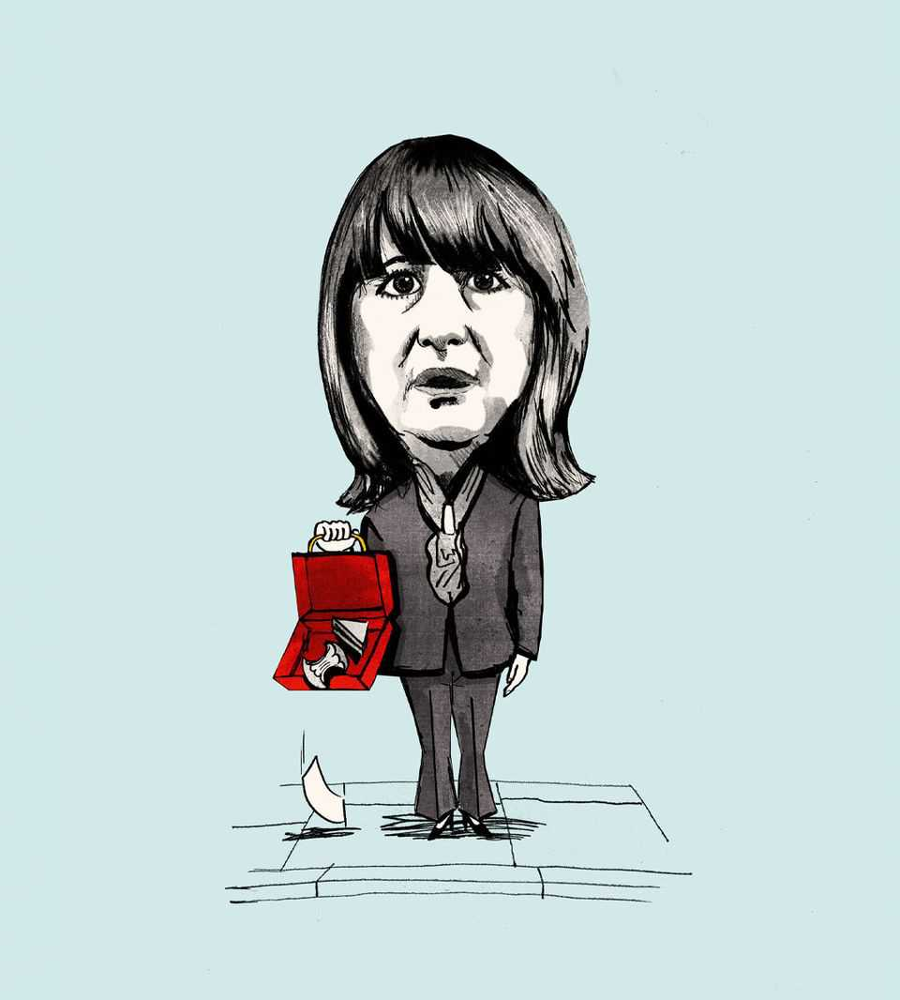

Leaders | Fiscal failure
This bodge-it budget does not give Britain what it needs
Without ambitious reform, the country will not thrive
November 27th 2025

BRITAIN IS in alarming decline. Its paltry productivity growth, high borrowing costs and incoherent economic policy are bad enough. But the country also risks the collapse of the political centre ground. The combined polling share of the populist-right Reform UK and populist-left Green parties now exceeds that of the Labour and Conservative Parties, the duopoly that has dominated British politics for over a century.

The brutal truth is that eventually, one way or another, radical change is coming to Britain. Either today’s centre-left government will choose the dramatic change that fixes the economy, or change will be forced upon the country by the financial markets or by voters stampeding towards the extremes.

This was the backdrop to the budget, presented on November 26th by Rachel Reeves, the chancellor of the exchequer. It is why this should have been a moment of radicalism by choice. Instead Ms Reeves offered a bodge job. The government seemed immobilised by its peril. Compounding her administration’s earlier mistakes, the chancellor failed utterly to lessen Britain’s economic and political vulnerability.

The immediate task was to restore fiscal credibility after official forecasts were downgraded to reflect, at last, Britain’s dire productivity trajectory. In attempting to accomplish this, the chancellor portrayed herself as a paragon of prudence. It was, after all, the second year in a row that she was filling a hole in the budget, not entirely of her own making, to meet her targets.

Compared with Reform and the Greens, Ms Reeves is indeed prudent. But that is no standard at all. With the deficit still gaping at 4.5% of GDP, Ms Reeves succumbed to her own worst instincts and those of her backbenchers by increasing borrowing, relative to her previous plans, for four years (even by the old growth forecast). Only in April 2029 does her extra fiscal consolidation bite. Even if she sticks to those policies in later budgets, her government will by then be at the end of its term. It may already be out of office. Meanwhile, the chance that Ms Reeves will have more holes to fill is alarmingly high: officials gauge the probability of meeting one of her debt targets as just 52%.

The consolidation was backloaded for two reasons. First, Labour chose to quench the thirst of its backbenchers for more spending. Ms Reeves rightly abolished a crude rule restricting parents’ benefits to two children. But she balked at offsetting this by spending less on Britain’s coddled pensioners and the many benefits claimants who have recently gamed the system. Since coming to office, Labour has tried and failed at both reforms, and has displayed little appetite to try again. Ms Reeves crowed over a projection that one Labour reform would get 15,000 people off benefits and back to work.

That is feeble. Since 2019 disability-benefits claimants in England and Wales have increased by 1.2m (40%).

The second cause of delay is that the government was too timid to raise headline rates of tax, which would have violated a manifesto pledge. Instead the chancellor extended by three years, beyond 2027-28, a freeze on tax thresholds, meaning that inflation will fill the coffers only gradually. Eventually there will also be a new tax on pension contributions, one of many minor new levies, most of dubious merit.

If and when taxes do catch up with spending, they will reach 38% of GDP, the highest in the post-war era. That is roughly the same as Germany, higher than Spain and not far off Norway and Sweden. This is not all the chancellor’s fault: Britain is ageing and it needs to spend more on defence. Yet she was careless about incentives to work and invest. The tax system’s many high marginal rates and cliff-edges remain, and Ms Reeves added to the complexity. A new levy on expensive homes might have been welcome but for its poor design. The tax treatment of savings will become even more fiddly, with an exemption for over-65s that is a handout to the old. Gambling taxes will go up, but bingo taxes will be scrapped.

The budget thus followed a pattern of obfuscation and superficiality that is well-established, but increasingly costly. Chancellors tinker while the country stagnates. That a Labour leadership with a working majority of 169 has to behave in the same unserious way reveals its staggering political mismanagement. This started in 2024 with its ham-fisted attempt outside the normal budget process to save a small amount of money by withdrawing an annual cash handout to pensioners.

The tragedy is that Britain’s economy has plenty going for it, if only it were better run. The country is younger, and ageing more slowly, than other large economies in Europe. It is a relative front-runner in adopting AI. Its labour market is more flexible (albeit getting less so under Labour). The belt- tightening needed to stabilise its debt-to-GDP ratio is about a third smaller than in neighbouring France. There is no immediate economic crisis, by contrast with deindustrialising Germany. Its problems—chiefly high housing and energy costs—are long-running and there is no mystery about how to alleviate them.

In 1945, 1979 and 1997 British governments remade the social contract with ambitious reforms that were often emulated overseas, including William Beveridge’s welfare state and Margaret Thatcher’s privatisations. In contrast, Labour’s talk on reform runs far ahead of its actions. Its housing policy has been timid and it has no solution to the economic drag from Brexit. On energy prices, which are among the highest in Europe, the budget’s big idea was to shift costs around, not bring them down.

After this budget, the drift towards populism will surely continue. Reform, led by Nigel Farage, has been moderating as power beckons, but is untested and vague. The Greens are led by Zack Polanski, who once agreed to enlarge a woman’s breasts using hypnosis. He now promises voters a gobbledygook fiscal rule by which “Inflation doesn’t go higher than the skills and resources that we have in our economy.” Charlatans can’t solve Britain’s problems. Neither, it seems, can Labour. ■

For subscribers only: to see how we design each week’s cover, sign up to our weekly Cover Story newsletter.

This article was downloaded by zlibrary from https://www.economist.com//leaders/2025/11/26/this-bodge-it-budget-does-not-give- britain-what-it-needs