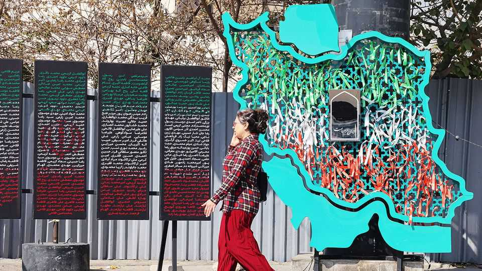

Leaders | An offer from Tehran
Iran’s reformists extend a hand
The West should heed Iran’s call to restart nuclear talks
November 27th 2025

Visit Tehran, as The Economist just did, and you might expect to find Iran’s rulers huddled defensively. It has been a brutal year for an unloved regime. A 12-day bombing campaign in June saw Israel, aided by American B-2s, pummel the country’s nuclear sites. Iran’s homegrown uranium-enrichment programme remains under rubble. Israeli strikes killed many senior military men and nuclear physicists. Walk around the city and scars from those attacks are still visible. Plaques commemorate the dead. And yet Tehran’s leaders sound eager to open up to the world. In an interview, Abbas Araghchi, the foreign minister, called for talks to resume with

America’s envoy, Steve Witkoff. He claims negotiations over peaceful uranium enrichment were about to bear fruit just before the missiles flew. A deal could include a proposal for outsiders, even Americans, to oversee peaceful enrichment on Iranian soil. On a visit to Washington, Saudi Arabia’s de facto leader, Muhammad bin Salman, is thought to have delivered a similar message from Iran to Donald Trump.

How should outsiders respond? Sceptics see only duplicity from a regime with a rotten record. Undoubtedly Iran wants time to restock supplies of its most effective conventional missiles. (The fear in Tehran is that Israel’s attacks will resume before its prime minister, Binyamin Netanyahu, faces elections next year.) Some see a bigger risk. Polls suggest that ordinary Iranians have been consistently keen for their country to get a nuclear bomb. What if scientists and weapons experts, making use of hidden enrichment sites, now dash to do just that, with talks as a smokescreen? Impossible, retorts the foreign minister. He claims, though others dispute it, that all 400kg of Iran’s highly enriched uranium is safely under rubble. A scramble for a weapon is out of the question, he says.

Sceptics are right that talks come with risks. Yet missed opportunities also bear a cost. Mr Trump now says he is “totally open” to a deal, even though he scrapped the last one, struck in 2015. His change of heart, if real, may be an acknowledgment that bombing Iran into giving up its nuclear ambitions, knowledge or capacity is not a permanent solution. He should make clear to Israel that a further round of bombing is unacceptable as long as talks remain possible.

Iran’s regime is getting weaker abroad, as its proxy militia forces in the region are diminished. It has softened some old rivalries, including with Saudi Arabia. At home, too, the regime in some ways is getting less extreme. The despised morality police have given up enforcing a law that women must wear the hijab. Clerics have less sway. Official appeals to Shia Islam as a uniting force are less strident, replaced by use of nationalist, Persian symbols. The supreme leader, Ayatollah Ali Khamenei, agreed to the 2015 nuclear agreement to keep uranium enrichment within strict limits. He looks ready, again, for his government to engage with the West. Yet he is 86. After his death a battle for succession could bring a new shift in power between reformists and hardliners. If the revolutionary guards prevail, they may prefer isolation to detente, as their front companies profit under sanctions.

In their different ways, all these factors offer an unusual opportunity to put relations between Iran and America on a new footing. Engagement could make the hardliners in Iran less powerful; certainly, another round of diplomatic hostility will benefit them. For now, a window is open. Mr Trump should send an envoy to Tehran to learn what sort of deal, if any, might be struck. ■

Subscribers to The Economist can sign up to our Opinion newsletter, which brings together the best of our leaders, columns, guest essays and reader correspondence.

This article was downloaded by zlibrary from [https://www.economist.com//leaders/2025/11/27/irans-reformists-extend-a-hand](https://www.economist.com//leaders/2025/11/27/irans-reformists-extend-a-hand)

Letters Taiwan’s real estate problem