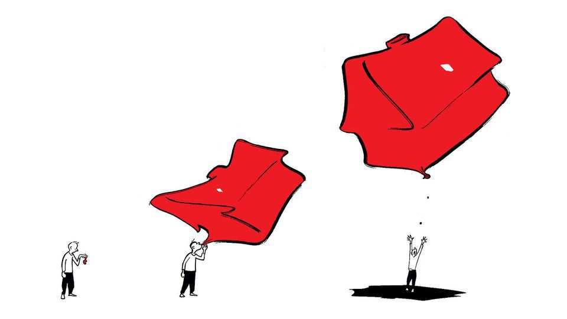
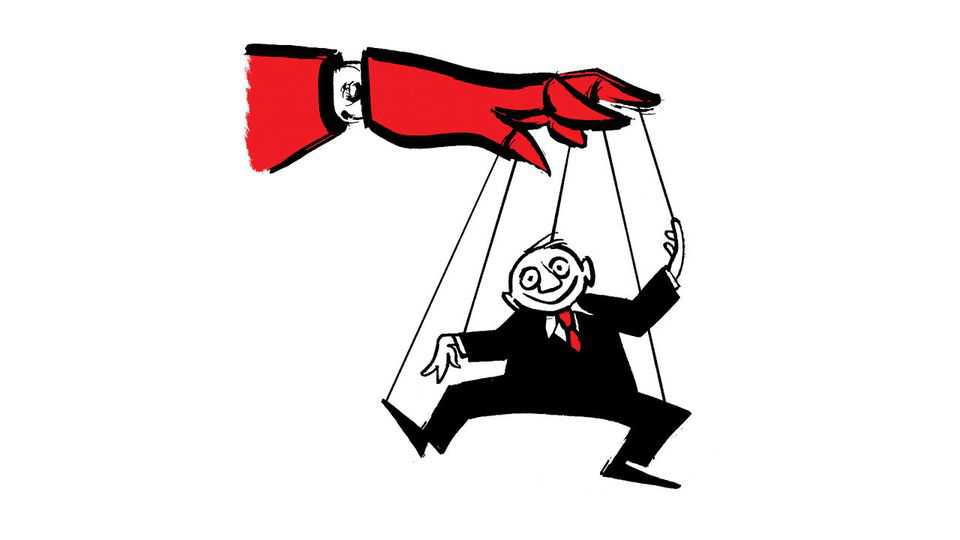

Letters | A selection of correspondence
Taiwan’s real estate problem
Also this week, Britain’s image abroad, facial analysis in hiring, the decline of relationships
November 27th 2025

Letters are welcome via email to letters@economist.comFind out more about how we process your letter You identified “The hidden risks in Taiwan’s boom” (November 15th) arising from the central bank’s weak-currency policy. But the more fundamental issue is the low-taxation regime on property holdings. The cost of holding real estate in Taiwan is virtually nil. Vacancy taxes exist only on paper and land- value assessments remain far below market prices. You mentioned how central-bank liquidity inflates housing prices, but the crucial point is that the

tax system has deliberately built an express highway to funnel these funds straight into property.

This is not some conspiracy, but the cumulative result of decades of profit- seeking by all parties. Cultural attachment to property ownership certainly exists, but culture is never destiny. What makes this structure impregnable is its perfect alignment with the core interests of Taiwan’s political-donation system. Financial conglomerates profit from mortgages, developers and landowners from soaring prices, and politico-business networks from land development. These vested interests are the primary bankrollers of Taiwan’s electoral politics.

The result is a zero-sum game in which the entire population is forced to participate. Younger generations shoulder mortgages with price-to-income ratios of 10-20, the middle class become reluctant “investors” to preserve wealth, and genuine productive investment languishes as capital is drained into property. This is the true root of Taiwan’s low wages, weak consumption and collapsing birth rates.

You worry about American trade pressure, but anyone familiar with Taiwan’s political reality knows that compared with Washington’s potential tariff threats, Taipei’s vested interest groups are the real obstacle to reform. This is not a technical currency question, but a political-economy Gordian knot.

Wang Wan-yuChairpersonNew Power PartyTaipei

It is true that Britain enjoys a positive international image (“Brand Britain has bounced back”, November 8th). But the brand hasn’t “bounced back”, because it has always been strong. Your article cited my annual study, the Anholt Nation Brands Index (NBI). In the NBI Britain’s rank has never fallen below sixth and typically meanders between third and fourth. More tellingly, and in common with every country we track except Russia, Britain’s overall global score has gradually risen since we started measuring it in 2005 (a weird phenomenon we call the “mood of humanity” causes the images of all countries to improve over time).

Aside from this gentle undercurrent, there’s nothing unusual about the stability of Britain’s image. People really don’t like to change their minds about other countries and it is extremely rare for any country’s score to change from year

to year by a statistically significant amount. That is apart from America’s, which has a uniquely volatile image.

This looks at image from a global perspective. A more meaningful way to study perceptions of countries is to focus on specific population groups in each country. Britain was ranked fourth in this year’s NBI by respondents in G7 countries (where it is gradually rising), but was seventh among BRICS+ respondents (where it is gradually falling). Britain is also slightly preferred by females and older respondents than by males and younger respondents.

Simon AnholtFounderAnholt Nation Brands IndexScratby, Norfolk

Bartleby’s column on using artificial intelligence in hiring (November 8th) raised important ethical questions. Companies are already doing this and it’s fundamentally broken. Hilke Schellmann, a journalist, tested AI interview platforms and answered every question with “I love teamwork”. She still received good scores. When she answered entirely in German for an English- language position she was rated 73% qualified. Despite these obvious flaws, employers use such tools even when nearly 90% admit that the tools reject qualified applicants.

This has triggered an arms race, with job candidates embedding hidden AI prompts in résumés (ManpowerGroup detects this in 10% of applications). Companies are now responding to “interview fraud” by requiring in-person rather than video meetings.

EUGENE YIGABarcelona

Why not roll AI face-reading tech out on dating apps? Let’s be honest, dating is already based on snap judgments, so we might as well make them algorithmically efficient. After all, no one drags Tinder to court because their date’s height, eye colour, or political views weren’t a perfect match. Why should a “face that doesn’t fit” be any different?

WEIBO XIONGHong Kong

Your briefing on the rise of singlehood and the decline of relationships offered a number of interesting potential explanations (“The great relationship recession”, November 8th). One other obvious factor is economic. If children are the ultimate goal of a relationship, and the cost of raising children continues to skyrocket, shouldn’t we expect fewer and fewer people to tie the knot?

Jake ThompsonCash-strapped father of twoBatavia, Illinois

Another reason for the decline of relationships is the impact of aggressive human-resources policies in the workplace. In the past many companies served as informal marriage bureaus, until starting a relationship at work became far too risky.

Richard WorsleyChichester, West Sussex

I was disappointed to read your interpretation of marriage as a binary choice of either marrying up or down. Any possibility of marrying an equal nowadays?

Tomas GomezNot-married yetParis

You pointed out that most women on online-dating apps are looking for a man who is at least six-feet tall. They may be in luck because, according to a blog

post on OkCupid, men on those same dating apps claim to be two inches taller than they really are.

Alan BuxtonRickmansworth, Hertfordshire

You noted the emerging trend of turning to an AI “companion” instead of a real partner (“My boyfriend is a model”, November 8th). The Rolling Stones forecast this in 1967. The band’s song, “2000 Man”, predicted: “Well, my wife still respects me, I really misused her. I am having an affair with the random computer.” Perhaps they will write another song predicting the end of AI centuries in the future. Keith Richards should still be around to see that happen.

Stan Kowalski Concord, New Hampshire

This article was downloaded by zlibrary from [https://www.economist.com//letters/2025/11/27/taiwans-real-estate-problem](https://www.economist.com//letters/2025/11/27/taiwans-real-estate-problem)

By Invitation

Ukraine must change how it is governed, writes a former adviser Russia must get no amnesty in any peace deal for Ukraine