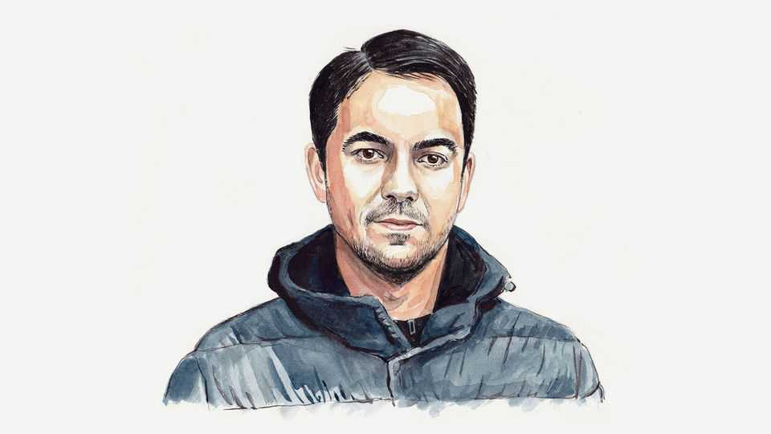

By Invitation | The threat from within
Ukraine must change how it is governed, writes a former adviser
Alexander Rodnyansky laments the concentration of power in the presidential office
November 27th 2025

TODAY’S HEADLINES are dominated by an American-Russian peace plan that could amount to managed capitulation for Ukraine. That is dangerous enough. Just as worrying is the state of the government expected to sign it. For the past two weeks Ukrainians have been digesting grim details from a huge corruption scandal. But the Energoatom affair, a $100m kickback scheme at the state nuclear operator, is not just another episode of wartime graft. It has

become a test of whether Ukraine’s leadership can reform the system it built, or if that system has turned into one of the Kremlin’s most valuable assets.

The outline of the scandal is now familiar. After a 15-month investigation, Ukraine’s anti-corruption agencies revealed that intermediaries allegedly skimmed 10-15% from Energoatom contracts, including those meant to protect substations from Russian missiles. Investigators said the money was routed through a network linked to Timur Mindich, a long-time business associate of Kvartal 95, President Volodymyr Zelensky’s media production company, who conveniently left the country just before searches began. Two ministers have been forced out. The entire supervisory board of Energoatom has been dismissed. Sanctions have been slapped on Mr Mindich and an associate. On paper, the system is working: detectives investigate, prosecutors indict, ministers resign; Brussels declares itself reassured. Look more closely, however, and a different picture emerges.

​This would be damaging at any time, but it is disastrous now. Contrary to repeated predictions of an imminent collapse, Russia’s economy has adapted to the war. The Kremlin is spending 7-8% of GDP on defence, and has financed this with higher taxes, reallocated oil revenues and a “guns over butter” bargain with its population. Independent analysts now estimate remaining fiscal capacity in years, not months. Ukraine, by contrast, spends close to a third of its GDP on the armed forces and can pay pensions and basic services only thanks to foreign aid. At the same time a mobilisation crisis is quietly unfolding: prosecutors have opened over 300,000 cases related to absence without leave and desertion since the full-scale invasion began.

It is into this already precarious situation that the Energoatom scandal drops. To European voters, it looks like a textbook example of corruption, and Russian propagandists hardly need to fabricate anything. Still, the immediate danger is not that Europe will abruptly abandon Ukraine. Rather, it is that support will become slower, stingier and more conditional just when Ukraine needs a predictable, multiyear framework to stabilise the front and the economy.

Mr Zelensky’s own response captures the ambiguity of this moment. In a recent video address, he reminded Ukrainians of their dignity and warned that the country faces one of the most difficult choices in its history, between accepting some version of the US-Russian draft peace plan or risking isolation

and a harsher winter. He also urged the political class to “end the mudslinging”. It sounded less like a head of state confronting systemic failure than like a new season of “Servant of the People”, the satirical television show in which Mr Zelensky starred before entering politics: the leader appealing over the heads of a discredited establishment which he, in fact, assembled and protected.

Behind this lies a broader governing philosophy. Since 2019 the presidential team has systematically personalised power. The cabinet has been treated less as an independent centre of policymaking than as an administrative extension of the presidential office. Loyalty has trumped competence. Institutional roles have been devalued; boards and commissions have been populated with friends and “practitioners” who measure success by surviving scandals, not by preventing them.

In all my years in government, they never mistook me for a “practitioner”. I was a theorist. The insinuation was clear: I wasn’t qualified to help with Ukraine’s transformation. I remember a close associate of the president once telling me that the real test of an economics “practitioner” wasn’t macroeconomics, but whether you could survive prison if fate sent you there. On that front, he and his circle held the advantage. I had to admit that my Princeton PhD in economics had skipped that part of the curriculum.

What happens next may be decisive in the medium term. Corruption scandals will almost certainly continue to develop, with more tapes, names and resignations. The president will denounce accusations, remove a few expendable figures, invoke national dignity and accuse his critics of undermining unity. The prime minister, Yulia Svyrydenko, will be kept in place long enough to front the “clean-up”, even though she oversaw the formation of the nuclear company’s supervisory board when she was economy minister. The president has, in effect, tasked her with investigating her own institutional design, hoping no one will notice. Ms Svyrydenko, who took up the post in July, has barely been mentioned so far—but largely because almost no one knows who she is. This anonymity is not a bug; it is a central feature of the appointment: a prime minister sufficiently colourless not to compete with the president and invisible enough to absorb blame without attracting attention.

Mr Zelensky is unlikely to change course voluntarily. He will continue to shift blame downward and sideways, and to argue that any talk of political change only helps Russia. Might he consider a different script? Only if the scandal, combined with the onerous peace plan, leaves him facing a choice between personally accepting deeply unpopular terms or stepping aside.

For Ukraine’s partners, the taboo question now is not whether corruption is pervasive, but whether the current leadership is still part of the solution, or has become part of the problem. Ukraine’s soldiers are still buying time at the front. Whether that time is used to overhaul a compromised system, or simply to extend the life of a long-running political series, will determine not only the quality of any eventual peace, but who will be left to sign it.■

Alexander Rodnyansky served for five years as an economic adviser to Volodymyr Zelensky. He is an economics professor at the University of Cambridge and co-founder of finformant, an analysis platform.

This article was downloaded by zlibrary from https://www.economist.com//by- invitation/2025/11/25/ukraine-must-change-how-it-is-governed-writes-a-former-adviser