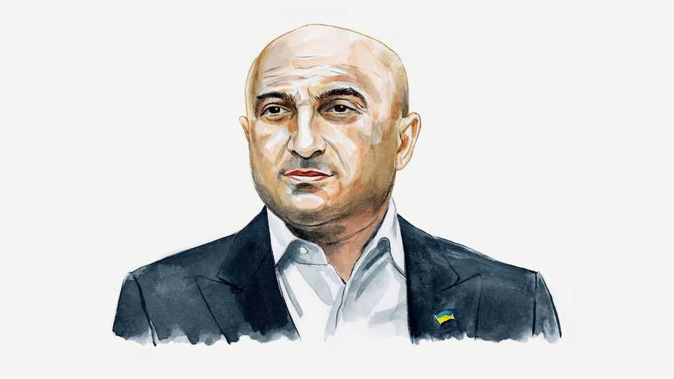

By Invitation | Postcard from Pokrovsk
Russia must get no amnesty in any peace deal for Ukraine
Gyunduz Mamedov, a lawyer-turned-soldier, fears the West will acquiesce in the Kremlin’s bid to undermine justice
November 27th 2025

FOR MOST Ukrainians, the Russian invasion split life into “before” and “after”. I’m no exception. Once upon a time, I was Ukraine’s deputy national prosecutor. Now I’m an army officer, advising front-line commanders and working in battlefield forensics. For much of the past few months I’ve lived in a dug-out near Pokrovsk, watching our brave defence of the city from up close.

In such conditions, survival is what matters. We have losses, far too many. We’re sleeping three hours a night. There isn’t exactly much time for reflection. And yet, all the same, I can’t stop thinking about my old line of work—and, in particular, about how the international justice system is failing. Russia is trying to escape responsibility for its atrocities. And it is achieving some success in the process.

Ukraine and its partners are now weighing an American-Russian draft peace plan that would grant “full amnesty for wartime actions”, with all parties “agree[ing] not to pursue claims or further settle grievances”. This provision, if enacted, would entrench impunity and erode the foundations of the international legal order. To fully appreciate what is at stake, one must understand the path Ukraine has had to endure.

Before the full-scale war, I led Ukraine’s effort to collect evidence of Russian war crimes. I began in 2016, working as a prosecutor on Crimea, then the Donbas. What I saw was a void: no one had truly been dealing with international crimes, not methodically, not structurally. Even the legal classification of what was happening was confused. Back then, I believed that if we only gathered enough evidence—if we documented every destroyed home, every tortured civilian, every unlawful killing—justice would follow.

Now I realise that I was wrong. Evidence means nothing if no credible criminal judicial process follows. History teaches that justice is usually the privilege of the powerful. More exactly, of the victors. After the second world war, the Nuremberg and Tokyo tribunals seemed to offer a universal promise: that law could be stronger than violence. But that promise has since been selectively applied. From Cambodia to Rwanda, from Srebrenica to Syria, justice has arrived late, limited, or not at all.

International criminal justice was already faltering before 2022. The West tolerated its own exceptions—from Iraq to Guantanamo. The International Criminal Court (ICC) was often left toothless, too cautious to investigate powerful states. Now Russia has learned to weaponise that weakness.

The result is that international law is being dissolved. Vladimir Putin is being allowed to flout ICC arrest warrants, flying to several foreign capitals including Ulaanbaatar and Dushanbe. The very idea that a head of state under

an active arrest warrant can move without consequence is proof that deterrence no longer works.

Ukraine, meanwhile, has proposed establishing a special tribunal for the crime of aggression—assuming, of course, it does not sign up to the blanket amnesty proposed in the Russian-American plan. I understand the impulse to create such a body. But I fear it is a legal structure built on moral correctness rather than legal durability. A tribunal initiated by the victim can be easily dismissed as partial. Few serious jurists believe it can overcome the problem of immunity for Mr Putin or other senior Russian figures. And without addressing this issue, can it truly meet the existing demand for justice?

As one of those who took up arms on February 24th 2022, I need not be told about the righteousness of our fight. But we need justice, not vengeance.

A credible international mechanism that would allow that is not straightforward. But perhaps the best path would be to give the ICC power to try the crime of aggression. When it comes to Russia’s aggression against Ukraine, the court is unable to address this foundational crime due to structural limitations—foremost among them the fact that Russia is not a party to the Rome Statute.

The Kremlin understands what is at stake. In talks, it has been insisting for some time that Ukraine renounce all legal claims against Russia. However tempting it may be for our politicians to bring a settlement closer, it would be a grave mistake. Allowing criminals to escape responsibility will only spawn other crimes. That is the lesson of the inter-war era. After the first world war, the collapse of plans to try Kaiser Wilhelm II contributed to an even greater catastrophe. Later, the fact that the crimes of the Soviet regime were never punished—and that the Russian Federation, as the Soviet Union’s successor state, carried this legacy forward—stands as a stark reminder of what happens when evil is left unchecked.

I have not lost hope. From the screens we watch near Pokrovsk, we still collect evidence. Footage showing our prisoners of war being killed in the most shocking and illegal ways. I’ve seen surrendered soldiers shot at point- blank range. I’ve seen wounded infantrymen executed by the Russians despite being immobile. These atrocities should keep us all focused on finding justice.

Russia’s war is a test of the international legal order. Should such crimes go unpunished, we can simply declare that might makes right, that borders can be redrawn by force. But the sad fact is that Ukraine cannot uphold justice alone. The West must actively promote the standards it claims to defend. Declared values carry weight only when anchored in virtues: wisdom, courage and a genuine commitment to justice. It is by practising these virtues, rather than simply proclaiming them, that the legal and moral order underpinning the free world can be upheld.■

Gyunduz Mamedov was Deputy Prosecutor General of Ukraine from 2019 to 2022. During that time he established the War Crimes Department, which led Ukraine’s first co-ordinated investigations of international crimes since 2016. Since 2022 he has served in the Ukrainian army.

This article was downloaded by zlibrary from https://www.economist.com//by- invitation/2025/11/24/russia-must-get-no-amnesty-in-any-peace-deal-for-ukraine

Briefing

Why Iran is making surprising overtures to America Many Israelis believe another war with Iran is coming