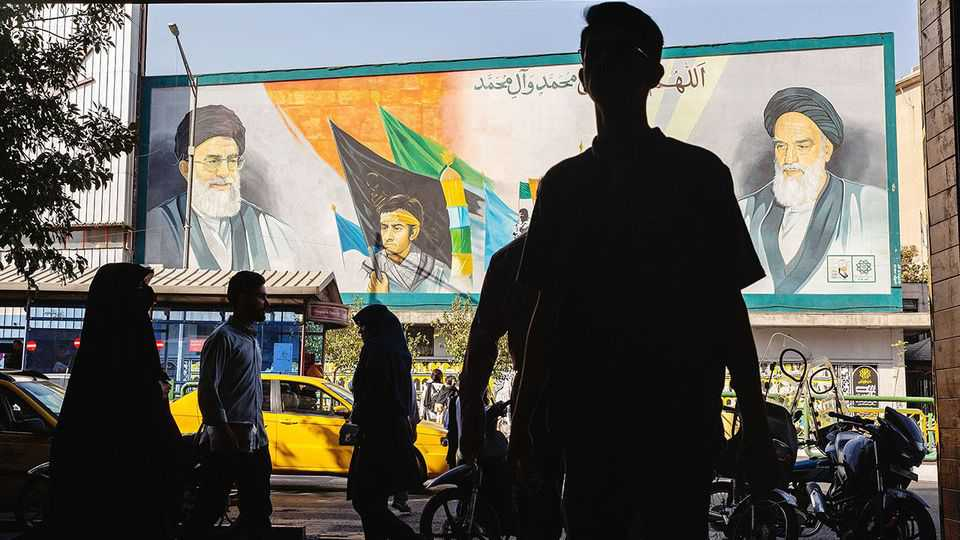
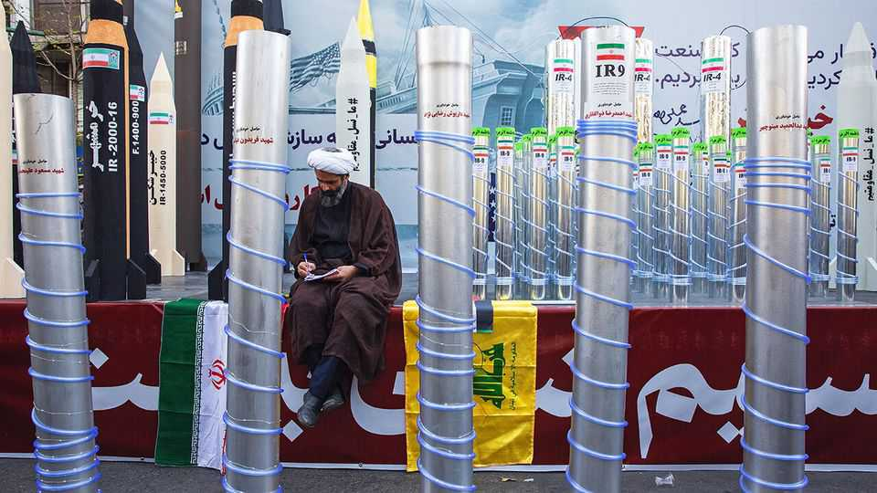
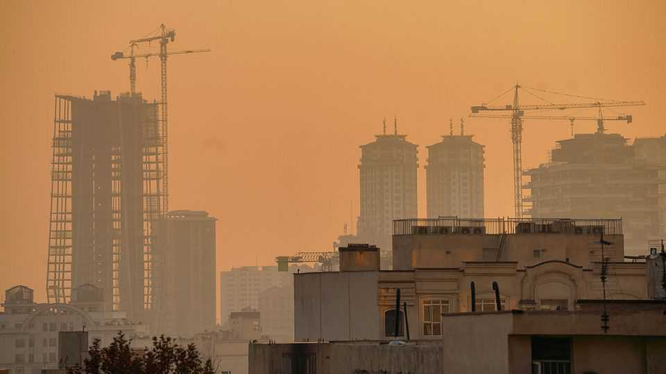

Briefing | Emollient mullahs
Why Iran is making surprising overtures to America
Its clerical regime appears to be adapting to survive
November 27th 2025

IT IS BARELY five months since America broke off negotiations over Iran’s nuclear programme and joined Israel in a lopsided 12-day bombing campaign against the Islamic Republic. Its air defences were pulverised, its top generals killed, its nuclear sites buried. The injured regime’s natural response might have been to lick its wounds and curse the two Satans, great and little. Yet its foreign minister, Abbas Araghchi, is signalling just the opposite.

That Mr Araghchi invited The Economist to Tehran for an interview was surprising enough. That he conducted the interview in English, against the advice of his media team, was even more unusual. That he agreed to speak to a correspondent whom the Iranian authorities had previously detained was yet more striking still. All these unexpected overtures appeared designed to underline the most remarkable thing of all: what he said. Iran, far from stewing in resentment, was ready to strike a “fair and balanced deal” with America, Mr Araghchi declared. Muhammad bin Salman, the crown prince of Saudi Arabia, is thought to have conveyed the same message directly to President Donald Trump on Iran’s behalf during a visit to Washington on November 18th. The regime, says an Iranian analyst, is desperate for a deal.

Mr Araghchi does not want to appear a pushover. “We are ready for negotiation, but not for dictation,” he cautions. Should it come to another fight, he says, Iran is ready, having learned some hard lessons from the 12-day war. It has already built a bigger and better stockpile of missiles, he claims. Iranian television channels broadcast endless images of secret bases in the desert bristling with missiles, of men in black fatigues carting munitions about and of devastating explosions that turn the sky red. “The night is long and the dervish is awake,” another official pronounces.

For the most part, this is bluster. Two of Iran’s three “prongs” of deterrence— its proxy militias around the Middle East and its nuclear programme—have been badly blunted. Israel has smashed Hamas and Hizbullah, previously the most threatening proxies. Houthi militants remain active in Yemen, but they are only a distant irritant for Israel. The American and Israeli strikes have also set back Iran’s nuclear programme. Whether owing to the bombing or out of prudence Mr Araghchi does not say, but enrichment “has now stopped”.

But the uncertainty surrounding the fate of the 400kg of uranium that Iran had enriched almost to weapons grade still gives Iran some leverage in any future negotiation. The regime has barred UN inspectors from visiting the bombed nuclear sites where, Mr Araghchi says, Iran’s stockpile lies buried. Western spies suspect that it managed to spirit out enough fissile material to make at least one nuclear device before the bombs fell. It may also have undetected enrichment facilities.

And there is always the possibility that a battered and cornered Iran becomes more dangerous. Some within its security establishment think its response to

Israel’s and America’s attacks was “too calibrated”. Next time, says Hamzeh Safavi, an analyst and son of a former head of the Islamic Revolutionary Guard Corps (IRGC), the regime’s praetorian guard, American bases in the Gulf would be fair game. “We’ll hit back at any base in any country that helps an attack on Iran,” vows yet another official. An attack on the Gulf states, in turn, would cause economic chaos and unleash a regional conflagration.

Yet Iran is clearly not seeking negotiations from a position of strength. Both domestically and internationally, the regime is in a bind. Although China buys its oil in defiance of American sanctions, it may not be willing to supply weapons. Russia might have fewer qualms, but has fewer weapons to spare. The economy is a mess. A newspaper editor who talks of national “decline” rattles off problems faced by ordinary Iranians, including water shortages, power cuts, choking smog and soaring prices. Popular discontent is visible in protests about all these scourges. Engagement with the West—however ideologically distasteful—is becoming a necessity.

Inflation is rampant. The price of rice has doubled in a year; onions are up 70% and cooking oil 40%. The slumping rial compounds the problem. Between 2018 and 2022 income per person shrank by almost a fifth. A third of Iranians now live below the government’s poverty line of $400 a month. Teachers typically earn less than $250 a month, a fraction of their salaries before the Islamic Revolution in 1979.

Tehran’s streets are clean but little new is being built. The city looks more shabby, dour and fatigued than when your correspondent last visited six years ago. There are more beggars and fewer cranes. Most of the latter are stationary. The once-gridlocked traffic has thinned. North Tehran has plenty of stylish coffee bars, but customers carefully nurse their drinks.

Iran has the world’s third-largest reserves of natural gas, yet it suffered a summer of blackouts. Power plants have taken to burning cheap, tarry oil instead of gas, hugely exacerbating already severe air pollution. Oil production, currently around 3.25m barrels a day (b/d), has never again come close to the 6m b/d achieved under the shah in the late 1970s. Not a single economic target from the government’s 20-year plan of 2005 has been met.

Six years of drought are intensifying the economic malaise. The reservoirs surrounding the capital are drying up. The peaks looming above Tehran are normally snow-capped. Yet when the haze lifts, now only barren rock is revealed. In Bushehr, a big southern port, the taps have already run dry. Masoud Pezeshkian, the president, has decreed that rice should be grown only in five provinces next year, not the usual 17. If the rains fail again, he said recently, he’d evacuate the capital—although his underlings quickly qualified his remarks.

The regime likes to blame the economy’s problems on Western sanctions. But powerful interest groups within Iran benefit from its insularity and would resist any opening. Sanctions may make trade with Western countries hard, but it is the regime itself that is impeding imports from China with high tariffs. “They strengthen the internal market,” exults Arsalan Kazempour, the boss of a conglomerate which produces everything from cooking oil to paper. He says sales are growing by 40% a year. The IRGC, critically, runs a sprawling business empire and also operates lucrative smuggling rackets.

Many Iranians point to mismanagement and corruption as the root of the economy’s difficulties. In front of billboards urging citizens to conserve water, sprinklers drench grass verges along the roadside. Fountains play merrily in country clubs frequented by the elite.

Discontent is everywhere. Even though government minders accompany your correspondent all the time, Iranians of all stripes openly grumble about their rulers. In private officials echo such sentiments.

The regime is trying to repress dissent. “What are you doing here? You’ll be arrested,” a doctor hisses when your correspondent asks to chat. “I can’t publish 80% of what I published when I started my career 25 years ago,” the newspaper editor says. Her staff are regularly summoned for interrogation or arrested. Her last summons was the previous week. Fines and lawsuits have forced the paper to cut its print-run by half and to move to tiny offices.

The government has executed more than 1,000 people in the past year, the highest number since the 1980s. Human-rights groups report a spike in suspicious “suicides” in prisons. The authorities’ paranoia appears to have become especially acute since the war revealed what detailed information Israel had about the regime’s inner workings. According to some reports, more than 20,000 Iranians have been held for questioning since.

Despite this crackdown, however, public frustration erupts into protest periodically. Farmers agitate for help against desertification. Bakers, lorry drivers and nurses denounce dwindling subsidies. Students are among the most vocal: “IRGC—you are our ISIS,” they chant at rallies. Elections, once an outlet for popular grievances, ring hollow. Turnout in Tehran in last year’s presidential poll was just 11%.

The authorities seem to realise that they have to pick their battles. There is little emphasis on public piety. In a week in Tehran your correspondent saw only one cleric on the streets. The call to prayer is relatively muted. A government propaganda tour stops at a gleaming new mall, not a shrine. “We’re the most secular country in the world,” insists a surgeon.

In particular, the government seems to have abandoned its fight to force women to wear the hijab. The relevant laws remain on the books, but the morality police who used to enforce them have vanished. Except at government offices and events, women’s bare heads are now the norm. North Tehran’s streets resemble a catwalk. Even senior officials do not always bother to maintain appearances: a leaked video from the lavish wedding of the daughter of Ali Shamkhani, an adviser to the regime’s supreme leader, Ayatollah Ali Khamenei, shows her unveiled and in a low-cut dress.

There is a sense that the regime is wavering in its convictions. It has plastered the capital with portraits of pre-Islamic heroes in an attempt to drum up national pride. A statue of an ancient Persian king receiving homage from a Roman emperor has been erected in Islamic Revolution Square. The celebration of Iran’s pre-Islamic history is redolent of the shah’s regime and would have been anathema in the early days of the revolution. “The old story

isn’t working,” says the nervous doctor, after ducking into a café where all the women are unveiled. “We’re becoming a republic, not an Islamic republic.”

Anti-Americanism is also fading. Diplomats imply they are almost friendly with their American counterparts. Mr Araghchi refers to Steve Witkoff, Mr Trump’s main foreign-policy envoy, as “Steve”. Even a guide at the former American embassy, today a museum cataloguing America’s sins, says the students who seized the building in 1979 and held its occupants hostage now admit the takeover was a mistake.

Although the war did briefly seem to bring Iranians together, fissures are already visible again. The IRGC seized on the fighting as a chance to increase its own authority, a move Mr Khamenei made easier by spending the war hiding in a bunker with minimal communication with the outside world. Even though the clerics are supposed to command the army, rather than the other way round, the generals killed at the start of the war have been buried reverently in the forecourts of local mosques.

The battle between Iran’s hawks and doves has also resumed. The hardliners argue that America has proved time and again that it is not trustworthy. In 2015, after all, Iran signed a nuclear deal with America, only for Mr Trump to renounce it when he became president a year later and impose strict sanctions. Mr Araghchi was busy haggling with “Steve” even as America signed off on Israel’s surprise attack this summer. From their bastion in the parliament, the hawks try to press their advantage. This month they impeached the doveish finance minister, Abdolnaser Hemmati. They will not necessarily scupper a deal with America, but will certainly resist an end to Iran’s nuclear programme, an invitation for Mr Trump, or anything that smacks of normalisation with Israel.

The factions within the regime are all awaiting an epochal event that cannot be far away. Mr Khamenei is 86. He is partially paralysed and increasingly frail. He is said to have drawn up a shortlist of possible successors. His son, Mojtaba—who has long been tipped as a possible heir—is reportedly not on it. Even cynics blanch at the idea of the revolutionary regime that overthrew a monarchy reverting to dynastic rule. Top posts in Iran often go to relatively obscure figures, buoyed by the support of different factions. Financial interests are likely to loom as large as ideological differences in the scramble for power.

What all this jockeying and intrigue will yield, whether in terms of talks with America or domestic reforms, is hard to predict. Many in Israel suspect the regime is simply awaiting the opportunity to revert to its past behaviour. But the flux in Tehran suggests it might be willing to reinvent itself to survive. ■

This article was downloaded by zlibrary from https://www.economist.com//briefing/2025/11/27/why-iran-is-making-surprising-overtures- to-america