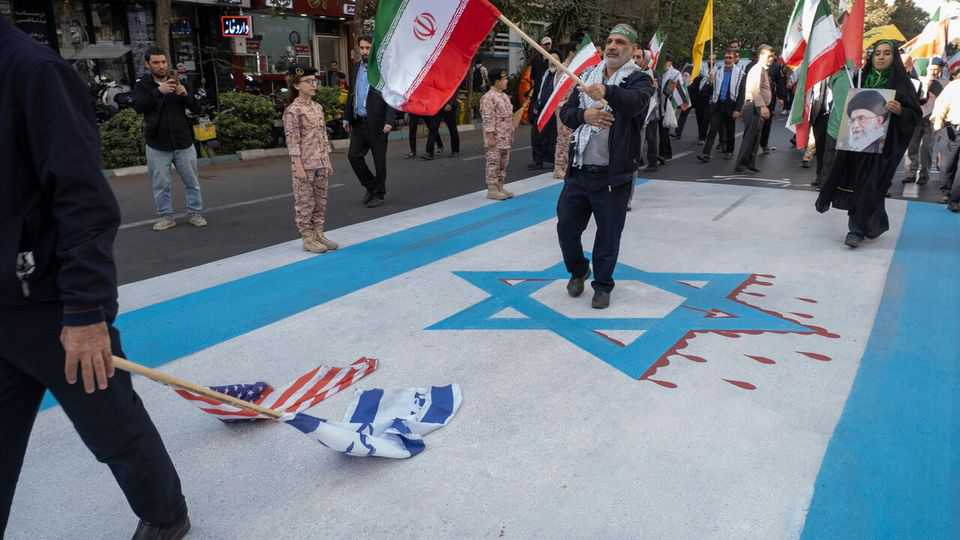

Briefing | A respite, not a reset
Many Israelis believe another war with Iran is coming
The only question is whether it will be sooner or later
November 27th 2025

“Iran simply can’t allow this impression to linger that we’ve been ahead of them every step of the way,” says an officer in an Israeli intelligence service. “They have to show that they can take us by surprise as well.” There are two schools of thought among Israel’s Iran-watchers. Some, like the intelligence officer, believe that the Islamic Republic will soon try to regain some of its lost standing in the region after two years of humiliation by launching some sort of surprise attack on Israel. Others argue that the regime

is focused on self-preservation and on trying to rebuild the military capabilities destroyed during its disastrous 12-day air-war with Israel in June. But both schools agree that the regime is likely to seek retribution. The question is only whether it will come sooner or later.

Raz Zimtt of the Institute for National Security Studies in Tel Aviv says Iran is already trying to rearm Hizbullah, a Lebanese militia which Israel has pummelled over the past two years. The Israel Defence Forces (IDF) are worried that Iran may start getting proxies in Iraq to launch missiles at Israel, much as Hizbullah used to do from Lebanon. Another fear is of a terrorist attack on an Israeli embassy or another such target.

By using proxies of one sort or another, all these forms of retaliation would be intended to make it more awkward for Israel to attack Iran directly in response. But the two schools of Iran analysts also agree that this stratagem would not work: Israeli reprisals would be swift, severe and aimed at Iran itself. That likelihood, of course, is a compelling reason for Iran’s leaders not to risk it, especially when they are already beset by so many problems at home. ■

This article was downloaded by zlibrary from https://www.economist.com//briefing/2025/11/27/many-israelis-believe-another-war-with- iran-is-coming

United States

MAGA is divided over the promise and perils of AI A shooting in Washington prefigures tougher immigration policies The federal government will now pay for Native American healing Chicago is facing a giant budget crisis California’s latest gold rush More Americans are being put to death “I love the smell of deportations in the morning”