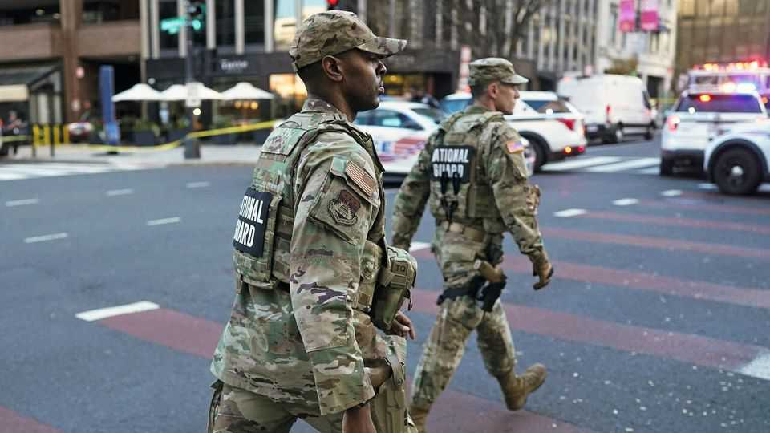

United States | Quis custodiet
A shooting in Washington prefigures tougher immigration policies
Members of the National Guard, who were deployed to protect people, became a target
November 27th 2025

For months National Guard troops in America’s capital have been on “presence patrol”. This is a fancy way of saying they have been taking walks with an eye to deterring crime. Their message to the city’s residents has been that the streets are safe. A shooting on November 26th, blocks from the White House, dispelled that idea—and the notion that Washington’s tourists and officegoers are the ones who need protecting. Two Guard members were themselves the target.

The soldiers were critically injured and hospitalised. The alleged attacker was shot, not fatally, by another Guard member. Donald Trump called it an “act of terror” and promised that the “animal” responsible would pay the “steepest possible price”. Officials named the suspect as Rahmanullah Lakanwal, a 29- year-old Afghan.

He is said to have arrived in 2021 aboard an evacuation flight after the Taliban takeover of Kabul. He—along with more than 70,000 other Afghans— received a temporary right to remain through a programme authorised by Joe Biden. The Biden administration offered similar schemes to Cubans, Haitians, Nicaraguans, Venezuelans and Ukrainians. Mr Trump ended most of them months ago.

Speaking after the shooting, the president called the arrival of “unvetted foreigners” the “single greatest national-security threat” facing America. Mr Trump said he will “re-examine every single alien who has entered our country from Afghanistan under Biden” and “ensure the removal of any alien from any country who does not belong here”.

The shooting will have consequences for Mr Trump’s use of the National Guard in DC, and perhaps elsewhere. A federal judge recently ruled that their deployment in the capital was illegal, though she paused her decision until December 11th to allow for appeals. Already the Trump administration has cited the attack in its legal filings. Meanwhile the Supreme Court is weighing a separate case about whether to let the Guard deploy to Chicago. This could affect its calculus, too.

And the shooting will give yet more impetus to Mr Trump’s immigration clampdown. Within hours the agency in charge of visa processing had halted all requests from Afghans. Mr Trump has cited crime by foreign-born residents as a basis for restrictions before. In June, in Boulder, Colorado, an Egyptian man whose visa had expired firebombed a pro-Israel demonstration. Days later Mr Trump imposed limits on travellers from 19 countries.

No mention is made of the fact that immigrants are less likely to commit crimes than native-born Americans. Extremist violence on their part is vanishingly rare—a testament to America’s skill at vetting and assimilating newcomers. Yet Mr Trump dislikes immigration, and talking it up as a security

threat gives him more excuse to restrict it. Courts tend to defer to the president in matters of national security.

As for the politics of the shooting itself, some of Mr Trump’s critics said it was the inevitable price of his performative use of the Guard. MAGA called it evidence of the capital’s crime problem, and the president called up 500 more guardsmen to DC. ■

Stay on top of American politics with The US in brief, our daily newsletter with fast analysis of the most important political news, and Checks and Balance, a weekly note from our Lexington columnist that examines the state of American democracy and the issues that matter to voters.

This article was downloaded by zlibrary from https://www.economist.com//united- states/2025/11/27/a-shooting-in-washington-prefigures-tougher-immigration-policies