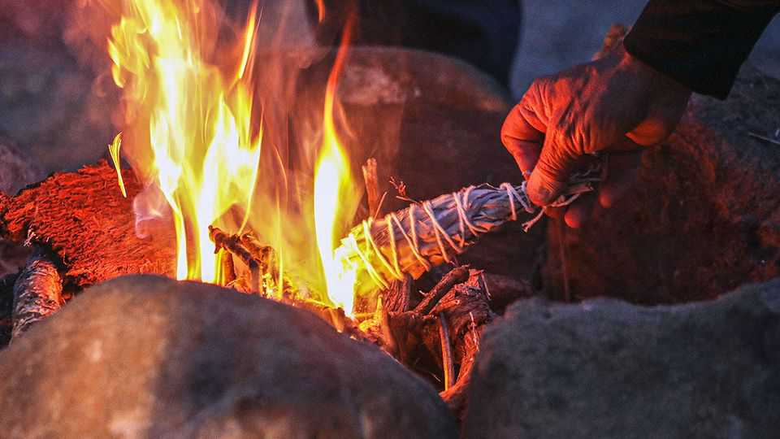

United States | Medicine show
The federal government will now pay for Native American healing
No, this is not a bizarre MAHA experiment
November 27th 2025

CAROLYN MORRIS flicks through a bulky folder in her office in To’Hajiilee, New Mexico. The clinical psychologist has filled it with the sorts of billing, evaluation and note-taking procedures that are now typical of American medicine. But they are all tailored for Native American healing rituals, like sweat lodges, a type of steam bath, and smudging, burning herbs. “I’m trying to design a way for a traditional healer to organise their thoughts,” Dr Morris, who is herself Navajo, explains. This bureaucracy is necessary because in some states traditional healing is now covered by Medicaid, the

federal health programme for the poor. She has taken on the red tape for the Cañoncito Band of Navajos Health Centre, just west of Albuquerque.

The change is not some bizarre Make America Healthy Again initiative, but the result of an experiment approved in the final months of the Biden administration. The states affected are Arizona, California, New Mexico and Oregon, which contain just over a quarter of Native Americans. Advocates hope that expanded traditional healing could help more people seek and remain in treatment. Native Americans are some of the sickest people in the nation, with life expectancy eight years behind the average. “It’s a huge deal,” which took over a decade to achieve, says A.C. Locklear, who leads the National Indian Health Board, a jubilant advocacy group.

Individual tribes can pick what healing is included and who is qualified to do it. To get the care paid for, people must both be enrolled in Medicaid, meaning they earn less than around $21,000, and be a member of a federally recognised tribe or a close family member of someone who is (additionally, California will currently cover only those in treatment for addiction). About a quarter of working-age Native Americans are on Medicaid and—unlike the Indian Health Service, which provides health care on reservations—it has open- ended funding.

Traditional healing “helps [patients] cleanse their mind”, says Sarah Bitsui, who works at the same clinic near Albuquerque. “The smell of the smudging of the herb, the prayers and the healing songs, it helps them get back on the right track.” It is particularly powerful for patients struggling with mental health problems or addiction, she argues (alcohol death rates are five times higher for Indians than among white Americans.) It can also draw people to a clinic and meetings with mainstream doctors. “The evidence showing the positive impact of traditional practices on health is emerging. It’s fairly new,” says Damian Chase-Begay of the University of Montana. “But it is steadily growing.” He points to his own research showing that Native Americans who value traditional healing are half as likely to use alcohol and drugs. The Medicaid pilots will give researchers a chance to conduct more research.

Depending on the state, the money for traditional healing is only authorised for two to five years. But advocates are optimistic that Robert F. Kennedy junior, the health secretary and himself a supporter of what is politely called nontraditional medicine, could keep it going. Mr Chase-Begay, the academic,

hopes that bringing traditional healing into federal funding could help preserve ancient rituals, too. ■

Stay on top of American politics with The US in brief, our daily newsletter with fast analysis of the most important political news, and Checks and Balance, a weekly note from our Lexington columnist that examines the state of American democracy and the issues that matter to voters.

This article was downloaded by zlibrary from https://www.economist.com//united- states/2025/11/27/the-federal-government-will-now-pay-for-native-american-healing