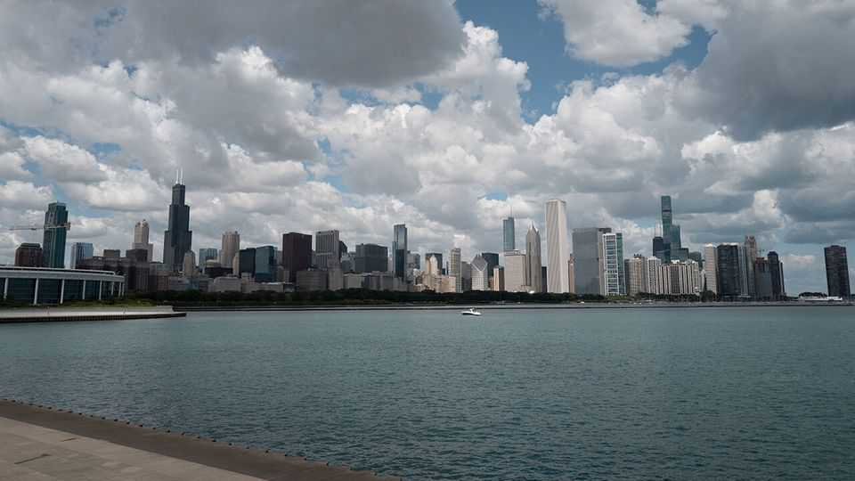

United States | Second city broke
Chicago is facing a giant budget crisis
Will the city choose to spend less or soak business?
November 27th 2025

The festive season is a time for physical post. Party invitations, presents, Christmas cards all arrive en masse through letter boxes. In Chicago this year there is a less welcome delivery too. Starting on November 14th, Cook County, which contains the city, started sending out its latest tax assessments to 1.8m property owners. This year, the average residential property bill has gone up by 17%.

The spike in tax bills has been long-expected. It is not that overall taxes have increased that much. Rather, for the first time property taxes now reflect changes in relative values since the covid-19 pandemic. Many downtown office buildings remain empty, and so their valuations have gone down. Property taxes target a total take, so this means taxes on residential properties automatically go up. The spike goes some way to explaining why Chicago is in a giant fiscal pickle. The Windy City may be a leading indicator of some of the problems many American metropolises will soon face.

The immediate problem for Chicago is a fiscal impasse. By the end of the year, by law, the city council and mayor must agree to pass a balanced budget. This year, thanks to the final winding down of pandemic-related federal support, the city has a $1.2bn deficit, equivalent to a fifth of the city’s operating budget (which it calls the corporate fund). What the city council and mayor Brandon Johnson agree on is that homeowners will not shoulder any further increase in the property tax (the bulk of which actually goes to the separate school district rather than the city, which is the other reason bills have risen so much). Otherwise they are on opposite sides.

There are really only two options: raise taxes or cut spending. Mr Johnson, a leftist who rose from obscurity to high office in 2023, does not want to make any cuts. Instead, he wants to reintroduce a $21 per employee monthly “head tax” on any business employing more than 100 workers, and to substantially raise a sales tax on services like software paid mostly by businesses. The mayor says that he is asking “large corporations and the ultra-wealthy to chip in more”. The teachers’ union, his principal backer, says that this amounts to “the most transformative budget to come out of City Hall in generations”.

The problem for the mayor is that not many people are inclined to give him what he wants. A generation ago, Chicago’s mayors could usually bully aldermen (city council members) to adopt whatever they proposed. Under the two Richard Daleys, a particularly imperious father-and-son pair, budgets often passed unanimously. Mr Johnson, however, is incredibly unpopular. Businesses hate the proposals, as does J.B Pritzker, the governor of Illinois, who is about as powerful in Illinois these days as Mayor Daley père once was.

On November 17th the city council finance committee voted down the mayor’s proposals 25 to ten. “We are concerned about the terrible signal it sends to people who create jobs,” says Bill Conway, an alderman whose

district covers much of downtown. He says Mr Johnson should instead come up with spending reductions. He points to a study commissioned from Ernst & Young, a consultancy firm, which proposes substantial savings by improving matters like procurement, which the mayor has mostly ignored.

The problem with the tax proposals is not so much that they would be that punishing initially, says David Greising, the boss of the Better Government Association, a watchdog. Rather it is the principle. The risk is that mayors come to rely on squeezing business a little more to fill the deficit each year. In future the city’s fiscal problems seem only likely to worsen. Already, some 40% of the total budget goes on paying debt and pension costs. For decades the city has filled its deficits with absurdly short-termist patches. In 2008 the second mayor Daley sold a 75-year lease on the city’s parking meters. But those sorts of options are running out.

And the bond market is fearful. On November 19th a bond issuance by the city, intended to refinance old debt, fell $75m short of its target. Even though the bonds issued are secured by sales-tax revenues, those that were sold did so at a higher interest rate than New York City pays on unsecured debt. If the city’s credit is downgraded, the cost of refinancing its long-term debt will rise, putting all the more pressure on future budgets.

Big cities all over America are facing similar challenges to Chicago’s, albeit not yet on the same scale. In New York, the mayor-to-be, Zohran Mamdani, has made large spending promises that he hopes will be paid for by tax increases that Kathy Hochul, the governor of the state, opposes. If he does not get them, he is more likely to have to make cuts than make buses free. In Los Angeles the city made a deal with unions in September to fill a yawning budget gap. President Donald Trump’s unilateral spending freezes are hitting city budgets even as lower immigration means populations—and the tax base —may start shrinking. The gusts chilling the Windy City now may be about to blow elsewhere. ■

Stay on top of American politics with The US in brief, our daily newsletter with fast analysis of the most important political news, and Checks and Balance, a weekly note from our Lexington columnist that examines the state of American democracy and the issues that matter to voters.

This article was downloaded by zlibrary from https://www.economist.com//united- states/2025/11/27/chicago-is-facing-a-giant-budget-crisis