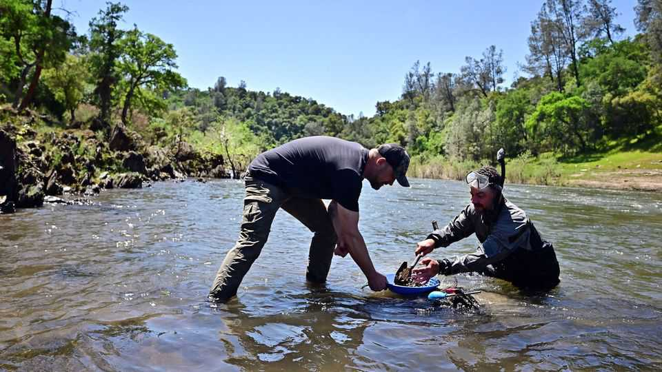
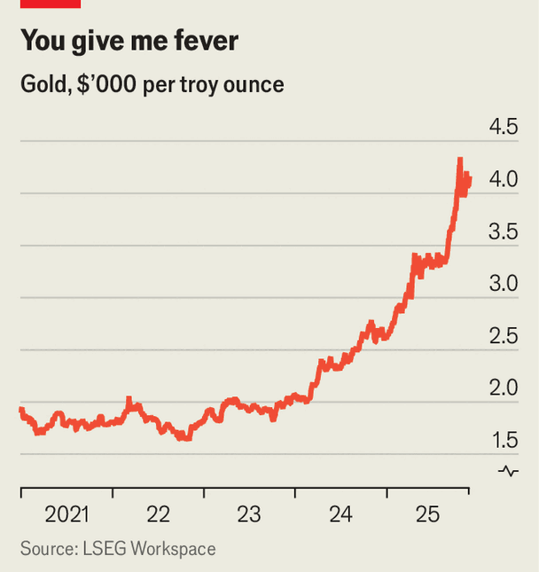
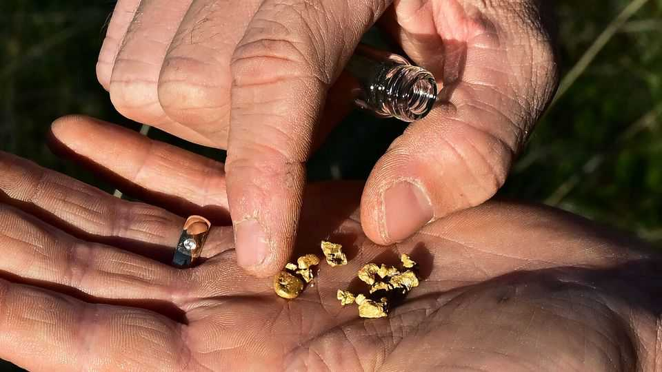

United States | Eureka!
California’s latest gold rush
The high gold price is luring prospectors to the mountains
November 27th 2025

HOLD THE pan with two hands, explains “Nugget” Nick Prebalick. Then swish the dirt around. It’s a balmy day in Jamestown, in the foothills of California’s Sierra Nevada mountains, and the second-generation miner is teaching your correspondent how to pan for gold. Dunk the pan three times, he continues, then repeat the whole process. Slowly but surely the rocks and sand wash away and leave behind a golden pebble about half the size of a pinky nail. “That’s a big piece!” says Mr Prebalick. He reckons it’s worth $20.

The gold price hit a record $4,380 an ounce on October 20th. It has since wobbled a bit, but is still around 55% higher than it was this time last year (see chart). Some analysts think gold could fetch $5,000 an ounce next year. Tourists, pensioners and treasure-seekers have flocked to the hills. Ten years ago Mr Prebalick could make about $30,000 a year showing people how to pan for gold. These days he says he is raking in more than $100,000. Prospecting clubs are growing. Marty Paulsen, the president of Temecula Valley Prospectors in southern California, says new people show up to every

monthly meeting. “How many of you joined the club to get rich?” he recalls asking. “Maybe eight or ten people raised their hands.”

The high price isn’t the only reason for this new gold rush. In recent years California has been buffeted by strong winter storms, which loosened gold deposits in the mountains. When the snow melts in the spring, nuggets and flakes tumble through rivers and lodge in creek beds, where a lucky miner may find them. Finally, spend time with a gold miner and they will mention the Discovery Channel’s “Gold Rush” reality show. The programme, now in its 16th season, follows rival mining crews in the Yukon in their quest to “get sluicy goosey for the tiny shiny”.

The high price, wet weather and reality fame have brought new life to California’s old mining towns, which depend on gold tourism. Columbia, one such town, is home to the Church of the 49ers, “Where God is the gold!” Drive around and you might spy Mother Lode Septic Services, Mother Lode Gun Club, and Mother Lode Dance Academy.

When gold was first found in 1848 eastern elites looked down on the riff-raff who went west, and the brawling boomtowns they built. “California”, wrote Henry David Thoreau in 1852, “is only three thousand miles nearer to hell”. Gold is still a risky business. Mr Prebalick patrols his property because

trespassers try to steal the sparkly stuff. It is possible to hit the jackpot: Mr Prebalick says he and his father once found 127 ounces in one day. But historians of the gold rush and modern miners argue that the real money is made by selling equipment to gullible prospectors. Greed, it turns out, is a surer bet than gold. ■

Stay on top of American politics with The US in brief, our daily newsletter with fast analysis of the most important political news, and Checks and Balance, a weekly note from our Lexington columnist that examines the state of American democracy and the issues that matter to voters.

This article was downloaded by zlibrary from https://www.economist.com//united- states/2025/11/25/californias-latest-gold-rush