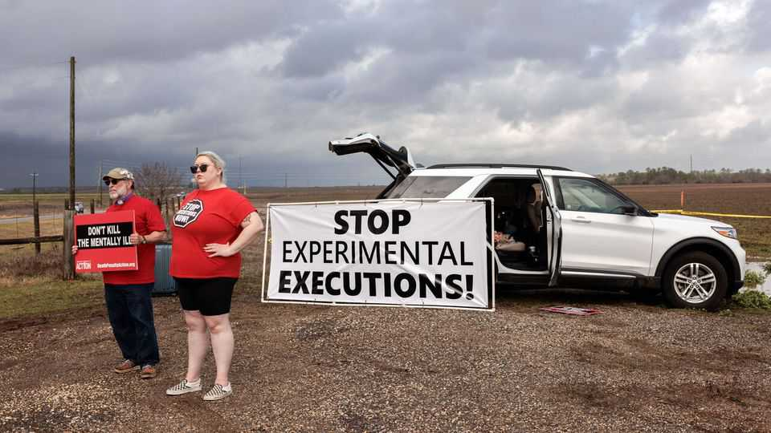
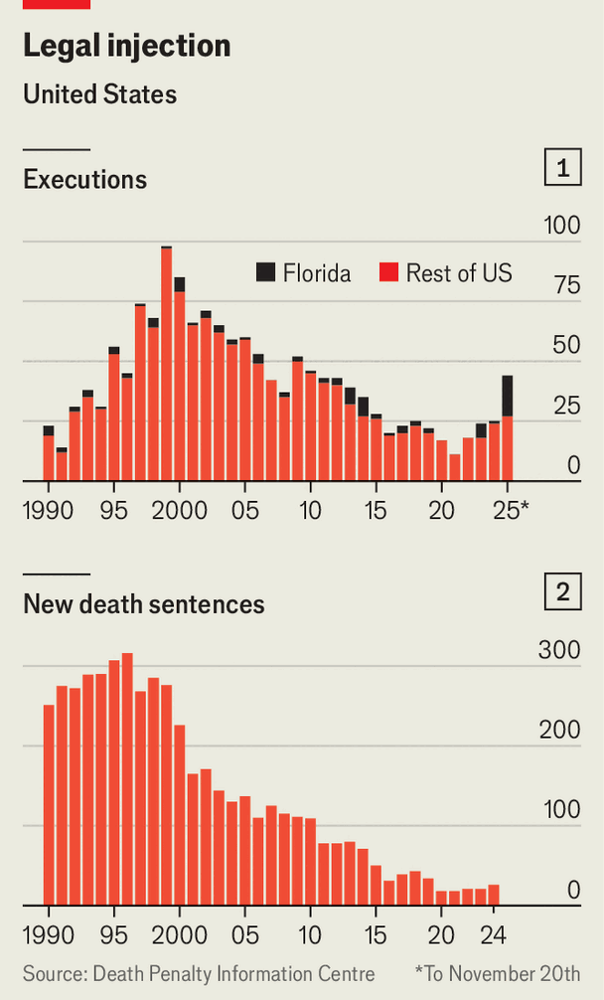

United States | Licence to kill
More Americans are being put to death
How the Supreme Court ushered in a surge in executions
November 27th 2025

AT TWILIGHT NEARLY four-dozen churchgoers from Our Lady of Lourdes in Daytona Beach shuffled off a bus onto a sun-bleached field facing the Florida State Prison. The Catholics had come to pray while Malik Abdul- Sajjad was being executed for the 1988 murder of a convenience-store clerk. They stood under a wooden sign carved with the word “opponents” until the vans carrying execution witnesses drove away, signalling the man had been killed. Each time the state puts someone to death, the caravan makes the two-

hour drive up the coast. Last year they came once. This year they have come 17 times.

By the end of December America will have executed 47 people, nearly double last year’s tally and the highest in nearly two decades. Florida, which is on track for its deadliest year on record by far, is responsible for most of the surge (see chart 1). But a handful of southern states that for years had paused executions have also resumed. Nationally, the number of people put to death remains far below the peak in the nineties. The long decline since then, however, appears to now be reversing.

One might expect the sudden killing spree to reflect the country’s mood, but it comes as support for capital punishment hits a 50-year low (though 52% of Americans still support it). Jurors have soured on it: since 1996, the number of new death sentences in America has fallen steeply (see chart 2). Lawyers reckon that the public is waking up to the fact that there is no evidence that capital punishment deters crime, and that historically states have not been very good at sentencing the right people. Since 1973, 201 death-row inmates have been exonerated. “There is a widespread realisation that we don’t need the death penalty and that the justifications for it are completely faulty,” says Cliff Sloan of Georgetown University.

Why then are states pressing ahead? The choice usually lies with a few powerful people—some of whom still seem to think killing is good politics. Ron DeSantis, Florida’s lame-duck governor with higher-office ambitions, ramped up executions while running for president, then paused them once he dropped out. In Oklahoma, where the state wanted to put most death-row inmates to death in just three years, an elected judge refused the Department of Corrections’s plea to slow the pace of executions to avoid officer burnout and told them to “man up” (he was later overruled). Indeed, tough-on-crime pressure is coming from the top: when Donald Trump took office, he immediately urged states to clear out their death rows and promised to help with any obstacles.

The biggest shift, however, comes from the Supreme Court. A decade ago the court would routinely block states from executing people without solid evidence or in torturous ways, forcing judges to make life-or-death decisions in the eleventh hour. In 2019 a more conservative-leaning bench appointed by Mr Trump changed course. In Bucklew v Precythe, it raised the bar for what counts as cruel and unusual punishment—laying the groundwork for states to test out new methods beyond lethal injection—and declared that “last-minute stays should be the extreme exception, not the norm.” The next year, Mr Trump presided over the executions of 13 people in the final six months of his first term, the first bout of federal executions in 17 years.

Bryan Stevenson, who runs the Equal Justice Initiative in Alabama, reckons that the court’s retreat from policing the death penalty has emboldened states to pursue executions they once wouldn’t have and to be more “experimental” in how they kill. This year the justices haven’t paused a single execution,

according to the Death Penalty Information Centre. Nor have they intervened in cases of obvious suffering. In May a three-officer firing squad in South Carolina missed a man’s heart, leaving him to die slowly, and in October an Alabama inmate thrashed for nearly 40 minutes as he suffocated from nitrogen gas—a fate he had petitioned the court to spare him from.

Phillip Egitto, the pastor who leads the Catholic caravan, has noticed the shift from the field outside the prison. Years ago his group would wait for hours in the dark as the courts debated whether the man in the death chamber should get another hearing. “Now our governor has it down like clockwork, it always starts sharply at six o’clock,” he says. Florida isn’t just taking advantage of the court’s retreat, it is also testing it. In 1977 the justices prohibited capital punishment for rapists, and in 2008 they clarified that the ban applied even for a child rape. This month the Sunshine State’s attorney-general said he would seek the death penalty for a nanny who molested children. His aim in bringing the unconstitutional charge, he explained, is to get the high court to overturn its precedent and allow the state to do more killing. ■

Stay on top of American politics with The US in brief, our daily newsletter with fast analysis of the most important political news, and Checks and Balance, a weekly note from our Lexington columnist that examines the state of American democracy and the issues that matter to voters.

This article was downloaded by zlibrary from https://www.economist.com//united- states/2025/11/24/more-americans-are-being-put-to-death