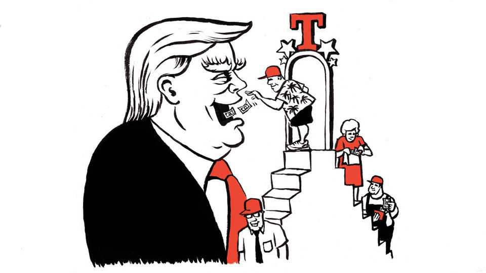

United States | Lexington
“I love the smell of deportations in the morning”
Through countless emails asking for political donations, Donald Trump is writing the MAGA narrative of his presidency
November 27th 2025

The invitation to join President Donald Trump’s cabinet would have come as a shock if Lexington had not already been honoured with so many generous proposals from the man: to be a White House Adviser, to join the Trump Inner Circle and the Trump Executive Board, and to become a member of the Trump Gold, Diamond and Platinum Clubs along with the Anti-Antifa Club. “J.D. Vance and I were just talking about you,” he emailed one day, with the offer of a seat on the Trump Advisory Board. All the president was asking in return,

besides sage counsel, was a donation of as little as $25 to his political action committee (PAC).

Mr Trump has been raising huge sums from billionaires and corporations for an ever-lengthening list of initiatives, from his triumphal arch in Washington to his efforts to retain majorities in Congress. But he has also continued imploring his less wealthy supporters, sometimes several times a day, to chip in to finance his core political operation via “Never Surrender”, a PAC created this year to replace a similar fundraising vessel that served his campaign in 2024.

For students of Mr Trump’s politics, his small-dollar appeals have particular value. Together, the hundreds of proposals and pleas Mr Trump has emailed to his most passionate supporters compose the MAGA narrative of his second term. They illuminate his movement’s priorities, mood swings and taste, at least as Mr Trump and his team understand them, and surely no one understands them better. It is a tale of triumph and yet constant peril, for the story, often rendered in all-caps, is a melodrama, and the emails are soaked in emotion.

As the tantalising prospect in the spring of “$5,000 DOGE DIVIDEND CHECKS!” gave way in the autumn to that of “$2,000 TARIFF REBATE CHECKS!” the tale was interesting as well for what it ignored: for example, almost anything to do with foreign policy. Mr Trump has clearly relished his royal treatment in foreign capitals and such bold strokes abroad as bombing Iran. But he did not mention them in soliciting his base. Instead, prominent issues in this chronicle include changing the name of the Gulf of Mexico to the Gulf of America, resisting communism and deporting undocumented migrants. In a clue to the demography of his small donors, the achievement Mr Trump probably cites most, with trademark overstatement, is “NO TAXES ON SOCIAL SECURITY!”

The president’s victories are perpetually menaced by “Radical Left Lunatics, also known as The Democrat Party” and by “unelected radicals in the courts”. Mr Trump urgently needs money to stop the Democrats from impeaching him again and from giving free health care and the vote to “illegal aliens”. A rare email touching on foreign affairs emphasised how Democrats who “HATE our country” are “CONSPIRING WITH CHINA”.

Whoever may be writing these messages, their sensibility is impressively Trumpian—conversational and even familiar (particularly after the IT team fixed an apparent bug that rendered the recipient’s first name as “your name”). The result is a simulacrum of the intimacy accorded to those who can afford to attend a fundraiser in the real world. Mr Trump often assures the recipient that he loves him. “You were on my mind the other day,” read one subject line. In an oft-repeated solicitation Mr Trump recalls being shot and wounded, saying God saved him to make America great. The Trumpian wit is frequently on display. “I love the smell of deportations in the morning,” he wrote.

And, very often, along with memberships and honours, there is stuff to be had: signed golf balls, gold golf balls, a chance at one of 1,500 “very limited edition” replicas of the “Gulf of America” executive order (curiously, the same limited number was on offer again two weeks later). Sometimes, the offer is of a possible offer: recipients are periodically asked to vote on whether they would prefer the chance of a motorcade ride to Trump Tower or a “Trump Force One” flight to Mar-a-Lago. The pressure can be intense. Lexington was alerted many times he had just six hours left to join the Platinum Club, until one day he was informed the membership he had never purchased was about to expire.

By Mr Trump’s fundraising standards, Never Surrender is small beer. It had about $38.5m in cash on hand as of June 30th, the end of the last reporting period, compared with $196m held by his super PAC, MAGA Inc. Though MAGA Inc can take donations in unlimited amounts, Never Surrender is subject to limits of $5,000 annually per person, and it cannot take corporate money. This compliance with stricter federal standards means that, unlike with MAGA Inc, Mr Trump can direct the funds in Never Surrender to specific candidates. “It’s particularly valuable in a political sense,” says Trevor Potter, president of the Campaign Legal Centre, a non-profit. Yet, he notes, this more democratic, transparent fundraising comes with its own political cost: “It encourages and incentivises people to be extreme in at least their public persona, because that’s what excites the base.”

In politics as in business, Mr Trump has succeeded in part by testing the limits of American cynicism on the one hand, and American credulity on the other. His high-dollar fundraising capitalises on the former, while his email solicitations are so transparent in their exploitation of the latter as to recall how he once marvelled at patrons in one of his casinos: “Look at those

losers,” he remarked, according to “Confidence Man” by Maggie Haberman. Though, in fairness, Mr Trump can surprise with his attentiveness. As Thanksgiving approached, he emailed to say he had personally approved Lexington’s application to the Platinum Club, though Lexington could not recall even making one. All the president needed in return was confirmation. And $20.25. ■

Subscribers to The Economist can sign up to our Opinion newsletter, which brings together the best of our leaders, columns, guest essays and reader correspondence.

This article was downloaded by zlibrary from https://www.economist.com//united- states/2025/11/27/i-love-the-smell-of-deportations-in-the-morning

The Americas

Jair Bolsonaro is jailed, leaving the Brazilian right fractured Canada’s indigenous-style prisons are designed to right historical wrongs Colombia’s armed groups are experimenting with deadly drones