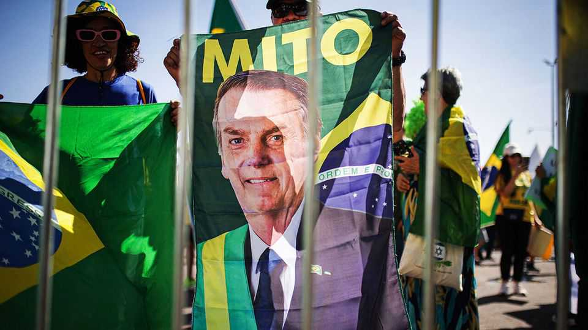
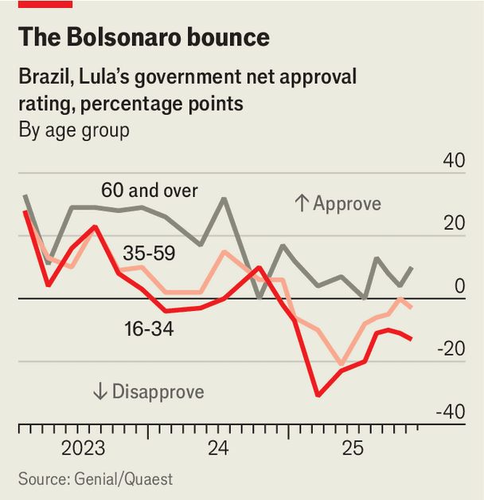

The Americas | Messiah no more
Jair Bolsonaro is jailed, leaving the Brazilian right fractured
His son’s actions have not helped
November 27th 2025

On November 25th Jair Messias Bolsonaro, Brazil’s hard-right former president, began a 27-year jail sentence for attempting a coup after losing his re-election bid in 2022. Brazil’s Federal Supreme Court found Mr Bolsonaro guilty in September. His lawyers appealed, and asked that he serve his sentence under house arrest because of his medical condition. They failed. Mr Bolsonaro will be confined to a small room designed for high-ranking officials at the Federal Police headquarters in Brasília, the capital. He will have a TV, air-conditioner, en-suite bathroom and the right to a daily “sun bath”.

Mr Bolsonaro’s imprisonment marks the end of his drawn-out exit from politics. In 2023 he was barred from public office for eight years for abusing his powers and using state media to spread falsehoods about voting machines. Yet he insisted that he would appear on the ballot. Other right-wingers eager to compete in next year’s general election, which will be held in October, were stuck in his shadow. With less than a year to go until the vote, Brazil’s right has no obvious leader. Infighting among potential candidates is growing.

The picture was very different just months ago. Approval ratings for President Luiz Inácio Lula da Silva, a left-wing stalwart serving his third term in office,

were sinking (see chart). Food inflation was stubbornly high, the left’s social- media presence feeble. Many voters felt that Lula, as the president is known, was spending too much time on foreign trips and too little tackling bread-and- butter issues at home.

In many ways Mr Bolsonaro’s own family is to blame for the reversal in the right’s fortunes. In March one of his sons, Eduardo, took leave from his job as a congressman in Brazil and moved to Texas to lobby Republicans to protect his father from prosecution. Donald Trump responded by imposing crippling tariffs of 50% on Brazilian imports, citing a “witch-hunt” against Mr Bolsonaro, as well as sanctions on the supreme court judge in charge of the case.

While Lula called the Bolsonaro family “traitors to the country”, ambitious right-wingers were put in a bind. At pains to dissociate themselves from the unpopular tariffs, they also wanted to show support for Mr Bolsonaro: any right-wing candidate needs his blessing if they are to be competitive in the election. It didn’t help that on September 7th, Brazil’s independence day, thousands of Bolsonaro supporters marched through São Paulo under a gigantic American flag. “They gave Lula the slogan of sovereignty on a silver platter,” says Camila Rocha of the Brazilian Centre for Analysis and Planning, a research institute.

Right-wing leaders tried to blame Lula for the tariffs, accusing him of being incapable of or uninterested in negotiating with Mr Trump. “Lula put his ideology above the economy, and this is the result,” asserted Tarcísio de Freitas, the governor of São Paulo and a possible presidential contender. That narrative soon fell apart, as Mr Trump and Lula cosied up. After meeting briefly on the sidelines of the UN General Assembly in September, Mr Trump praised their “excellent chemistry”. On November 20th, in response to pressure at home, he removed most of the tariffs on many of Brazil’s exports to the United States, including staples such as coffee, beef and fruit. He appears to have all but forgotten Mr Bolsonaro.

Eduardo’s rogue actions also led to an internecine spat. Brazilian investigators, who have charged him with attempting to interfere with Mr Bolsonaro’s trial, released text messages he sent his father in which he bad- mouthed Mr Freitas: “He has stood by with his arms crossed, watching you get screwed while he warms up for 2026.” In part because of the spat, Mr

Freitas has been reluctant to run for the presidency, claiming instead that he will stand for re-election as governor, a safer bet. “The big problem for the next candidate is Bolsonaro’s sons,” says Gabriel Rezende, a political scientist in Rio de Janeiro. No one knows who they will support.

As the right split, Lula’s government found its mojo. On November 5th the Senate passed his headline campaign promise: a reform raising the threshold for income-tax exemptions from 3,036 reais ($564) per month to 5,000, and lowering taxes for those earning up to 7,500. It will benefit some 16m Brazilians. Plans to increase taxes on rich Brazilians, fintechs and gambling firms would make the package revenue-neutral, but these are going nowhere.

The reforms are wildly popular with Brazilians and have forced right-wing legislators into contortions. “There’s nothing to celebrate,” claimed one deputy after the bill passed in the lower house and she had voted to support it. “Does anyone doubt that the price for this bill will be passed on [to consumers] in higher prices for products?” asked another, who also voted in favour. Ahead of the vote Lula’s new social-media team flooded Brazilians’ feeds with AI-generated videos lambasting “the BBBs: billionaires, banks and betting companies”. In one, a wealthy patron gorges on lobster and champagne but insists on paying a lighter bill than his working-class co- diners, who have had simpler meals.

Since it is losing the argument on sovereignty, tariffs and taxes, the right is going for Lula’s weak spot: security. On October 28th a police raid on two favelas in Rio killed over 130 suspected gang members. Most Brazilians supported the raid, but Lula suggested that traffickers were themselves victims of drug users, sparking outrage. “The left has an incapacity or an inhibition against going after criminal organisations, with which it works,” says Ronaldo Caiado, a right-wing presidential hopeful and governor of Goiás, an agri- business-powerhouse state. (There is no evidence the left works with gangs.) He wants to label gangs as “narco-terrorists”, aping the Trump administration’s language.

Other candidates are also trying to bolster their crime-busting credentials. On November 17th Eduardo and his brother Flávio Bolsonaro, a senator, visited El Salvador. Strongman president Nayib Bukele has thrown more than 1.5% of the population into jail as part of a crackdown on gangs; an astonishing 8% of all young men have been arrested. Days later Brazil’s lower house approved

a bill introduced by a close ally of Mr Freitas that would increase prison sentences on gang members and make it easier to confiscate their assets.

Much could still go wrong for Lula. Most Brazilians think the 80-year-old should not run for office again. His income-tax reform could push up inflation by boosting consumption. If security deteriorates it could make him look soft on crime. Romeu Zema, another presidential hopeful who is the governor of Minas Gerais, says the left “depends totally on Lula”, while the fierce competition on the right “proves it is better at producing good leaders”. In the long run, that may be true. But for now the greatest beneficiary of Mr Bolsonaro’s chaotic legacy is Lula. ■

Sign up to El Boletín, our subscriber-only newsletter on Latin America, to understand the forces shaping a fascinating and complex region.

This article was downloaded by zlibrary from https://www.economist.com//the- americas/2025/11/26/jair-bolsonaro-is-jailed-leaving-the-brazilian-right-fractured