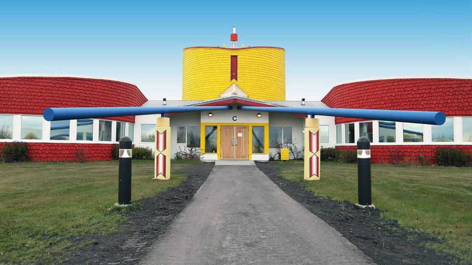
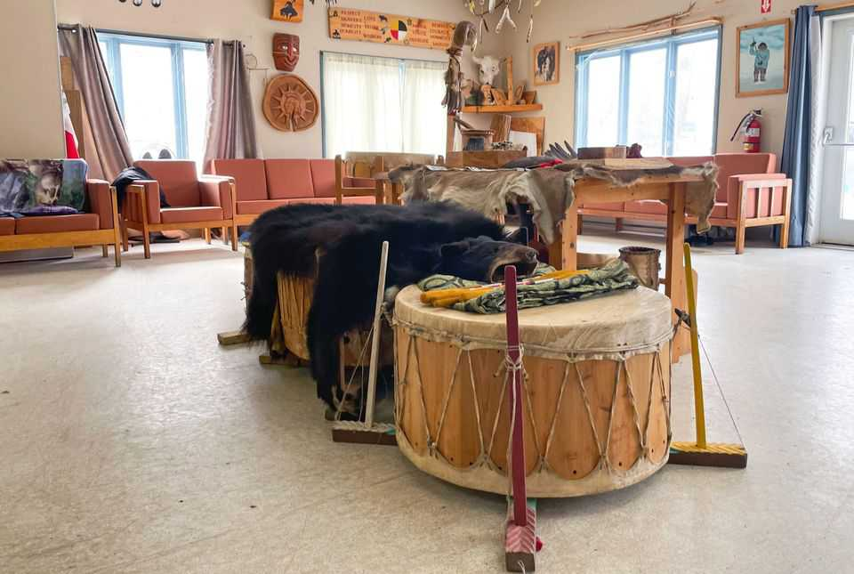

The Americas | Time to heal
Canada’s indigenous-style prisons are designed to right historical wrongs
When rehabilitation is the focus, reoffending rates drop
November 27th 2025

WIllow Cree Healing Lodge does not look like a prison. The men held there are not called “offenders” but nîcisânak, a Cree word for siblings. Their day usually starts with prayers and smudging, in which a spiritual adviser wafts smoke over inmates as an act of cleansing. Later they may study for a high- school diploma, learn to fight fires or attend a sweat-lodge ceremony.

This is one of ten such institutions in Canada. Healing lodges are alternatives to prison based on the practices and beliefs of Canada’s indigenous peoples, who have suffered centuries of discrimination, forced assimilation and abuse. They are far more likely to end up in prison than the average person. Five percent of Canadians describe themselves as indigenous, but they account for a third of the people in prison; in women’s prisons the figure is half.

The first healing lodge opened in 1995 as a way to rehabilitate indigenous prisoners. Unlike in rehabilitation-focused prisons elsewhere, the emphasis is on reconnecting with heritage. Elders counsel inmates and teach indigenous languages and history. They also lead spiritual ceremonies, dances and feasts. Each healing lodge reflects the traditions and style of its region. One in Manitoba has a tipi-inspired design, whereas the one in British Columbia has a longhouse.

Indigenous men have the highest rates of recidivism of any group in Canada. Healing lodges are meant to help break this cycle. Men who go through them are half as likely to end up back in jail compared with similar offenders who do time in conventional prisons.

For prisoners to succeed after release, they need a job, family support and a sense of purpose, says Justin Tetrault of Simon Fraser University. The lodges work because they help inmates to learn to look after themselves, as well as professional skills. In a normal prison, inmates make few decisions for themselves. At a healing lodge, they prepare their own meals and do charity work. Healing lodges also help offenders make sense of their past. An elder, for example, might help an inmate forgive his mother’s mistakes by explaining the horrors of the residential school she was sent to.

Over the past decade, the number of indigenous prisoners has grown faster than the spaces available at healing lodges. Most have a long waiting list. In total, there are about 450 beds. That is enough for less than 10% of the indigenous people in lock-up. ■

This article was downloaded by zlibrary from https://www.economist.com//the- americas/2025/11/27/canadas-indigenous-style-prisons-are-designed-to-right-historical- wrongs