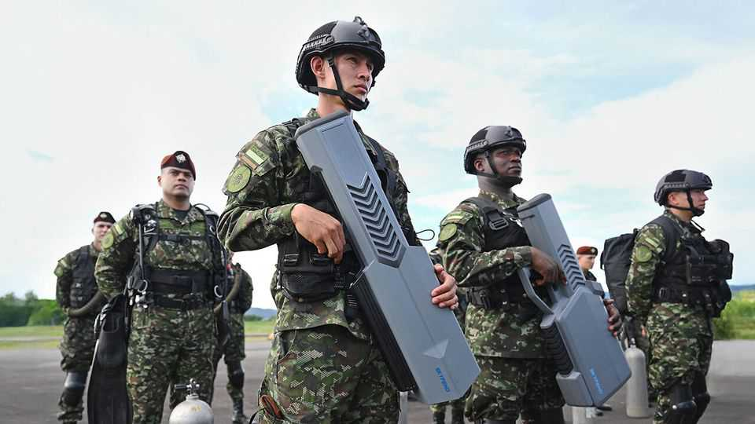
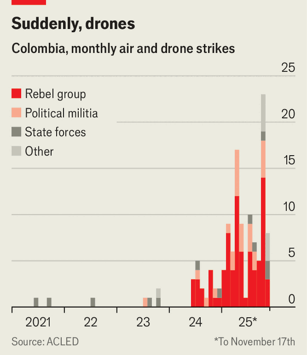
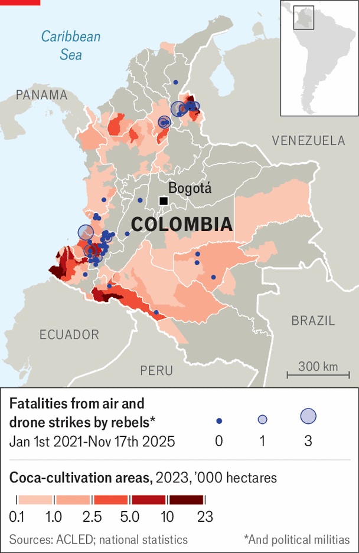

The Americas | Kamikaze craze
Colombia’s armed groups are experimenting with deadly drones
Drone warfare is becoming Latin America’s latest criminal innovation
November 27th 2025

DRONE WARFARE has come to Colombia. In recent months the country’s security forces have been targeted with one drone strike after another by armed groups, consisting of roughly half a dozen drug gangs, and revolutionary militias that have been battling the government for more than 60 years. Soldiers on patrol, army bases, police stations and naval vessels have been hit. “The old guerrillas tried a thousand times to get missiles and never succeeded,” said Humberto de la Calle, Colombia’s former vice-president,

after a wave of drone attacks this summer. “This has never happened before in Colombia.”

Armed factions have been deploying drones for years. The Gulf Clan, a drug gang, was using them for smuggling in 2016. Two years later the National Liberation Army (ELN), a paramilitary group, began using them for surveillance. But the use of weaponised drones by gangs did not begin until

2023. Last year a ten-year-old boy was the first person in Colombia to be killed by a drone after it dropped a grenade on a football pitch. Attacks have risen sharply since then. Armed Conflict Location and Event Data (ACLED), a research group based in the United States, has recorded more than 80 drone attacks in Colombia by non-state groups since the start of the year, up from fewer than 20 in 2024. Air strikes from helicopters and planes, which are the preserve of Colombia’s armed forces, are now vastly outnumbered by drone attacks.

Colombia’s armed groups were already on the front foot. Since his election in 2022 Gustavo Petro, Colombia’s president, has pursued a policy of paz total (total peace), negotiating with nearly all the country’s armed groups at once. But the policy has failed. The militias have used ceasefires to regroup, rearm and train with drones. Their ranks have swelled and they have seized territory.

In January the ELN launched an offensive in Catatumbo in the east of the country, where it has since carried out several drone attacks. Footage shows Colombian soldiers scattering when a mortar shell, dropped from above, explodes next to them. Cauca, a western province where gangs are fighting for access to the Pacific ocean, is another hotspot.

In July a faction of the Revolutionary Armed Forces of Colombia (FARC) hit a navy patrol boat with a first-person-view (FPV) drone, the kind that is piloted by an operator watching through its camera. The pilot flew it into the boat and the drone exploded, kamikaze-style. It was perhaps the first deadly use of FPV drones in Colombia.

One reason for the rise in attacks is the availability of cheap commercial drones, mostly manufactured in China, which armed groups can modify to carry bombs. Another is the use of drones in the war in Ukraine. The appearance of videos from that conflict was a “watershed moment” which showed Latin American armed groups what could be achieved, says Henry Ziemer of the Centre for Strategic and International Studies, a think-tank in Washington. Thousands of Colombian fighters have joined the conflict in Ukraine as mercenaries; some are said to have enlisted in Ukraine’s foreign legion to gain experience with drones. Gangsters in Mexico, who have also increased their use of drones, are thought to have done the same.

Colombian drone operators are much less skilful than Ukrainian ones. While “it’s easy to get started using drones, it’s harder to use them very effectively”, as Mr Ziemer points out. According to ACLED’s database, few of the strikes launched in Colombia actually succeed in killing one or more of their targets. Still, the armed forces are worried. Knowing that their enemies operate drones is enough to limit what the soldiers are willing to do. And drone use is probably still a long way from reaching its peak. As groups like the ELN and the Gulf Clan gain experience in using the devices, their ability to do serious damage with them is likely to improve.

The armed forces are beginning to fight back. This year a state-run aerospace firm developed the Dragom, Colombia’s first domestically produced attack drone. In October the air force started its own drone unit. The government has also spent $25m on American-made jamming equipment to defend army

bases. It may deploy such kit to protect rallies and polling stations during next year’s election.

It is not clear whether these measures will work. Unlike in Ukraine, where most of the fighting takes place along a fairly continuous front line, Colombia’s armed groups are fighting for control of small areas of territory, spread out right across the country. That makes it hard to counter drones with jammers without disrupting civilian communications.

Clamping down on supply chains is another solution: the government is trying to tighten import restrictions and introduce a tougher permit system for drone ownership. But smuggling networks would probably be quick to adapt.

In the meantime, weaponised drones are spreading beyond Colombia. In September a drone attacked a prison in Guayaquil, Ecuador’s biggest city. Last month gangs in Brazil used drones to launch grenades at police during a raid in Rio de Janeiro. Drone warfare has battered Colombia. It looks set to shake the region, too. ■

Sign up to El Boletín, our subscriber-only newsletter on Latin America, to understand the forces shaping a fascinating and complex region.

This article was downloaded by zlibrary from https://www.economist.com//the- americas/2025/11/25/colombias-armed-groups-are-experimenting-with-deadly-drones

Asia

Meet the road-building, Muslim-baiting monk who could rule India Nepal’s youth toppled the government. Now they want to remake it America’s oldest ally in Asia is drawing closer to China When is a Malaysian footballer not a Malaysian footballer?