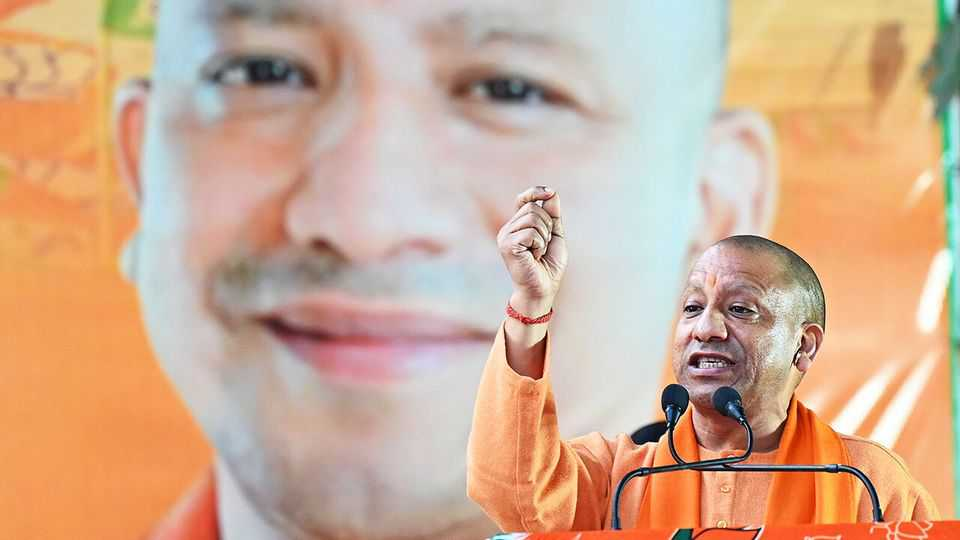
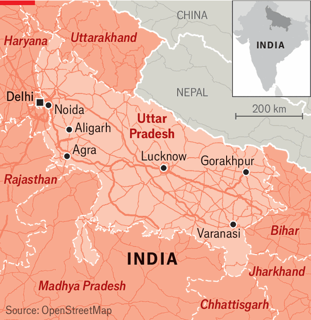
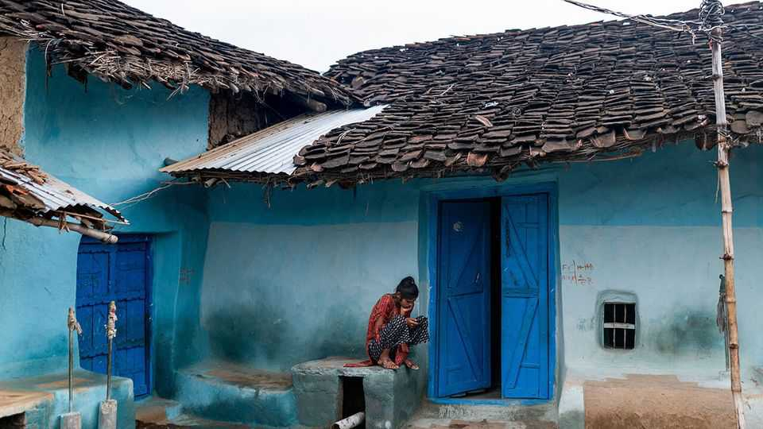
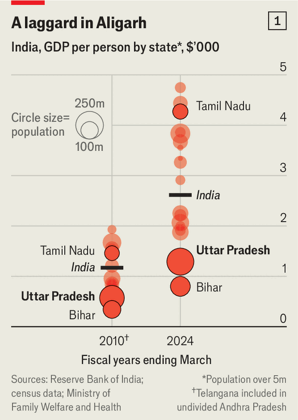
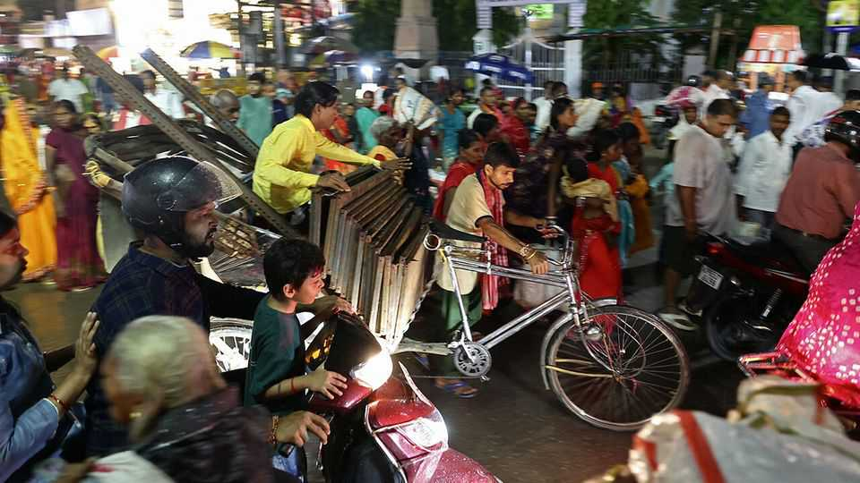
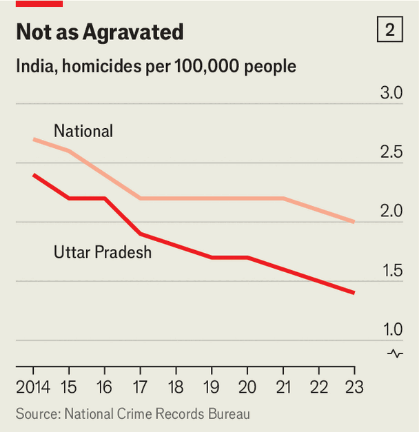

Asia | Yogi Adityanath, chief minister of Uttar Pradesh
Meet the road-building, Muslim- baiting monk who could rule India
Some see the leader of India’s biggest state as a visionary. Others fear him
November 27th 2025

FOR MOST of his life he has been a monk, renouncing worldly possessions, wearing saffron and rising early to pray, meditate and feed sugary treats to cows at a temple in Gorakhpur where he is the head priest. For the past eight years he has also been one of the most powerful politicians in the world, ruling over an Indian state of 240m people. If it were a country, it would be the world’s sixth-biggest.

Some people think Yogi Adityanath, the chief minister of Uttar Pradesh (UP), is a possible future prime minister of India. Others balk at the notion. At the very least, he represents an important strain in the country’s politics: a muscular Hindu nationalism that lays a lot of asphalt. Businesses praise his efforts to build roads, pep up the electricity supply and crush crime. Critics accuse him of trampling on human rights and Muslims.

Though he seldom gives interviews to the foreign press, he met The Economist on November 11th in Lucknow, the state capital, to talk about development. In a high-ceilinged audience room, flanked by Hindu icons and smiling disarmingly, he outlined his plans to create a $1trn economy in UP by 2029.

That is impossible, barring a sudden collapse in the value of the dollar. The state’s total output is around $300bn; no large economy can treble in size in four years. Still, puffery aside, UP’s recent growth story is impressive.

It started from a low base. Agrarian, landlocked, riven by caste and tortured by gangsterism, it has long been one of India’s poorest states, living off huge fiscal transfers from the centre, typically amounting to as much as it raised in tax. In the past 15 years, however, governance and growth have perked up. That process accelerated under Mr Adityanath, who has been chief minister since 2017. On his watch UP has grown at an annualised rate of 6.9% (excluding 2020-21, when the entire country was ravaged by covid). In the past three years it has grown faster than India as a whole. UP was “once regarded as a sick state”, says Mr Adityanath. Now it is “one of India’s economic growth engines”.

What changed? The most visible factor is an infrastructure boom. Drive from Gorakhpur, where Mr Adityanath’s temple sits, to Lucknow, the state capital, and you will enjoy miles of smooth, fast roads (see map). The state has more than 12,000km of national highways, up from 8,500km in 2016, and 18 airports, up from six in 2017, though many still lack scheduled services.

As in much of India, villages have been connected with all-weather two-lane roads and reasonably reliable electricity. “Funding is not a constraint,” says Mr Adityanath. As a popular chief minister belonging to the Bharatiya Janata Party (BJP), the Hindu-nationalist grouping that governs India, he has extracted money for big projects from the central government. He has also prioritised them himself: at 6.6%, state investment as a percentage of GDP was the highest in India last year.

All this has made UP an easier place to make money. According to the Economist Intelligence Unit, our sister company, the business environment has improved faster than in any other Indian state in the past five years. That is also thanks to other reforms, including to land and labour regulations. Arvind Panagariya, an economist, reckons better law and order has made the biggest difference. “When crime rates are high, investors are not going to come to your state,” he says. In the past, gangsters ran a land mafia, making it hard for

firms to set up shop. Today, says Mr Panagariya, “some parts of UP don’t look like UP.”

That is certainly true of Noida, an IT and manufacturing hub dotted with skyscrapers and business parks. It is situated at UP’s western edge and, more relevantly, on the edge of Delhi. That gives it its two great strengths: access to a large, skilled workforce and a lot of vacant land near the national capital. Samsung, Xiaomi and Google have all moved in, lured in part by the incentives Noida can offer as a special economic zone. Metropolitan Noida is home to about 1% of UP’s population, but accounts for a tenth of its GDP and an outsize share of its tax revenues.

There are signs of investment beyond Noida, too. Defence manufacturers have set up in a corridor that stretches to nearby Aligarh and Agra. IBM and Genpact, which provide IT services, have established large offices in Lucknow. Tax revenues have more than doubled in real terms since 2017. UP is one of a handful of states that runs a healthy budget surplus.

Yet it is not certain that Mr Adityanath has established a model of development that can sustain its current pace. UP has failed to attract labour- intensive industries such as clothing that could absorb its giant workforce. Its economy is powered by a small number of high-value jobs in the west. Elsewhere there is a long tail of low-quality, informal work. Frustration over the lack of opportunity was one reason why the BJP lost a swathe of seats in the state in national elections last year.

Growth matters because UP has so far to go. Income per head, at $1,300, is about half of the Indian average (see chart 1). It is also unevenly spread. Travel beyond pockets of success, and you will see many places where people live in shacks and scratch a bare subsistence from the soil. Many women hardly leave the village, other than to toil in nearby fields for 225 rupees ($2.50) a day. In Anai, a village 40km from Varanasi, locals pointed to new toilets that were built as part of a government scheme. They don’t work, and villagers still defecate in the fields.

Investment in infrastructure is not matched by that in human capital. Only 57% of adults work, roughly on a par with the national figure. But female labour-force participation, though rising—Mr Adityanath credits a policy of reserving a fifth of government jobs for women—is among the lowest of any state, at 35%. Abhishek Mishra of the opposition Samajwadi Party argues that

flashy summits have yielded little investment, partly because investors doubt that UP’s workers will be productive.

The chief minister boasts of his “zero-tolerance approach towards criminals and corruption”. Since he took over, more than 250 suspects have been killed and more than 10,000 wounded during “encounters”, the Indian term for when police shoot a suspect supposedly resisting arrest. The property of alleged criminals is routinely bulldozed, earning Mr Adityanath the nickname “Bulldozer Baba”. Rather than proving that the buildings were bought with the proceeds of crime (which is hard), the state sometimes asserts that they were erected without proper permission (which is true of large swathes of Indian cities).

The most accurately measured crime has indeed fallen. Between 2016 and 2023 the homicide rate per 100,000 people fell from 2.2 to 1.4 in Uttar Pradesh, compared with 2.4 to 2 in India as a whole (see chart 2). Voters approve. At a gathering of women entrepreneurs in Lucknow, most agreed that going out is less scary than before. More reliable electricity has improved street lighting. An acolyte at Mr Adityanath’s temple gushes: “He is like Lord Ram… good for the people who are good, and bad for the people who are bad.”

Sticklers for civil liberties are less enthusiastic. Many think a lot of the “encounters” are staged, amounting to extrajudicial executions. A former police officer denies this, but then adds that if “any gangster” were to go around “twirling his moustache” and boasting that he’s a gangster, “Let him see if he stays alive for 24 hours.”

Muslims complain that the bulldozers are especially active in their neighbourhoods. In general, they are frightened of Mr Adityanath. He founded a youth movement that many describe as a militia, only disbanding it five years after becoming chief minister. In speeches, he often uses incendiary language about Muslims. He has accused them of waging a “love jihad”, seducing Hindu women so they convert to Islam and bear Muslim babies. Muslim men who date Hindu women have sometimes been arrested or beaten up by thugs.

The chief minister reassured The Economist that “there is no Hindu-Muslim conflict in Uttar Pradesh.” He boasted that “in the past eight-and-a-half years, there have been zero instances of rioting and no curfews.” And, he added, for context: “Around the world, we are witnessing violence even in countries with far smaller Muslim populations.” Some might detect in this a dog-whistle— that Muslims are troublemakers. Mr Adityanath’s pitch for India is loud and clear. If you like your Hindu nationalism blunt and forceful, he’s your man. ■

Stay on top of our India coverage by signing up to Essential India, our free weekly newsletter.

This article was downloaded by zlibrary from https://www.economist.com//asia/2025/11/27/meet-the-road-building-muslim-baiting-monk- who-could-rule-india