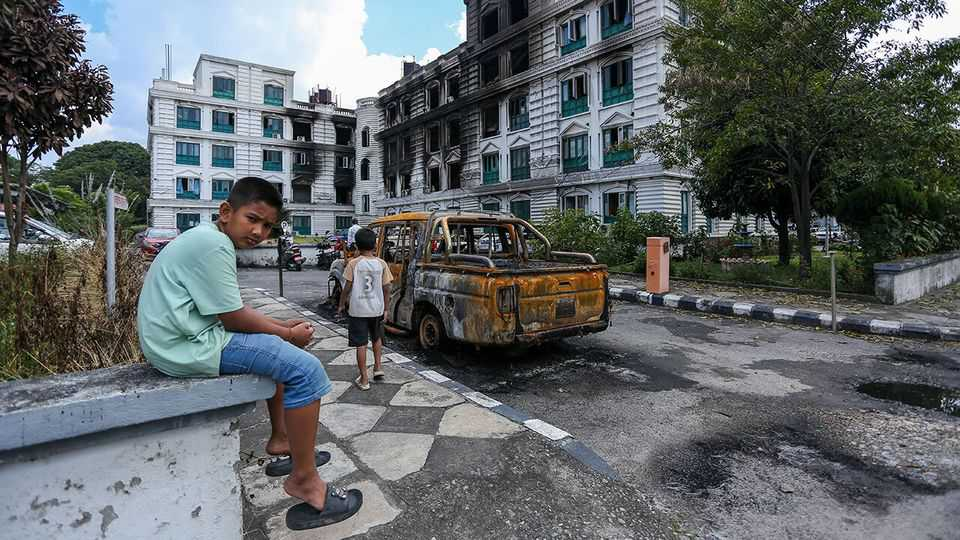

Asia | Picking up the pieces
Nepal’s youth toppled the government. Now they want to remake it
An infusion of fresh faces, ideas and energy could help pull the country out of its economic stupor
November 27th 2025

THE VIEW from Ajaya Bhadra Khanal’s office is a constant reminder of the high stakes of his job. A few hundred feet away sits the burnt-out shell of Singha Durbar, a 117-year-old palace that was until September 9th the office of the prime minister of Nepal. That day, rampaging mobs set it ablaze—along with the parliament, other federal buildings and several businesses. Prisons

were opened and politicians attacked in their homes. K.P. Sharma Oli, the prime minister, resigned. The police vanished. Anarchy reigned.

What had started the previous day as a peaceful protest against corruption and a social-media ban escalated sharply after police fired at unarmed protesters, killing 19, most of them students. An outraged country took to the streets. Troublemakers took advantage of the chaos to settle scores. Only on September 10th did the army step in to restore order. Two days later Nepal’s president dissolved parliament and appointed Sushila Karki, a former Supreme Court chief justice known for her rectitude, as interim prime minister. Mr Khanal is her chief adviser. From their premises next to the old palace, their task is to get their country back on track. Priority number one, says Mr Khanal, is to hold elections. Voting is scheduled for March 5th next year.

Almost three months after the near-total collapse of the state, an uneasy calm prevails in Kathmandu. Two emotions animate the capital: hope and fear. The hope is that elections will deliver a novel coalition with the imagination to fix the country’s many problems, chief among them corruption and unemployment. The fear is that security challenges or major-party boycotts could delay the polls, setting off a fresh crisis.

Both outcomes are plausible. Nepal’s politics is dominated by the left and in particular “three old men”: Sher Bahadur Deuba (79) of the Nepali Congress; Pushpa Kamal Dahal, known as Prachanda (71), of the Maoists; and Mr Oli (73) of the Communists. Since the country adopted its current constitution in 2015, the three have propped each other up in coalitions, playing what many Nepalis see as a game of musical chairs to stay in power. It is an unstable arrangement—there have been seven governments since, excluding the interim one—but it works for the main players.

The old guard has yet to grasp the scale of public anger. Mr Oli, still grumpy about being ousted, is demanding the restoration of parliament. The Maoists claim to have overhauled their workings, but remain essentially unchanged. The Nepali Congress is in the midst of an internal power struggle. But as a deadline to register for elections loomed this week, all three had agreed to take part.

Lending new energy to politics are the young protest leaders. Many are venturing into politics by starting their own parties. Kishori Karki, who went viral after rescuing an injured protester in September, received news of her party’s registration as she spoke to The Economist. Pradip Gyawali, another prominent protester, has joined the interim government as an adviser. Others are being wooed by establishment parties. Ordinary Nepalis are fired up, too. Nearly 840,000 new voters have joined the electoral rolls since September.

It helps that the two biggest external influences on Nepal have clearly signalled their preference for elections. India has leant on the major parties to take part, and will provide security and logistical support to ensure a smooth vote. China, too, is keen to avoid instability on its border. Western countries are keeping their distance but have been quietly supportive.

Another reason to participate is fear. The spectre of corruption charges looms over establishment figures, should they lose their grip on power. Protesters worry that the police, many of whom were assaulted and some killed by gangs unaffiliated to the youth movement, could mount a campaign of revenge. Mrs Karki, a reluctant prime minister, fears a loss of legitimacy if the interim government’s rule extends beyond March. And everyone is anxious about renewed unrest.

Corruption remains the main issue for Nepali voters. But underlying that concern is a deep anxiety about their futures. Nepal’s median age is 26, yet its economy has little to offer the young. One in five young people is unemployed. GDP per person is barely above $1,400, roughly half that of neighbouring India, where many Nepalis find work. Others travel to the Middle East, South Korea or the West. Nearly 2.2m of Nepal’s 29m people live overseas, most of them men. “Many of my friends are abroad,” says Mr Gyawali. “They told me to come there. But I want to be here and use my expertise to make the nation.” ■

This article was downloaded by zlibrary from https://www.economist.com//asia/2025/11/27/nepals-youth-toppled-the-government-now- they-want-to-remake-it