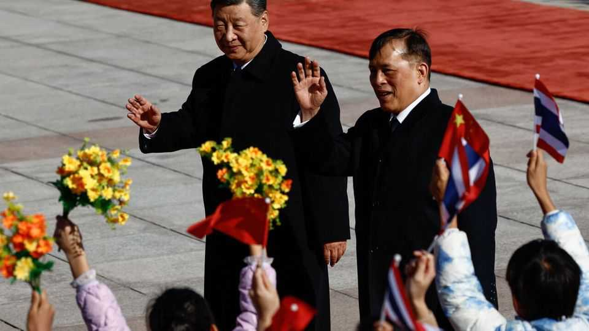

Asia | Swinging state
America’s oldest ally in Asia is drawing closer to China
Thailand increasingly depends on its bigger neighbour for trade and security
November 27th 2025

THE DAY before Thailand’s king arrived in China, his country’s government sent his host a special gift. On November 12th She Zhijiang, an alleged Chinese criminal kingpin, was extradited from Bangkok after three years of legal wrangling. Mr She is accused of running extensive online gambling and fraud operations in Myanmar, and China had long wanted him back to face justice at home.

King Maha Vajiralongkorn is the first Thai monarch to visit China since the two countries established diplomatic relations half a century ago. His trip was the most high-profile signal yet that Thailand, which has long struck a careful balance between China and America, is leaning ever closer towards its northern neighbour.

The tighter relationship is visible across several spheres. Particularly notable is Thailand’s responsiveness to China’s trickier demands. The extradition was just the latest. In August an art gallery in Bangkok removed exhibits by Tibetan, Uyghur and Hong Konger artists, reportedly after Chinese diplomats complained. Earlier in the year Thailand sent 40 Uyghur men, who had been in detention since 2014, back to China despite offers from America, Canada and other countries to provide asylum. America pointedly noted its dismay as “Thailand’s long-standing ally”. But Thailand said it feared retaliation if it resettled the Uyghurs elsewhere.

Such moves may be the result of pressure from a mighty neighbour. But business, too, is driving the shift. Chinese firms are investing heavily in Thai infrastructure, from industrial parks to high-speed rail projects. The countries’ relationship got a boost in 2023 when Pheu Thai, then the ruling party, sought more tourism and investment from China, according to a recent paper by Paul Chambers of Naresuan University. Bilateral goods trade reached $122bn in the first ten months of this year, up from $116bn in all of 2024.

China is also an important source of international visitors to Thailand, which depends on tourism for 12% of GDP and a fifth of all jobs. Chinese accounted for 6.7m of Thailand’s 35.5m international tourist arrivals last year. That number plummeted to 3.4m in the first nine months of 2025 after Wang Xing, a Chinese celebrity, was kidnapped and trafficked across the border to a scam compound in Myanmar at the start of the year. Many Chinese tourists fear a similar fate if they travel to Thailand, which is now working with China to dismantle the fraud industry.

The security dimensions are equally striking. After America cut military financing and scaled back joint exercises following a Thai coup in 2014, China quickly filled the void. It offered submarines, tanks and armoured vehicles at lower prices than Western equivalents, and without lectures about democracy and human rights. Between 2016 and 2022 Thailand purchased $394m in Chinese arms compared with $207m in American weapons,

according to the Lowy Institute, an Australian think-tank. It now buys anti- ship missiles, air-defence systems and armoured vehicles from China. America’s military assistance to Thailand has fallen further recently, from $106m in 2023 to $8m in 2025.

Thailand has not entirely abandoned its American alliance, which traces its origins to a treaty of “amity and commerce” signed in 1833. The pair still conduct the region’s largest multilateral military exercise every year. Titled “Cobra Gold”, it involves some 30 countries and thousands of American troops. America remains Thailand’s biggest export market—though Donald Trump’s tariffs may affect that status, too. And Thailand is wary of swinging too far into China’s orbit. Low-end imports, mostly from China, have hurt local manufacturing, leading to factory closures and job losses. More than 70% of Thai CEOs worry about further damage from cheap Chinese goods. While the Thai king was still on his five-day tour of China, Thailand’s finance minister Ekniti Nitithanprapas quietly announced that the country would impose a 10% duty on low-cost imports from January 1st. The move was a rare pushback. Closeness to China brings its own risks. ■

This article was downloaded by zlibrary from https://www.economist.com//asia/2025/11/27/americas-oldest-ally-in-asia-is-drawing- closer-to-china