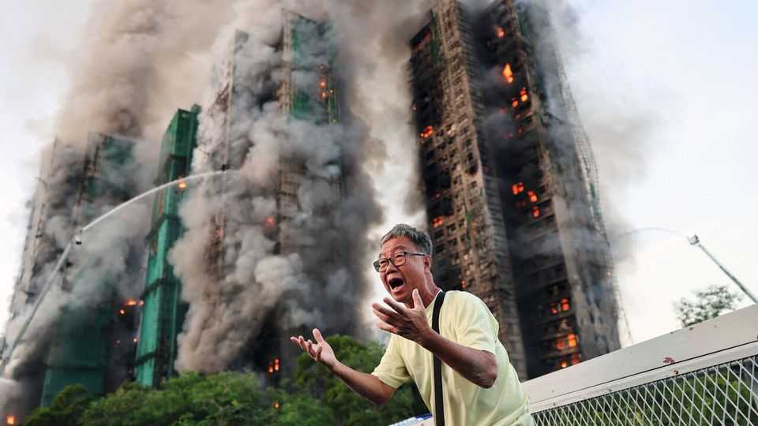

China | Buildings ablaze
A terrible inferno kills dozens in Hong Kong
Hundreds are still missing
November 27th 2025

On November 26th a fire swept apartment blocks in the Wang Fuk Court housing complex in Hong Kong’s Tai Po neighbourhood. The next day 55 people were confirmed dead and another 15 were in a critical condition. Some 279 were still missing. The fire’s cause is unknown, but officials are looking into materials that were being used for renovations. It is one of the deadliest blazes in Hong Kong since the second world war.■

Subscribers can sign up to Drum Tower, our new weekly newsletter, to understand what the world makes of China—and what China makes of the world.

This article was downloaded by zlibrary from https://www.economist.com//china/2025/11/27/a-terrible-inferno-kills-dozens-in-hong- kong