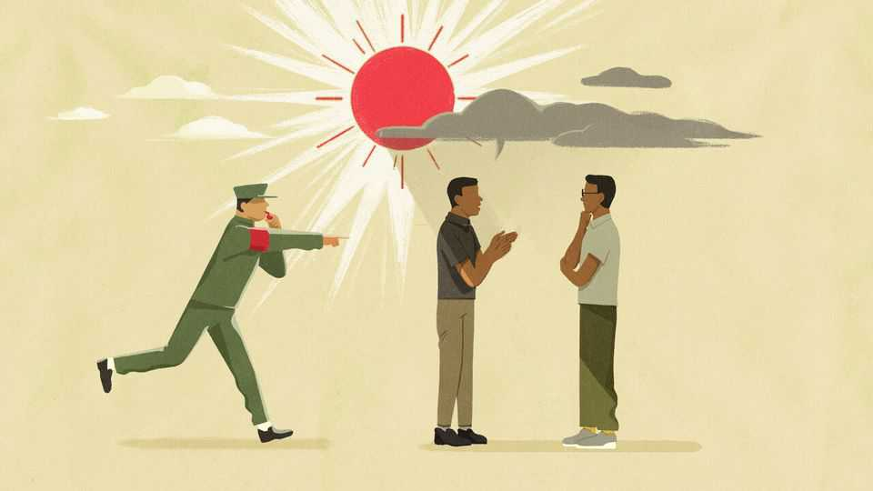

China | Chaguan
China’s Communist Party wants positive energy only, please
But enforced online optimism is no remedy for economic gloom
November 27th 2025

The police in Weifang, a city in eastern China by the Bohai Sea, seem to be doing a bang-up job. A tidy 99.1% of its 9m residents are satisfied with public safety, according to the local government. From fraud to robbery, officials say crime there has fallen over the past year. But recently its police have been busy dealing with a trend that is much harder to expunge: the spread of negative feelings among the city’s residents.

Here, the standard for falling foul of authorities is rather murky. In an announcement on November 17th, the Weifang police outlined cases from the past month. In one a local man, Mr Ren, had used his social-media account to publish videos that were critical of agricultural policies, allegedly pumping out distortions as he sought to attract followers. The police said they had prevailed upon him to remove his offensive videos. In another, a student surnamed Qiu got into trouble at school and then went online to accuse his teacher of being a bully. In doing so he had damaged the school’s reputation, the police said. They brought the student in for a stern discussion to rectify his behaviour.

Weifang is far from alone in such policing of popular sentiment. China is in the midst of a national campaign that aims to squash pessimism and promote positivity. In some ways this is nothing new. One theme of Xi Jinping’s leadership, dating to his rise to the top of the Communist Party in 2012, has been the promotion of “positive energy”, especially in online discourse. People who post criticism of the government on social-media sites have always run the risk of seeing their accounts closed or suspended.

But the special emphasis now suggests China’s leaders have something extra to worry about. One inference—fairly obvious—is that the economy is weak. About 17% of Chinese aged between 16 and 24 (excluding students) are unemployed, according to the latest official data. As in any country, disaffected young plus ubiquitous social media make for a volatile mix. Yet there may also be something else at play. The underlying dynamics of public opinion appear to be changing. For decades China has been one of the most optimistic countries, a place where people believe that tomorrow will bring better opportunities. In the past few years, however, that faith in progress has given way to doubt.

Detecting such shifts is fraught in a country where it is so hard to study public opinion. Nevertheless, data show growing frustration. In big surveys in 2004, 2009 and 2014, Martin King Whyte, a sociologist at Harvard, collaborating with researchers from Peking University, rejected the common assumption that gaping inequality was sowing discontent in China. Instead he concluded that people were more focused on fairness, ascribing success in life to attributes such as talent.

After a gap of nearly a decade, Mr Whyte updated that survey, the results of which were published earlier this year in the China Journal, a Western academic periodical. The change was striking. In the earlier surveys, about 62% of respondents agreed that hard work was always rewarded in China. In the new survey, that share was sharply down, to just 28%. Other research points in the same direction as pessimism apparently grows more pervasive. In a recent study by professors from Peking University in the China Quarterly, another journal, younger respondents were less likely to believe in upward mobility for children in poorer families.

All this needs a caveat. Chinese are gloomy, but still more optimistic than many in the West. Mr Whyte and his colleagues are careful to point out that they see no “social volcano” on the horizon. Nearly half of the respondents to their recent survey still thought they would be better off in five years’ time, albeit down from nearly three-quarters a decade ago.

For the Chinese government, though, the mere fact that pessimism is on the rise is a problem. Not only does it reflect a weakened belief in official narratives about the spread of prosperity. It also speaks to a certain ennui with modern life, potentially sapping the can-do energy that has helped fuel China’s success. When the cyber administration, China’s chief internet regulator, launched its campaign against negative sentiment in September, it said that, among its targets, it wanted to counter the idea that working hard is pointless.

Discussion about the campaign has focused on the government’s decision to ban three popular influencers from most major social-media sites. One was Zhang Xuefeng, a tutor who said that students from poor families would struggle to get good jobs since they lacked the right connections. A second was Hu Chenfeng, a live-streamer who divided the population into Apple and Android users as a shorthand for rich and poor. The third was Lan Zhanfei, a travel blogger whose ostentatious videos perhaps irked those less lavishly fortunate than himself. But the campaign has been broader. Authorities say that some 1,200 online accounts have been suspended or closed on Weibo, a social-media platform.

What are the results? Negativity has not disappeared. Whenever the government releases economic data, there are plenty of online comments about how tough things really are. Moreover, some blowback is inevitable.

The term “positive energy”, promoted by officials, now carries a tone of irony, if not outright cynicism, in private conversation.

At a time when social media stoke anger around the world, it is easy to understand why China pays them so much attention. Yet the party has set itself an ever-expanding mission. Its current campaign has taken aim not at criticism of the government but rather at depictions of reality. In such a situation, censorship can only mask the symptoms. The roots of China’s new pessimism lie in its economy, not on its apps. ■

Subscribers can sign up to Drum Tower, our new weekly newsletter, to understand what the world makes of China—and what China makes of the world.

This article was downloaded by zlibrary from https://www.economist.com//china/2025/11/24/chinas-communist-party-wants-positive- energy-only-please

Middle East & Africa

The changing shape of Chinese aid to Africa Armed men take power in Guinea-Bissau, again Mired in financial crisis, the Houthis resume threats to Saudi Arabia The killing of a Hizbullah commander shows how fragile truces are How Pepsi trounced Coca Cola in the Middle East