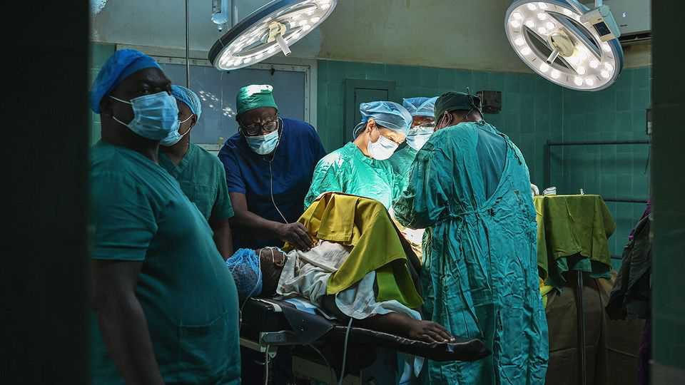

Middle East & Africa | Strategic generosity
The changing shape of Chinese aid to Africa
As Western countries cut support, China is unlikely to fill the gap
November 27th 2025

Named after a late Zambian president, the English words “China Aid” on the façade of Levy Mwanawasa University Teaching Hospital on the outskirts of Lusaka reveal the true benefactor. It was built by China, which also paid for an expansion in 2020 that more than quintupled its capacity and turned it into one of Zambia’s biggest medical facilities. A rotating team of Chinese doctors helps make it one of the best. In a country that has long depended on health aid from Western countries, this hospital shows that another power is vying for

influence. As the West scales back its support, many wonder whether China will fill the gap.

In China’s bid for worldwide political influence, health plays an important role. As he rolled out his global infrastructure scheme, the Belt and Road Initiative (BRI), China’s leader, Xi Jinping, did not just talk about pouring concrete. He also promised Chinese support for health projects.

China does not publish an annual figure for spending on health aid. Data from the Institute for Health Metrics and Evaluation at the University of Washington suggest that after a surge during the covid-19 pandemic, it has returned to a few hundred million dollars a year. This is a middling sum by rich-country standards, and small compared with the several billion that America is still spending, even after massive cuts this year by President Donald Trump. But China’s health aid is carefully targeted at countries where it seeks commercial or strategic rewards.

One is Zambia. It has rich reserves of copper and cobalt. China has poured billions into Zambian mines. In September a Chinese state firm agreed to invest $1.4bn in an upgrade to the 1,860km Tazara railway between Zambia and the Indian Ocean port of Dar es Salaam in Tanzania. The project, originally built by China in the 1970s, was the focus of a trip to Zambia this month by China’s prime minister, Li Qiang. He was the highest-ranking Chinese visitor in more than 18 years.

Just a few years ago, China’s chances of being hailed as global leader in health might have seemed unlikely. Early in 2020 its response to the emergence of covid-19 in the city of Wuhan dented its credibility. It quickly shared genetic data of the virus, but only after an initial cover-up of the outbreak. Officials from the World Health Organisation (WHO) investigating the origins of the virus were kept on a tight leash. It remains cagey about the topic.

But China used the pandemic to boost its image among poorer countries, showering them with vaccines and protective equipment. According to AidData, a research group at the College of William and Mary in Virginia, China’s covid-related donations were worth more than $4.6bn between 2020 and 2022, surpassing those of America ($4.1bn) and Germany ($3.6bn).

China’s pandemic handouts won plaudits in many recipient countries. In sub- Saharan Africa, 36% of government, civil-society and private-sector leaders surveyed by AidData said they viewed China much more positively as a development partner as a result of this aid. Only 6% said they had become more negative. It is hard to prove what China reaped politically from this. But the 70 states that have endorsed both China’s claim to Taiwan and China’s use of “all” efforts to unify with it include almost every African country. Most, including Zambia, have adopted this language in the past couple of years.

Since the pandemic, China has stepped up its presence in global health. In May, at this year’s annual World Health Assembly, the decision-making body of the WHO, China’s delegation was nearly twice as big as in 2019, before the covid-19 pandemic began. It was four times bigger than India’s, and two and a half times the size of America’s in 2024, before Mr Trump became president again and announced America’s withdrawal from the WHO (it will leave in January).

China is not flashing the cash, however. At the assembly, it promised $500m over the next five years to WHO funds. With America out of the picture, this would make China the biggest government donor. But the pledge is in line with what it would be expected to pay, given the size of its economy. The Gates Foundation, an American NGO, now towers above governments: it supplies nearly 11% of the WHO budget, compared with China’s 2.8%.

China’s aid efforts have suffered from a lack of co-ordination among the various ministries involved. The China International Development Co- operation Agency, set up in 2018, is small and lacks bureaucratic clout. Dr Ruby Wang of LINTRIS Health, a consultancy, notes that China does not say it wants to fill the gap left by the West. She says its approach remains “piecemeal, opportunistic and experimental” as it seeks to maximise “political and economic objectives” as well as pursue “development in the Western sense”.

Take Zambia. America used to supply the country with more than 80% of its funding for combating HIV. It had pledged more than $360m in 2025 before Mr Trump pulled the plug. By its own reckoning, America’s aid before Mr Trump’s cuts accounted for one-third of Zambia’s spending on public health. Compared with that, China’s support is tiny. On November 20th it pledged

$3.5m over the next two years for HIV prevention in South Africa. In Zambia it donated 5,000 HIV test kits worth maybe a few thousand dollars.

Zambia also shows how Chinese efforts to boost its soft power through health aid can be complicated by its other activities. In February the collapse of a dam at a Chinese copper mine caused a massive spill of toxic waste and a political uproar. Zambia’s president, Hakainde Hichilema, was elected in 2021 partly on the back of public anger over alleged corruption and profligate borrowing involving deals with China under the previous administration. Even so, Mr Hichilema still sees Chinese investments as crucial for Zambia’s economy.

The Trump administration is not oblivious to China’s political gains on the continent. In September it published an “America First Global Health Strategy”, which insists America remains committed to being “the world’s health leader”. It says that, especially in Africa, American health aid could be “an important counterweight to China”. It called for a new approach to delivering it: by routing assistance mainly through recipient-country governments. This would “maximise the impact of our aid” on bilateral relationships, it said. The one-time health-aid superpower, in other words, is copying China’s playbook. ■

Sign up to the Analysing Africa, a weekly newsletter that keeps you in the loop about the world’s youngest—and least understood—continent.

This article was downloaded by zlibrary from https://www.economist.com//middle-east- and-africa/2025/11/27/the-changing-shape-of-chinese-aid-to-africa