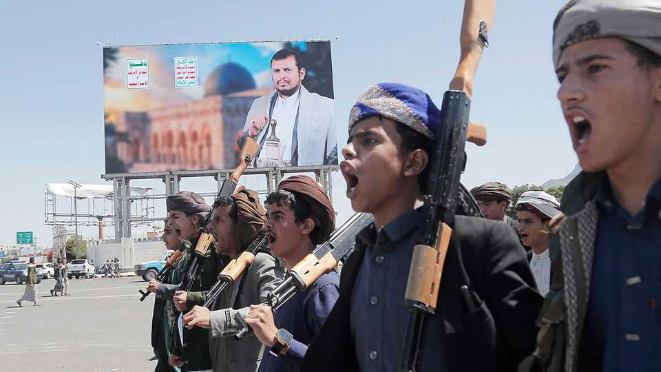
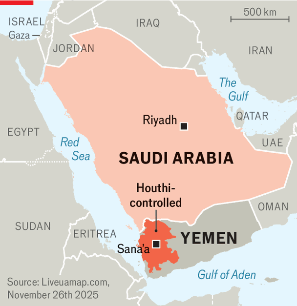

Middle East & Africa | Yemen’s endless war
Mired in financial crisis, the Houthis resume threats to Saudi Arabia
But with Donald Trump in the White House, their brinkmanship could backfire
November 27th 2025

ON November 3rd lunchtime in the Saudi capital was interrupted by air-raid sirens. Officials said it was a routine test (they did a similar exercise in 2021). But the klaxons and mobile-phone alerts were also a reminder of the unresolved war across the kingdom’s southern border. In 2014 the Houthis, an Iranian-backed militia that had fought a long insurgency against the Yemeni government, marched out of their stronghold in

the country’s north. They eventually seized control of Sana’a, the capital, and most other big cities. The next year Saudi Arabia assembled an Arab coalition to beat the Houthis back. But it quickly sank into a quagmire. More than a decade later the Houthis still control most of Yemen’s west, home to three- quarters of the population (see map).

A UN-brokered ceasefire between the kingdom and the Houthis has largely held for almost four years: the militia has not attacked Saudi cities since 2022. But a full deal to end the war has proved elusive, largely because of Houthi

intransigence. Whenever the Saudis offer a concession, the militia pockets it and demands more.

Since October 7th 2023, though, the Houthis have had other priorities. The group started firing missiles and drones at Israel soon after it invaded Gaza, a show of solidarity with Palestinians that also proved a useful distraction from its domestic misrule. Yet the Gaza ceasefire, which took effect on October 10th, has halted the campaign against Israel for now. Some diplomats worry that the militia will now turn its attention back to Saudi Arabia.

The Houthis have already sharpened their rhetoric against the kingdom. In September Abdel-Malik al-Houthi, the group’s reclusive leader, accused it of being in league with Israel. Last month Houthi propagandists warned of renewed cross-border attacks if the Saudis did not lift their “economic strangulation” of Yemen.

That points to the underlying reason behind the threats: the Houthis are struggling with a financial crisis. The reasons for it are myriad. Israeli strikes —retaliation for Houthi attacks—have damaged ports, cement factories and other businesses that generated revenue for the group. American sanctions have cut off financial flows. Hard data are scarce, but some Yemeni analysts also see signs of a drop in remittances to Houthi-controlled areas, largely driven by fatigue in the diaspora and tighter restrictions on money transfers.

The group still has illicit sources of revenue, from drug-trafficking to cryptocurrency schemes. But it is clearly squeezed. Some months it pays partial salaries; other months, nothing at all. Wadhah al-Awlaqi, an economist at the Sana’a Centre for Strategic Studies, a think-tank, estimates that food and fuel imports in Houthi-controlled areas were down by 20% and 27% respectively up to August, compared with the same period last year.

A peace deal under discussion for the past few years would commit Saudi Arabia temporarily to pay public-sector salaries in Houthi-controlled areas. Even if they cannot reach a final agreement, the Houthis may hope to use threats to force the kingdom into paying for peace.

Yet such brinkmanship could backfire. By the time the Saudi-Houthi ceasefire took effect in 2022, the war in Yemen had upset the kingdom’s allies. Thousands of Yemeni civilians were killed by poorly targeted Saudi strikes,

while many more died from hunger and disease. Joe Biden restricted arms sales to Saudi Arabia soon after he took office in 2021. By then the United Arab Emirates (UAE), the most capable member of the Saudi-led coalition, had already withdrawn most of its troops.

Things look very different today. Both Saudi Arabia and the UAE are on good terms with Donald Trump, who ordered a seven-week bombing campaign against the Houthis earlier this year to halt their attacks on commercial shipping.

The president declared Saudi Arabia a major non-NATO ally and signed a defence pact with the kingdom when Muhammad bin Salman, its crown prince, visited the White House on November 18th. He may face pressure to help if Saudi Arabia is attacked again. Israel, for its part, could decide to step up air strikes against the Houthis—not only to weaken an enemy, but also to strengthen its ties with Gulf states, which frayed during the Gaza war.

The war in Yemen has slipped down the global agenda over the past two years. It may not stay there. The Houthis have honed their capabilities through two years of attacks on Israel. Recruitment is said to be up, though it may not all be voluntary (the Houthis practise forced conscription and use child soldiers). The group’s leaders are more uncompromising than ever. “Everyone thought they could manage the situation in Yemen,” says one diplomat. “It won’t work any more.” ■

Sign up to the Middle East Dispatch, a weekly newsletter that keeps you in the loop on a fascinating, complex and consequential part of the world.

This article was downloaded by zlibrary from https://www.economist.com//middle-east- and-africa/2025/11/27/mired-in-financial-crisis-the-houthis-resume-threats-to-saudi- arabia