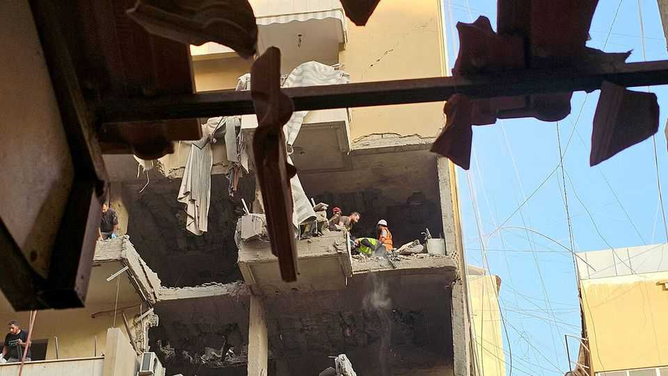

Middle East & Africa | Febrile states
The killing of a Hizbullah commander shows how fragile truces are
Israel’s ceasefire agreements in Gaza and Iran and are shaky, too
November 27th 2025

HE WAS ABOUT to mark a year in his post as military chief of Hizbullah, the Shia-party-cum-militia that is fighting to preserve its dominant position in Lebanon. That was not to be. On November 23rd Haytham Ali Tabatabai was killed, along with at least four others, in an Israeli air strike in southern Beirut.

Mr Tabatabai’s assassination is the latest of dozens of strikes against Hizbullah that Israel has carried out since it signed a ceasefire with Lebanon a year ago. The Lebanese government says those raids have killed 331 people. Yet it was only the second such strike in Beirut, Lebanon’s capital. Israel insists that the attack did not breach the truce. But it is a reminder that ceasefires in the region remain shaky.

Appointed at the end of November 2024, just after the ceasefire came into effect, and tasked with rebuilding Hizbullah’s military apparatus, which Israel had wrecked in 2024, Mr Tabatabai was a marked man. His predecessor, Ibrahim Aqil, was killed by an Israeli strike less than two months after he took the job.

Mr Tabatabai’s assassination comes as the ceasefire between Israel and Lebanon is under increasing strain. In 2024 Israel destroyed much of Hizbullah’s long-range rocket arsenal and a chain of underground outposts along the border. These were built to launch a surprise attack on Israeli communities in the north of the country, on a much larger scale than the Hamas attack on southern Israel on October 7th 2023. The ceasefire, brokered by America and France, was supposed to prevent Hizbullah from rearming. It included assurances that the Lebanese army would deploy in southern Lebanon and confiscate what remained of Hizbullah’s weapons.

For the first few months, this seemed to be working. Yet Israeli and American officials are complaining that Hizbullah has successfully pressed the Lebanese army to desist. Last week, in a sign of displeasure, America cancelled meetings scheduled at the Pentagon for Lebanon’s army chief.

Lebanon complains that Israel’s air strikes and continued occupation of five outposts within Lebanese territory breach the ceasefire. Israel has no intention of changing course. “After October 7th our strategy has to be preventing any threat on our borders,” says an Israeli general. “If this can be achieved through ceasefires, great. If not, we will continue to attack.”

Hizbullah has yet to respond to the killing of Mr Tabatabai. Israeli intelligence agencies believe the group is unlikely to retaliate, though as a precautionary measure against drone attacks GPS coverage has been disrupted in northern Israel.

The fragility of the ceasefire with Lebanon mirrors the state of the region. More than 340 Palestinians have been killed in Gaza since the ceasefire came into effect there on October 10th, according to local authorities. A truce that ended the 12-day war between Israel and Iran in June is holding for now. Yet Israeli officials have been warning that another war with Iran “is just a matter of time” if the Islamic Republic continues to develop its nuclear and ballistic- missile programmes. The Gaza and Iran deals were brokered by Donald Trump. An American attempt to resolve a dispute between Israel and Syria over the Golan Heights has yet to bear fruit.

All this shows that ending wars needs sustained attention. “America imposed ceasefires with Hamas, Hizbullah and Iran and is trying to do the same now with Syria, but it’s not enough just to say there’s a ceasefire,” says an Israeli security official. “Trump likes to list the wars he’s ended, but making sure they don’t flare up again takes a lot of work.” Those hoping for a quick fix in Ukraine should take note. ■

Sign up to the Middle East Dispatch, a weekly newsletter that keeps you in the loop on a fascinating, complex and consequential part of the world.

This article was downloaded by zlibrary from https://www.economist.com//middle-east- and-africa/2025/11/25/the-killing-of-a-hizbullah-commander-shows-how-fragile-truces-are