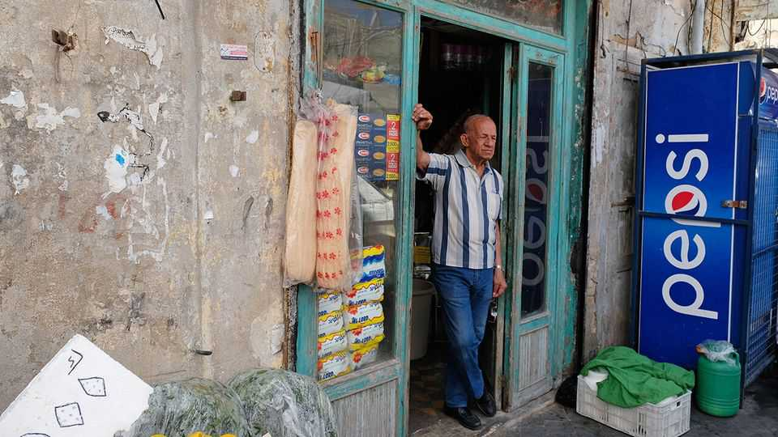

Middle East & Africa | The soft-drinks war
How Pepsi trounced Coca Cola in the Middle East
Its dominance is entwined with the region’s turbulent politics
November 27th 2025

Order a fizzy drink in Baghdad or Beirut and chances are you’ll be served a Pepsi. Unlike anywhere else in the world, in the Middle East Pepsi has managed to trounce Coca Cola. Its success is part random chance, part clever navigation of political fault lines that have not spared America’s big soft- drinks companies. Pepsi’s dominance has a long history. Back in the 1960s Arab governments imposed a boycott on Coca Cola after the firm said it would open a bottling

factory in Israel. Though the boycott lost steam towards the end of the 1980s, when Coca Cola sponsored the youth football world cup in Saudi Arabia, the intervening years gave Pepsi plenty of room to cement its dominance.

In doing so it shrewdly played local politics, says Kamel Abdallah, a Lebanese soft-drinks tycoon. In Iraq it fostered good relations with the Arab parts of the country (Coca Cola trumps it in Iraqi Kurdistan, where Turkey’s influence is stronger). The Baghdad Soft Drink Company hosts the largest Pepsi factory in the world, according to Haider al-Bassam, its boss. In Lebanon, the family behind the country’s Pepsi production has close ties to influential Druze factions. In Saudi Arabia, which led the original boycott against Coca Cola, Pepsi’s market share is 70%.

But there is a striking island of Coca Cola red in a sea of Pepsi blue: the Palestinian territories that prompted the boycott back in the 1960s. Coca Cola’s market share in the West Bank is some 90%, says Zahi Khouri, the firm’s licensee there. In 2022 he opened a Coca Cola factory in Gaza.

The factory was flattened in the Gaza war. That war also put fresh pressure on both companies, as people in the region resumed boycotting American brands in protest at America’s support for Israel. Local soft-drink brands, such as Jordan’s Matrix or Lebanon’s Zee Cola, started to eat into the American firms’ dominance.

However, by most accounts they don’t taste nearly as good. The industry’s big hitters are already clawing back whatever market share they briefly lost. For the time being, the Middle East’s soft-drinks landscape looks set to remain blue with a splodge of red. ■

Sign up to the Middle East Dispatch, a weekly newsletter that keeps you in the loop on a fascinating, complex and consequential part of the world.

This article was downloaded by zlibrary from https://www.economist.com//middle-east- and-africa/2025/11/27/how-pepsi-trounced-coca-cola-in-the-middle-east

Europe

Ukraine may be a step closer to peace, or to destruction Macron, Merz and Starmer are forming a new trilateral leadership Denmark gets ready to cancel Christmas cards Turkey’s refs are caught up in a huge sports gambling scandal Denmark has become a red-tape-free wedding destination If the fighting ends in Ukraine, the infighting in Europe will begin