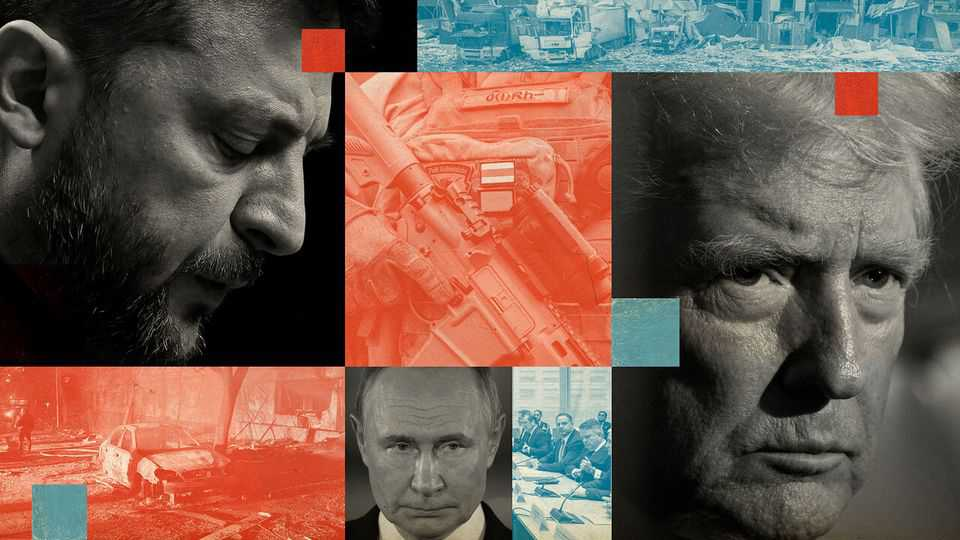
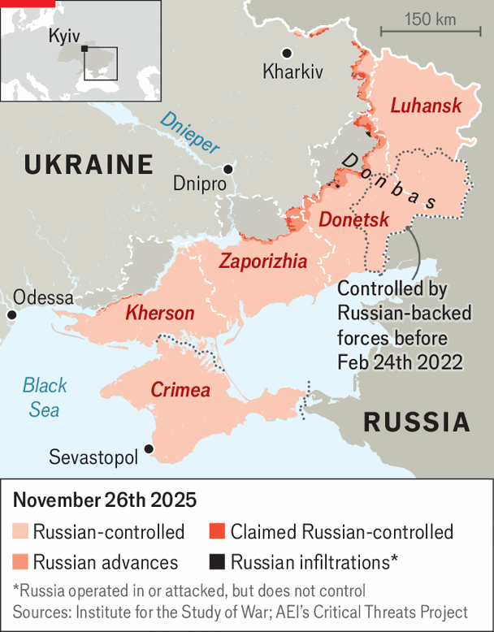

Europe | The maze runners
Ukraine may be a step closer to peace, or to destruction
A baffling week of Trumpian diplomacy and plotting
November 27th 2025

A week is a long time in Ukraine. On November 19th reports emerged of a secret Russian-American “peace plan”, one that looked to Ukrainians like a demand for capitulation. By the weekend European, Ukrainian and American officials were in Geneva for an emergency summit to rework the proposal. On November 26th American and Russian negotiators finished consulting in Abu Dhabi on that revised draft. Those with knowledge of the latest talks say the document is still in flux. Ukraine is happier with the latest version, but no one imagines Vladimir Putin will agree to it. The process is tilted against Ukraine:

talks aim at reconciling Russian demands with Ukrainian concessions. And the Kremlin is likely to get the final word.

But in Kyiv, last week’s panic and profanities have given way to cautious relief. The talks in Geneva removed the worst features of the original 28-point plan, apparently penned by America’s special envoy, Steve Witkoff, with heavy Russian input. The new 19-point version eases limits on Ukraine’s army (to 800,000 instead of 600,000). It removes an amnesty for war crimes and any reference to America getting some of Russia’s frozen assets. But some of the thorniest issues are set aside for Donald Trump to discuss with Volodymyr Zelensky. These include Russia’s territorial demands, a constitutional change ruling out nato membership, and the exact nature of America’s security guarantee. A meeting between them at the White House, which was originally planned for November 27th, has been delayed.

It is hard to judge how real the peace process is. Certainly, the latest rounds of American bargaining and pressure on Ukraine are the most substantial yet. “This isn’t another round of what we saw before,” says a Western diplomat in Kyiv. Those close to the talks speak of “serious progress” bringing some Ukrainian and Russian positions together. “We are coming to a point where people will have to say yes, we’re on, or nope, that’s it,” said one informed source. But the source predicted that Russia would soften only at the end of the process, which remains months away at best. The question is when Russia will start to yield “and what the position on the front lines will be”.

Mr Trump appears to have dropped his demand for a Ukrainian signature before December. He may be frustrated by what comes next. Ukrainian observers think the Kremlin will not be ready to bargain until late winter. That is when Mr Putin will have to decide whether to launch a wider round of conscription, and when Russia’s economy will start to feel real stress from falling oil revenues and sanctions.

If America’s diplomacy looks incoherent, it is in part because of internal rivalries. On one side are Mr Witkoff and the vice-president, J.D. Vance, who seem bent on a settlement that favours Russia and prioritises American commercial interests. On the other are the more traditional players of the intelligence community and State Department. Marco Rubio, the secretary of state, has laboured with European allies to put things back on track. Sources in the White House say Mr Rubio won this battle, but it will not be the last.

The plotting may not be just within the administration. On November 25th Bloomberg published two recordings, one purportedly of a phone call between Mr Witkoff and Yuri Ushakov, a Kremlin foreign-policy adviser, and a second one between Mr Ushakov and Kirill Dmitriev, Mr Putin’s special envoy. Mr Witkoff is depicted coaching Mr Ushakov on how Mr Putin should approach Mr Trump. He also suggests that Mr Trump will back Russia’s demand to be given the rest of Donetsk province, which is still held by Ukraine—perhaps the toughest sticking-point of any potential agreement.

Mr Dmitriev denies the calls took place, but Mr Ushakov has been less categorical. In a more conventional American administration the leak might have led to Mr Witkoff’s dismissal. Instead, Mr Trump has confirmed that his

special envoy will travel to the Kremlin next week to meet Mr Putin. The American liaison to Ukraine will be Dan Driscoll, the army secretary and a close ally of Mr Vance.

All this comes at a moment of deep tension in Ukrainian politics. A corruption scandal centred on Energoatom, the state nuclear company, involves members of Mr Zelensky’s inner circle. Timur Mindich, the president’s former business partner, has fled to Israel after being accused of co-organising a scheme to defraud the company of at least $100m via kickbacks on contracts. Two ministers have fallen. A former deputy prime minister—another longtime friend of the president—faces fraud charges. Mr Zelensky has refused calls to overhaul his government or fire his powerful chief of staff, Andriy Yermak, who has bought himself time by leading the Ukrainian side in the peace negotiations.

Compared with the threat of internal instability, the battlefield can seem almost a secondary concern. Some analysts think Ukraine’s position is manageable. Russia has yet to show it can turn its creeping advances into a big breakthrough. “At this pace—and at this cost—there is no way Russia can win strategically,” says Andriy Zagorodnyuk, a former defence minister.

But on several important indicators, things are looking worse for Ukraine. It is running out of soldiers. Russian investment in mass-producing drones is paying off: it is choking Ukraine’s supply routes behind the front lines. And new weapons in the pipeline—jet-powered strike drones and glide bombs— threaten to make eastern cities like Kharkiv and Dnipro uninhabitable. Russia may be poor at conquering, but it excels at destruction.

With that prospect, many in Ukraine are sceptical that Mr Putin will ever accept a deal that allows Ukraine to survive. Forcing him to do so would require real American pressure, which has not been forthcoming. One former Ukrainian diplomat thinks Ukraine’s best chance is simply to keep on fighting without losing its allies.

That requires renewed flows of foreign funding, which at this point must come almost exclusively from Europe. An EU summit scheduled for mid-December, which could decide the fate of the frozen Russian assets, is more critical than ever. “The path has become very narrow,” the source says. “Avoid a blow-up with Trump. Keep the weapons flowing, paid for by Europe. And then wait, in

the hope that the Kremlin reaches the point where it thinks the war becomes unsustainable.”■

To stay on top of the biggest European stories, sign up to Café Europa, our weekly subscriber-only newsletter.

This article was downloaded by zlibrary from https://www.economist.com//europe/2025/11/27/ukraine-may-be-a-step-closer-to-peace-or- to-destruction