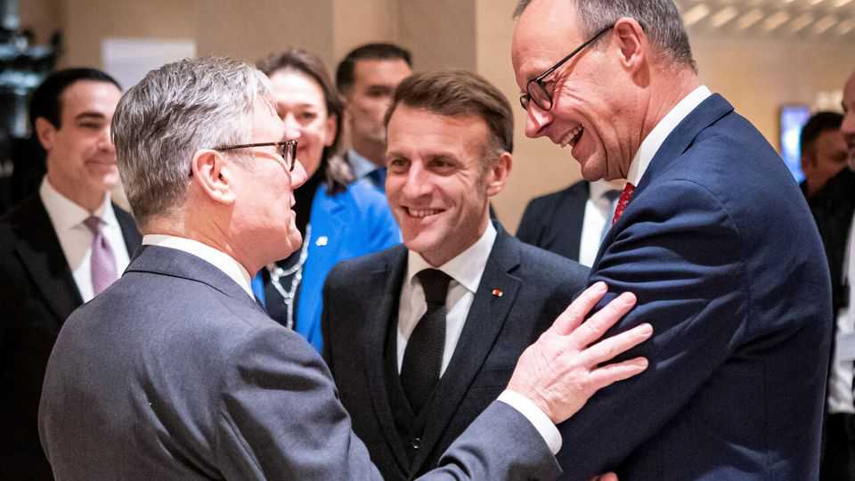

Europe | Europe’s new diplomacy
Macron, Merz and Starmer are forming a new trilateral leadership
Three leaders struggling at home, but vigorous abroad
November 27th 2025

As Europeans scrambled to help Volodymyr Zelensky push back on America’s 28-point peace plan, the Ukrainian president’s first European call was with the leaders of Britain, France and Germany. In Johannesburg for the G20 summit, this trio—Britain’s Sir Keir Starmer, France’s Emmanuel Macron and Germany’s Friedrich Merz—sat down together the next day to agree on a strategy, dispatching their respective national-security advisers to meet American and Ukrainian delegations in Geneva. Quietly, the trio is emerging as Europe’s new top-tier leadership.

An earlier duo of German and French leaders, Angela Merkel and Nicolas Sarkozy, gave rise to the nickname “Merkozy”. Contractions of the current trio’s names are less catchy: Macmerzmer? Sterzcron? Yet their collaboration, known as the E3, is becoming just as tight. Co-operation is neither institutional nor a pre-cooked strategy. This ad hoc leadership has emerged because it seems to work. It began to take root when Mr Merz took office in May, and after Britain had voted in 2024 for a government that made a reset with the European Union a priority. Just days after Mr Merz became chancellor, the trio made an 11-hour train ride to Kyiv that was crucial in helping them to bond.

Since then they have consulted closely on how to help Mr Zelensky, handle America’s Donald Trump, and face down the Russian threat to Europe. Their national-security advisers—Britain’s Jonathan Powell, France’s Emmanuel Bonne and Germany’s Günter Sautter—speak several times a week. On November 18th Sir Keir flew to Berlin to join Mr Macron and Mr Merz for dinner; they discussed Ukraine, European security, Iran and Gaza, agreeing to confer more often à trois. “The three get on well, trust each other, and I think share the view that, even if you have ties to the US, the Russian threat and geopolitical context mean that Europe has to take charge of its own security,” notes Benjamin Haddad, France’s Europe minister. The E3 suits and even impresses Mr Trump, says a German official. This week Johann Wadephul, Germany’s foreign minister, called the E3 Europe’s “working muscle”.

The trilateral format first emerged in 2003, when the three countries’ foreign ministers went together to Tehran to try to negotiate with Iran over its uranium-enrichment activities. Europe’s diplomatic efforts to that end have kept co-ordination going. But not since Britain voted to leave the EU in 2016 has the link between the three countries’ leaders been this strong.

The revived E3 has a lot to do with the three politicians themselves, an improbable trio forged by chronic domestic weakness and external threats. Their styles have little in common: Sir Keir’s stiffness and Mr Merz’s businesslike manner contrast with Mr Macron’s energetic showmanship. Yet each has spent time outside politics: Mr Macron as an investment banker; Sir Keir, a public prosecutor; Mr Merz, a corporate lawyer. Although from different political families, they are all serious pragmatists, keen on getting things done. Each also happens to be deeply unpopular at home, in charge of a

weak government and threatened by the populist right. When the three meet, says one official wryly, they bond over their shared political woes.

For France, the E3 appeals as a step towards what Mr Macron has long called European “strategic autonomy”. This has to include Britain, the continent’s only other nuclear power. Long seen as a Gaullist fantasy, the idea now carries weight in a Europe faced with a disengaging, if not hostile, America. Mr Macron and Mr Merz have warmed up Franco-German ties that had gone cool. France and Germany have also bound themselves tighter to Britain through bilateral treaties signed or updated this year. This web of treaties now links the three countries in what a French official calls “multi-bilateralism”. For Britain, says Anand Menon of UK in a Changing Europe, a British think- tank, direct links with France and Germany are “a way of compensating for Brexit”. The Anglo-German treaty identifies closer trilateral co-operation as one of its explicit ambitions.

So far the trio has been most closely aligned on Ukraine. They are behind the “coalition of the willing” that has been planning a reassurance force to be sent to Ukraine in the event of a ceasefire. Co-led by Britain and France, it now has a military headquarters outside Paris. Germany will not put boots on the ground. But Mr Merz has co-chaired coalition meetings, including the one on November 25th. On other matters, notably recent diplomacy over Iran’s nuclear programme, the E3 gives Europe a distinct, united voice.

The E3 plainly faces limits. Britain and France agreed to recognise a Palestinian state; Germany, for historical reasons, was never going to follow. Germany and Britain are reflexively Atlanticist and happy to buy American arms; France wants Europe to buy European. Brexit constrains the E3’s ambitions: China policy, for instance, is largely about trade, an EU competence where Britain cannot play a role.

Even if the E3 proves its political worth, says one adviser, it will not endure if it is seen by fellow Europeans as a top-down directoire, or exclusive club. Some Europeans are wary. Italy hates being left out. Poland, which hoped to revive the three-way “Weimar triangle” with France and Germany (until its election of a nationalist president this year quashed that), is not pleased either. Mindful of this, the three leaders have tried to keep the format flexible. At various times they have brought in Poland, Italy, Finland, EU institutions and NATO.

If Europeans end up having to swallow a deal on Ukraine made over their heads, the E3 will not look like a very potent format. If used deftly, however, it could help to keep Europe relevant, defend Ukraine’s interests and curb Mr Trump’s worst instincts. Those may not be soaring ambitions. But Macmerzmer may be Europe’s best hope of achieving even them. ■

To stay on top of the biggest European stories, sign up to Café Europa, our weekly subscriber-only newsletter.

This article was downloaded by zlibrary from https://www.economist.com//europe/2025/11/27/macron-merz-and-starmer-are-forming-a-new- trilateral-leadership