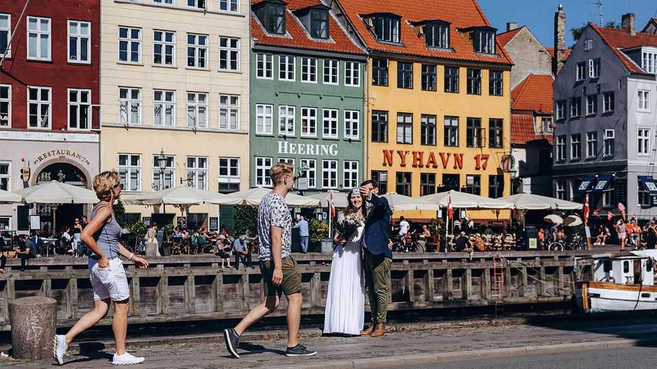

Europe | Marriage of convenience
Denmark has become a red-tape- free wedding destination
In much of Europe, getting married is a nightmare for foreigners
November 27th 2025

At Frederiksborg Castle chapel, outside Copenhagen, couples may wait two years for a wedding date. A three-hymn limit is in place to keep ceremonies short. The chapel hosted the wedding in 1995 of Denmark’s Prince Joachim and Alexandra Manley, a Hong Kong-born businesswoman. That made it attractive to people who “travel, find love and want to marry”, as Henrik Winther Nielsen, the vicar, puts it.

Combining travel and nuptials has been a boon for Copenhagen, which has become a destination-wedding spot less for its charm than for its liberal marriage laws and speedy digital registration system. In 2024 the number of foreign couples getting married here rose to 5,400, more than double that in 2019. Wags call it the Las Vegas of Europe.

In most European countries getting hitched is easy if both partners are citizens, tricky if one is an immigrant and baffling if both are foreigners. In Italy both parties must submit a smorgasbord of paperwork from their home countries for translation and multiple rounds of approvals. Recently divorced women must show proof they are not pregnant. In Germany lovebirds whose German is not fluent must use an approved interpreter to meet with officials, and can be asked for documents—six months old or less—that might not even exist in their home country.

For Alexander and Katerina, a Russian-Ukrainian couple living in Germany, it was too much. They wound up tying the knot last August at Copenhagen’s imposingly ornate brick city hall. So did a Salvadoran woman and her Italian boyfriend, who flew in from their home in Dublin. They were unable to marry in Ireland because she had lost her birth certificate; Copenhagen required only a passport.

Rasmus Clarck Sorensen, co-founder of Getting Married in Denmark, a wedding agency, has seen his clientele rise from ten a month in 2014 to 250 a month now. Comparisons to Las Vegas are overblown, he says: “No one can walk into a town hall tipsy and get married.” How they walk out is another matter. Copenhagen city hall’s tourist shop sells champagne flutes, sparkling wine and bouquets. Such is the demand that local couples find it hard to get wedding slots, touching off a new front in the country’s nativist political trend. Since October 40% of the ceremonies at city hall have been reserved for Copenhageners. Some Danes advocate another way to ease the burden: a wedding tax on foreigners. ■

To stay on top of the biggest European stories, sign up to Café Europa, our weekly subscriber-only newsletter.

This article was downloaded by zlibrary from https://www.economist.com//europe/2025/11/27/denmark-has-become-a-red-tape-free- wedding-destination