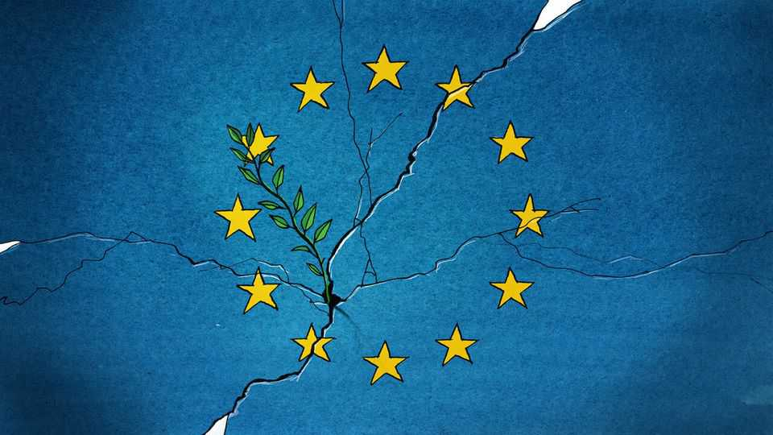

Europe | Charlemagne
If the fighting ends in Ukraine, the infighting in Europe will begin
Beware Europe’s great de-galvanisation
November 27th 2025

One thousand three hundred and seventy-two days into what was meant to be a three-day war, is peace finally in sight for Ukraine? Who knows. A flurry of amateurish diplomacy between America and Russia in the past week has yielded much sound and some fury, notably from Europeans irate at being left on the sidelines of another set of peace talks. But for now there is little in the way of a truce. Ukraine has probably done well to sidestep the dodgy deal originally cooked up between the Kremlin and the White House. Still, one day, and hopefully soon, an agreement to end the war that both Ukraine and

Russia can accept will be found. That will be a moment of intense relief. Yet at the same time, for Ukraine’s European neighbours, it will have some awkward consequences. War has galvanised the continent. When war ends, watch out for the effects of the great de-galvanisation.

Nearly four years of fighting on its doorstep have given Europe, often a fractious continent, the closest thing to national unity it has ever known. The visceral reaction to Russia’s butchery on the battlefield sent a shock wave of shared purpose across the continent; a feeling that the world had changed swept from Scandinavia to the Mediterranean. Some transformations happened at the national level, notably the German Zeitenwende that ditched what remained of its post-war pacifism. But the war also put the union in European Union. Acting in concert, its 27 member states gave refuge to millions of Ukrainians, found weapons and money to donate, and offered their neighbour the prospect of accession to the club, all while imposing 20 rounds of sanctions on Russia. (The EU even found ways to work constructively with Britain.) Sometimes the union has fumbled. Often it has been too slow. But in Volodymyr Zelensky’s darkest hours the Ukrainian president found comfort in meetings of EU leaders in Brussels.

This unity (apart from Hungary) has been inspiring, but is unlikely to survive a peace intact. For countries on the eastern flank of the continent, such as the Baltics, Finland and Poland, a ceasefire in Ukraine would stir as much anxiety as relief. From their vantage point, the war’s end will free up Russian resources for another campaign—possibly against them. Ukrainian soldiers have since 2022 been a bulwark against Russian aggression, but might then be demobilised. Much of the continent’s eastern half would thus want Europe to isolate Russia yet more firmly. Many in its western half, in contrast, crave normality. With the war over, they would ask whether Europe really need spend all that money on defence. Peace, to them, would offer a chance to return to the status quo. These views would struggle to coexist within a single union.

To make things trickier, one of the objectives of the mooted peace, being negotiated largely over Europe’s heads, is to allow Russia back into the fold in some way. The original 28-point plan devised by Russia and America envisioned it returning as a member of the G8, for example. The plan also called for dropping sanctions, most of which have been imposed by the EU. That would play into the hands of those in Europe who think commercial ties

with Russia should be resumed sooner rather than later. The battle lines would be drawn not merely across the continent’s map, but within its parliaments. Europe’s populist-right parties tend to be friendly towards Russia, but they would not be alone. It would not be long before, say, business interests in Germany propose improving Europe’s competitiveness on energy prices by gradually resuming imports of piped Russian gas to households and factories —at least in small quantities. Furious Poles and Estonians might denounce this as treason against Europe.

How to deal with Ukraine will be another source of division in the event of a peace. The country is unlikely to be in a good state. Europe does not want a basket case on its doorstep. But sympathy for Ukraine at war may not carry over to Ukraine at peace. If and when the fighting stops, questions will arise over whether Ukrainian refugees greeted with open arms in 2022 should not return home. And who will pay for reconstruction? Europe’s plan hinged in part on using over €100bn ($116bn) of the Russian assets frozen in EU financial institutions to keep Ukraine afloat. But the 28-point plan indicates that America wants a share of those spoils—and of the business opportunities in Ukraine’s reconstruction. Thorny questions will also be asked about whether to keep Ukraine on the path to EU accession, particularly in light of its latest corruption scandal. The main argument for promising Ukraine membership in the EU was to boost its wartime morale. Cynics will argue that in peacetime that is no longer needed.

But the most wrenching disagreement will come around how to deal with America. Few Europeans keeping abreast of Donald Trump’s presidential antics think the transatlantic alliance is as reliable as it once was. The debate on how to wean the continent off American security guarantees is not new. France’s Emmanuel Macron deemed NATO “brain-dead” even before the war, and has long wanted the continent to develop greater “strategic autonomy”. Central and northern Europeans are more amenable to such pleadings than they once were, but are still wary of alienating the military hegemon that has buttressed their freedom for decades.

The debate over whether Europe should remain bound to America has been stifled while the hot war rages. Europeans have swallowed their pride, for example agreeing in July to a lopsided trade deal. They winced when Mark Rutte, NATO’s secretary-general, called Mr Trump “Daddy”. But what else could they do, when losing the support of America’s petulant president could

spell disaster for Ukraine? There is a degree of humiliation a continent at war must endure. When the fighting in Ukraine ends, some Europeans may decide that the bowing and scraping is over. ■

Subscribers to The Economist can sign up to our Opinion newsletter, which brings together the best of our leaders, columns, guest essays and reader correspondence.

This article was downloaded by zlibrary from https://www.economist.com//europe/2025/11/27/if-the-fighting-ends-in-ukraine-the- infighting-in-europe-will-begin

Britain

Britain’s budget prioritised Labour's political survival Britain will tax electric cars more heavily. Good How did Rachel Reeves’s budget compare? A landmark trial of puberty blockers could end up in court Who should control British newspapers? Which country is most similar to Britain? Britain’s left-wing government is left-wing