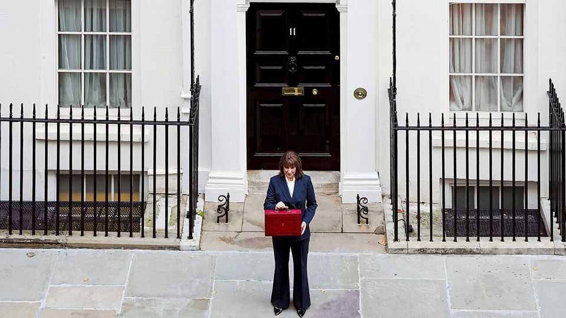
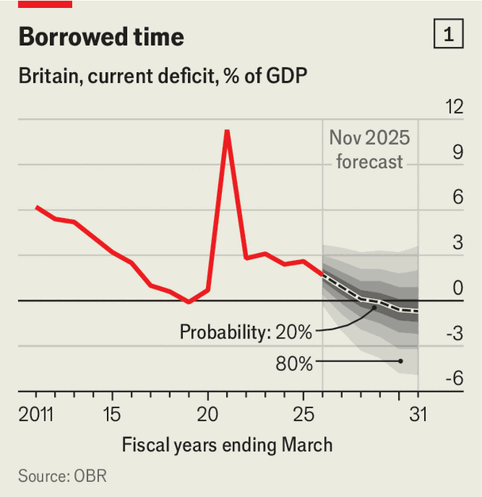
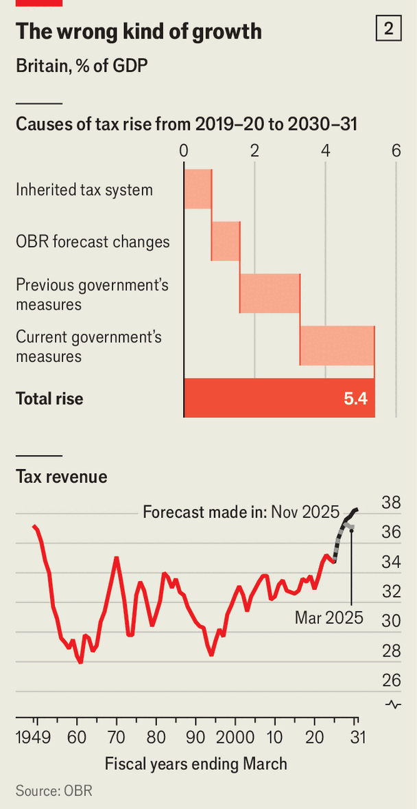

Britain | Party first, country second
Britain’s budget prioritised Labour's political survival
And ducked the painful choices needed to revive the economy
November 27th 2025

Britain’s chancellor devoted much of her budget speech to lambasting the previous government. “The Conservatives crashed the economy,” thundered Rachel Reeves, accusing them of “time and time again” ducking “necessary reforms”. Labour, she insisted, is different: it is prepared to make the choices needed to revive growth. Sir Keir Starmer has similarly clothed his actions in the language of service. “Country first, party second”, he reminded Labour Party members in 2024. “That isn’t a slogan. It’s the foundation of this project.”

Yet the budget did what the government has done since coming to power: put party before country. The Office for Budget Responsibility (OBR) gave a sunnier-than-expected outlook for the public finances, raising its deficit forecast for 2029-30 by only £6bn ($7.9bn, or 0.2% of GDP). Ms Reeves could have used this windfall to ease tax rises and launch supply-side reform. Instead, she produced a vintage Labour tax-and-spend package: £26bn in tax increases in 2029-30 and £11bn in extra spending. Worse, the taxes are back- loaded whereas the spending starts now, meaning higher borrowing in the short term. Most damagingly, the budget dodged the reforms needed to lift growth.

The OBR’s forecast underlines the need for more urgency on growth. It has cut its projection for average real GDP growth in 2026-29 from 1.8% a year in March to 1.5%, largely because of weaker expected productivity growth—a bleak continuation of Britain’s record since the global financial crisis of 2007- 09. The only reason this gloom did not create the £20bn-30bn fiscal hole previously feared is that the composition of nominal GDP has shifted. Inflation is now expected to be higher, and more of the growth is to come from real wages rather than profits. Because earnings are taxed more heavily than corporate profits, this delivers a bigger-than-expected revenue boost. In short, the government was spared by luck, not a stronger economy.

Ms Reeves’s budget is not all bad. Unlike last year’s effort, it should not be inflationary. That, and the absence for the most part of actively harmful policies, meant that the market reaction was muted. Yields on ten-year gilts fell slightly. Businesses will be relieved that the event itself proved calmer than the lead-up. Ms Reeves was fortunate that the day’s most amateurish moment was not of her making but the OBR’s, when it mistakenly published its forecasts before she began her speech.

But avoiding a bond-market tantrum is hardly enough. A better yardstick is whether the budget contained policies capable of delivering the results Ms Reeves claimed to be aiming for. “I will grow our economy through stability, investment and reform,” she declared. Yet in three crucial areas Ms Reeves revealed a preference for short-term political expediency over the hard choices required for growth.

Start with stability. Ms Reeves has two fiscal rules meant to signal prudence: net public financial debt must be falling as a share of GDP in 2029-30 (the

investment rule), and day-to-day spending must be covered by tax revenues (the stability rule). The easiest way to achieve stability is to create plenty of headroom. That would prevent a repeat of this year’s fiasco, when speculation about possible tax rises to bring the finances back in line dampened business confidence and investment.

Ms Reeves boasted that she had doubled headroom against the stability rule from £9.9bn at the last budget to £21.7bn. While this is welcome, it is still only three-quarters of the average margin set by previous chancellors. The OBR reckons she has a 59% chance of meeting this rule—little more than a

coin toss (see chart 1). A government serious about stability would have used the OBR windfall to build a truly robust cushion (say, £30bn).

Second, Ms Reeves underwhelmed in how she decided to fill the funding gap. A country-first budget would have tackled head-on the fact that Britain’s spending levels are unsustainably high relative to the quality of the services the state provides. In 2029-30 spending is forecast to be 44.3% of GDP, five percentage points greater than before the pandemic. This will lead to taxes reaching 38.2% of GDP in 2029-30, the highest levels since the 1940s (see chart 2). That will weigh on private investment and thus growth, especially given that most of the increase is going on day-to-day spending rather than public investment.

The chancellor used the budget to announce yet more giveaways. The biggest was the abolition of the two-child limit on means-tested welfare payments, which costs £3bn a year. While this will lead to a welcome reduction in child poverty, a fiscally responsible chancellor would have paired it with reforms to tackle rapidly rising spending on disability benefits and pensions. Instead, Ms Reeves did the opposite, spending £7bn in 2029-30 on reversing her previous attempts to ration disability benefits and winter-fuel payments.

Rather than taking serious steps to control spending, the budget focused on tax rises to make the fiscal arithmetic add up. The biggest was freezing the thresholds at which different rates of income tax kick in, raising £12.7bn in 2030-31. The burden mostly falls on lower and middle incomes. While this clearly contravenes Labour’s manifesto promise not to raise tax on “working people”, it is not the worst way to raise revenue. It is broad-based, meaning the pain is spread widely, and it recognises that the wages of average earners are one of the few things that are lightly taxed in Britain by international standards.

Other tax grabs will be more sinister in their effects. Consider the decision to limit the pension contributions that can be made via salary-sacrifice schemes. There was previously no limit on such contributions, but this measure will raise £2.6bn in 2030-31 by making national insurance payable on contributions over £2,000 per person. Such a rise will discourage savings, which are key for people’s personal finances and boosting domestic investment. The policy will further increase taxes on employers (who also pay national insurance). It is a quintessentially anti-growth measure, which should have had no place in a pro-growth budget.

The final, and most worrying, shortcoming concerns Ms Reeves’s actions to boost growth. The chancellor claims to prioritise growth above all else; in her speech she called it “the engine that carries every one of our ambitions forward”. Yet her speech provided little fuel for this engine.

A lack of serious tax reform was the biggest missed opportunity. Britain’s complex tax system disincentivises enterprise at every turn. Marginal tax rates of 62% encourage those earning £100,000 a year to go part-time. Stamp duty on housing makes it less attractive for people to move to areas with more productive jobs. Lower taxes for self-employed people discourage people from joining a company, even when doing so would be more efficient. A chancellor who was serious about growth would tackle these perversities. Yet, with the notable exception of road pricing, there was little attempt at tax reform at all.

This lack of ambition on growth can be seen across the board. Ms Reeves mentioned no new initiatives to strengthen UK-EU trade, despite acknowledging the damage caused by Brexit. She praised the government’s migration reforms, yet new policies that restrict access to permanent residency will discourage economically useful immigrants. Labour’s employment-rights bill, meanwhile, is actively anti-growth, making the labour market more inflexible and employers less willing to take a chance on new people.

Ms Reeves’s budget satisfied the bond market and its spending giveaways will quell Labour’s restless backbenchers. Yet it undoubtedly put the country second. The chancellor’s inability to make difficult decisions on spending, tax reform and growth will do nothing to arrest Britain’s managed decline. Most concerning is the impact her budget will have on trust in politics. Only 12% of Britons now trust the government to put country before party most or all of the time, down from 47% in 1987. A budget that claims to put country first but does the opposite will only deepen the public’s cynicism. ■

For more expert analysis of the biggest stories in Britain, sign up to Blighty, our weekly subscriber-only newsletter.

This article was downloaded by zlibrary from https://www.economist.com//britain/2025/11/26/britains-budget-prioritised-labours- political-survival