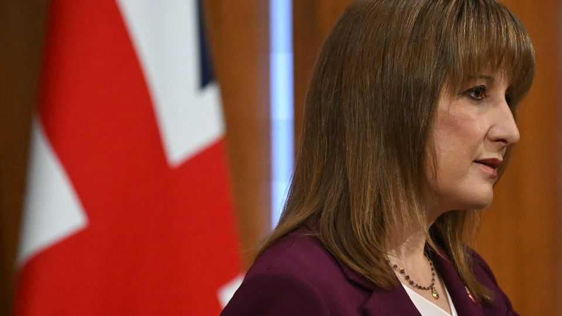
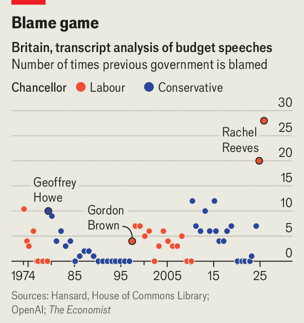

Britain | The mudslinging metric
How did Rachel Reeves’s budget compare?
Our analysis of 50 years of chancellors’ speeches
November 27th 2025

BEFORE the budget on November 26th Rachel Reeves, the chancellor, said that she would not “spend her time gazing into the rear-view mirror” because “to blame the hand you’re dealt is a dereliction of duty”. During her 64- minute speech in the House of Commons, did Ms Reeves stick to her word? To find out, we took the transcript of Ms Reeves’s budget speech—as well as every other budget and significant fiscal event since 1974—and asked OpenAI’s large-language model to analyse each speech, returning a battery of

quantitative and qualitative variables. (Among the best jokes is Jeremy Hunt’s quip in 2023 that “British ale is warm, but the duty on a pint is frozen.”)

Ms Reeves did not keep this particular promise. Her list of complaints included that her Conservative predecessors “crashed the economy…lost control of debt” and that “Tory austerity left classrooms crumbling and [hospital] waiting lists sky high.”

Our AI analysis identifies 28 instances where the chancellor blamed the previous administration. That is even more “mudslinging” than during her maiden budget speech in October 2024, when she blamed the Tories 20 times (more than any chancellor in our analysis). Contrast that, for example, with the relative magnanimity shown by Geoffrey Howe in 1979, after the country had been bailed out by the IMF. He blamed the previous government just ten times during his maiden speech.

Other political parties were not spared Ms Reeves’s opprobrium. She implied that Mr Farage, the leader of Reform UK, which has a 11-percentage-point lead over Labour in the polls, was a “Russian asset”. She also reminded Parliament that Zack Polanski, leader of the Green Party—which is now polling better than Labour among 18-to 34-year-olds—once had a career as a rather dubious hypnotherapist. No sooner had she sat down, however, than the chancellor faced a barrage of mud from opponents about her own economic mess. ■

For more expert analysis of the biggest stories in Britain, sign up to Blighty, our weekly subscriber-only newsletter.

This article was downloaded by zlibrary from [https://www.economist.com//britain/2025/11/25/how-did-rachel-reevess-budget-compare](https://www.economist.com//britain/2025/11/25/how-did-rachel-reevess-budget-compare)