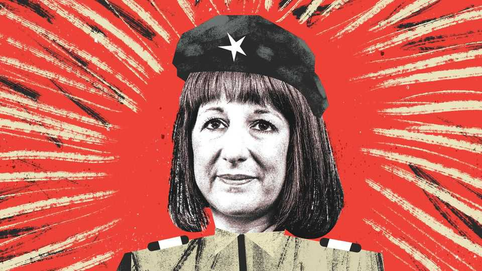

Britain | Bagehot
Britain’s leftwing government is leftwing
An obvious fact. But still an overlooked one
November 27th 2025

They bayed, they hollered, they hooted, they cheered. After a miserable 18 months, in which they had ranged from dejected to mutinous to feral, Labour mps finally had something to shout for when Rachel Reeves, the chancellor, unveiled a straightforwardly leftwing budget. A mansion tax was once a terrifying spectre of life under Ed Miliband. Now it is government policy. “I think if you have a house that is worth £5 million, then you can probably afford it,” said Ms Reeves. The two-child limit on benefits, which keeps

300,000 kids in poverty, was scrapped. Spending up. Taxes up. Borrowing up. Labour mps: cheered up.

The budget was further proof of a strangely overlooked fact in British politics: Ms Reeves is a chancellor in the most economically leftwing government of the past five decades. Forget this budget. Consider the last one. Ms Reeves raised taxes more than any chancellor in several decades. She also launched a gargantuan amount of spending. Across two budgets, Ms Reeves increased taxes by almost £70bn (2% of gdp). At the same time, she has pledged about £80bn of extra spending. The tax-and-spend party has taxed and spent.

Nor is this leftward charge limited to fiscal policy. Private schools have been taxed. Railways will be nationalised. Ms Reeves sits atop a government that has pledged to spend £4bn a year on council housing. It handed £23bn over two years to the National Health Service (NHS), with few strings. (Business would pay, naturally.) Under Labour the minimum wage—now £26,400 a year for a 40-hour week—has reached a point where a grad-schemer working late at a Big Four firm can earn less per hour than the person cleaning their office. ¡Viva la revolución!

Yet after all this, Labour is unpopular. More specifically, it is haemorrhaging support to its left. For each voter who drifts right, two more head to other progressive parties, such as Zack Polanski’s surging Greens. How has the most leftwing government in a generation ended up in such a mess?

In opposition, Labour claimed it would not be a bog-standard, centre-left government. It promised technocracy; before the election Ms Reeves hailed “modern supply-side economics”, rather than tax-and-spend. It would offer a rewiring of the state. The reality is less profound. Breakfast clubs will be rolled out across the country at a cost of £400m. Leviathan will now shove cornflakes down a seven-year-old’s gullet.

Oddly, leftwing policy generates protest, not praise, from the left. Employment rights will soon be overhauled. Overnight, employers will change from having two years before unfair-dismissal rules apply to new hires, to one day. Anti-union legislation from the David Cameron era will be scrapped. It is so sweeping even the Resolution Foundation, a centre-left think-tank, has called for restraint. Yet some will not take the win. Sharon

Graham, the general secretary of Unite, Britain’s biggest union, treks from studio to studio grumbling about the Labour government.

The botched political strategy of Ms Reeves and her boss, Sir Keir Starmer, created a strange impression of the government. Punching the left, even while pursuing an avowedly leftwing economic strategy, was seen as wise politics. It was for this reason that policies such as the two-child limit on benefits stuck around. It was a policy to look austere; to look hard; to look less leftwing. Now Labour is a party happy to look soft, generous and as leftwing as it has always longed to be. The result? Sir Keir’s government has achieved the rare alchemy of being loathed by the right, yet scorned by the left for being a bunch of closet Tories.

Under Labour Britain has a fast-bulging state. But what does it have to show for it? Policy takes a while to bite. When a government is dishing out pain, such as during the austerity years, this is a positive; when a government is trying to spread pleasure, it becomes a weakness. Gigantic spending on the NHS is yet to translate into much improved performance. Even if councils have extra money, Britain’s public realm is still exhausted. The state has never been so expensively funded, yet seemed so tired.

Attempting social democracy in the current economic environment is a miserable, frustrating endeavour. For all that Ms Reeves and her fellow ministers are more leftwing than they admit, they do—just about—operate within Britain’s fiscal constraints. No such rules apply to the “ordinary hope” offered by Mr Polanski of the Greens, who pledges socialism at little cost for anyone other than the super-rich. Even a once-in-a-half-century government tax-and-spend splurge seems fiscally frigid in comparison.

Most fatefully, it is only on the economy that Labour can claim to be leftwing. When it comes to social issues, such as cracking down on asylum-seekers, the party drifts right. Left on the economy and right on culture is, supposedly, a cheat code for the British electorate. Labour’s polling—which, at 18%, edges to fascinating new lows—reveals it is anything but. People who are leftwing on the economy tend to be progressive; those who are economically right- wing tend to be conservative, points out Ben Ansell of Oxford University. Labour is chasing a voter who barely exists.

Labour is beginning to admit what it always was: a normal, centre-left party, which would put up taxes and spending in a bid to make Britain better. Did Ms Reeves, who had a picture of Gordon Brown on her wall at university, truly believe that putting children in poverty was wise policy? Sir Keir is a soft-leftist at heart, rather than a hippy-punching hardman. Principles were hidden in the name of political expediency. Now that they are on show, few believe they are sincere. How could they be? Persuading progressive voters to believe in Labour is the task. If Ms Reeves and Sir Keir cannot manage it, perhaps someone else can. ■

Subscribers to The Economist can sign up to our Opinion newsletter, which brings together the best of our leaders, columns, guest essays and reader correspondence.

This article was downloaded by zlibrary from https://www.economist.com//britain/2025/11/26/britains-left-wing-government-is-left- wing

International

AI is upending the porn industry The wrong sort of peace leads to the next war