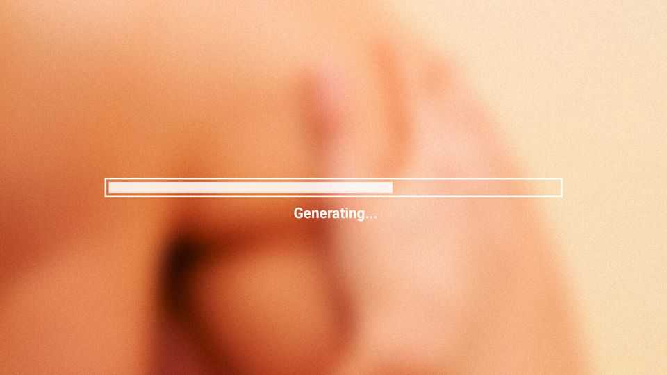
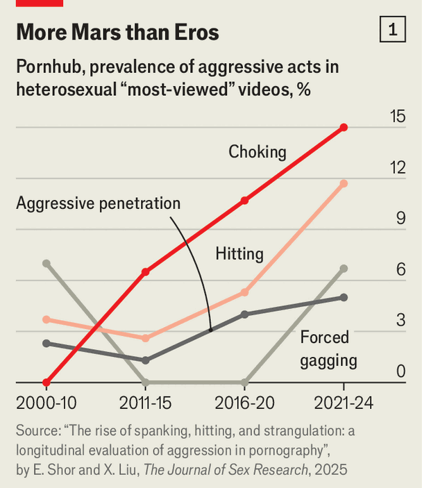
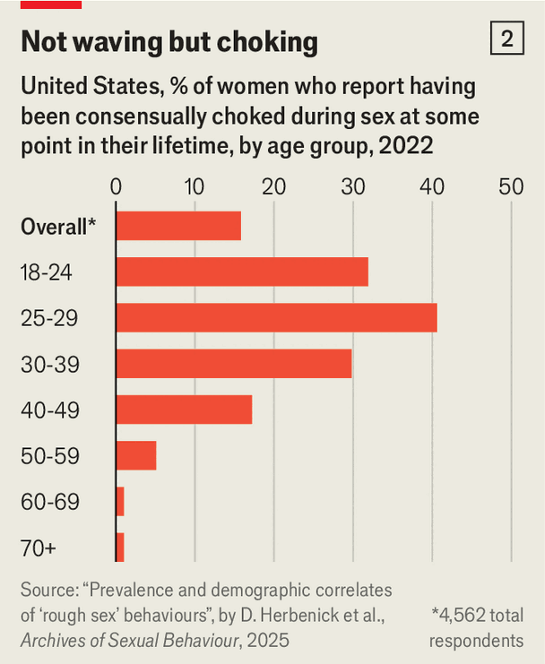
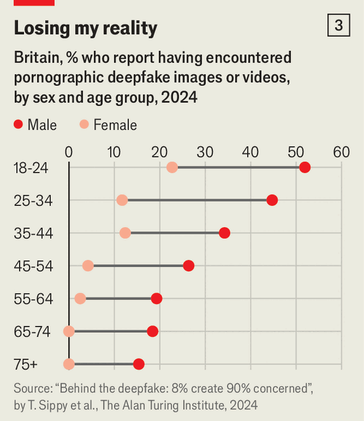

International | Silicone valley
AI is upending the porn industry
Synthetic smut will soon be flooding the internet, bringing new opportunities and perils
November 27th 2025

PORN HAS long been a proving ground for new technology. When Johannes Gutenberg invented the printing press in the 15th century it was quickly deployed to print bawdy pamphlets. Adult films were put on video in 1977, a year before mainstream Hollywood ones, and dominated sales for some time. When Minitel, a French precursor to the internet, was launched in the early 1980s, erotic services initially accounted for between one-third and a half of all traffic. It is a similar story with 8mm cameras, cable television—and now artificial intelligence (AI), too.

Even as many businesses dither over deploying AI, the technology is already being put to work producing smut. Porn sites are awash with AI-generated videos and images. Big AI firms, struggling to make money from their super- smart models and to justify their sky-high valuations, are getting in on the act. xAI’s Grok already offers a “spicy” mode capable of generating explicit imagery and video. OpenAI will offer erotica on ChatGPT from December (though only to verified adults). The market for AI-driven adult content will be worth $2.5bn this year, according to Global Commerce Media, a research group, and it is expected to grow at a constant rate of 27% a year until 2028.

The speed at which AI is being adopted raises existential questions for the porn industry, and for society. Will performers be elbowed aside by algorithms? If synthetic porn becomes ubiquitous, will viewers pay for the real thing? And what of the porn studios and platforms that dominated the industry for so long? The answers offer a glimpse of how AI might reshape more buttoned-up businesses next. More troubling are questions over the new dangers posed by AI tools that are already being used to sidestep bans on images showing the sexual abuse of children or to produce X-rated deepfakes that feed scams.

For AI firms, the allure of the porn industry is clear: sex sells. In Britain three- quarters of men and a half of all women admit to having viewed X-rated content, according to YouGov, a pollster (and because many people are too embarrassed to confess this to a stranger, the real figure is surely higher). Worldwide, the porn industry rakes in almost $100bn in revenues every year, twice as much as AI does. Five of the 50-most visited websites in the world are porn sites, according to Similarweb, a data provider. The industry was long dominated by “tube sites”, like Pornhub and xHamster, which serve up free videos and make money through ads. More lucrative subscription platforms have emerged that charge users to view content, with added fees for custom content and personalised chat. OnlyFans, probably the best-known, made over $1.4bn in revenues and $520m in profits in the 2024 financial year.

In the past, each new technology, from videos to internet streaming, has generally gained ground because it reduced the cost of distributing smut. But AI is more revolutionary than evolutionary, because it can produce customised porn on demand. The range of uses this technology can be put to is limited largely by the imagination (and whatever restrictions AI firms will agree to bake into their models). Some AI-porn generators can allow a user to summon

an ideal partner—down to skin tone, physique, personality and even their relationship to the user—and have them act out fantasies and provide companionship. (Want nudes of a 92-year-old with an athletic figure who likes reading and has a foot fetish? AI can provide them.) For those who prefer to leave a little to the imagination, there are sexbots that produce text-and audio- based erotica from a few prompts.

Some in the industry speak of loftier goals. Arman Chaudhry, the founder of Unstable Diffusion, an uncensored image generator, likens developers training AI to create porn to art teachers starting with life drawing of nudes. “It’s a great test of how models understand the world and anatomy,” he explains. But this hardly seems the purpose of “nudify” apps, which take images of clothed people and spit out plausible nudes and are troublingly popular among schoolyard bullies.

Though the adult industry is poorly tracked, all the signs suggest that AI- generated porn is booming. Google searches for “AI porn generators” and “nudify apps” have increased in the past few years. Indicator, a publication focused on digital deception, tracked 85 “nudify” sites in the six months to May and found they received about 18.5m visits a month between them and made as much as $36m in the year to May. The ten most popular websites offering AI companions focused on “mating” drew 78.5m visits in the first quarter of 2025, according to a study led by researchers at the Universities of Oxford and Cambridge. Our own number-crunching suggests they received triple the traffic in the three months to October.

AI tools intended for more staid purposes are also being dragged under the sheets. Lauren Kunze, the head of Pandorabots, a chatbot developer that blocks lewd content, observes that the two groups most likely spend hours talking with machines are bored children and people seeking sex. One female character hosted by Pandorabots, Kuki, is propositioned by a third of users and has been told “I love you” 90m times in 15 years. Of all the uses of AI, Ms Kunze says: “Sex chat has the strongest consumer mandate, is easiest to enable and is the most monetisable.”

As in many other industries facing technological disruption, the effects of change are felt most immediately by the people working in it and legacy firms. Demand for human on-screen talent is unlikely to vanish entirely. In one study published last year in Cognition and Emotion, a journal, researchers

showed participants images of scantily clad people and asked them to say which they thought were made by AI (spoiler, none was) and then to rate how arousing they found the images. The study found that participants were aroused by what they thought were AI-made images, but less so than those they thought showed real people. “Just like people feel empathy for Anna Karenina or Ned Stark despite knowing they are fictional characters, they can also feel aroused by virtual models,” the researchers wrote.

Still, competing with machine-made porn is getting tougher as the technology advances. Another study, published in iScience in 2022, found pictures of synthetically produced faces were more likely to be perceived as real than those of actual people. Another study, published in Psychological Science, found that it was particularly hard for participants to identify fakes among pictures of white faces, which are over-represented in AI-training data and in porn. Leo Saros, the founder of Flirtflow, an automated chat service for OnlyFans creators, says AI has improved so markedly in recent months that users almost never realise they are messaging a machine. “It’s a bit like the matrix,” says Mr Saros. “As long as you don’t know you’re in it, you don’t have doubts and you enjoy it.”

Big-name porn stars have most to lose. Fans will inevitably use deepfake technology to graft their faces onto X-rated videos or use their work to train AI tools without their consent. A few stars, resigned to the unstoppable, are choosing to ride the wave by licensing their likeness to AI firms and building avatars that earn tips from fans. For Vicky Vette, who is 60 and who launched a digital double of herself on the Eva AI companion app earlier this year, it could extend her career in an ageist industry. Bonnie Blue, who made headlines by bedding more than 1,000 men in a day, reckons her porn is future-proof because she interacts with fans online and off. “A lot of it is with strangers and a lot of it is with the public,” she says. “How can you replace that?”

Among amateur actors and models, AI is a useful tool for stripping out drudgery. Rather than working for big porn studios, most now make money directly from fans on subscription platforms. They are porn stars, cameramen, editors and administrative assistants too. AI video generators cut the time it takes to produce a polished two-minute clip from days to hours. Chatbots do the lucrative work of private messaging. Flirtflow, for example, takes 8% of earnings from personalised chats, which is much less than it costs creators to

hire real people to respond to fans. “AI lets them grow their business without burning out,” says Alison Boden, the executive director of the Free Speech Coalition, an adult-entertainment industry association, and the former boss of Kink.com, a site that provides what the name suggests.

Also affected are the middlemen who have controlled the distribution of porn for generations. Studios, having lost business to subscription sites, face a new risk: that the videos they shelled out vast sums making are quietly being used to train bots. In July Strike 3 Holdings, an American producer of raunchy films, sued Meta, the owner of Facebook, for allegedly breaking copyright rules by training AI models using its films. (Meta denies the allegation.) Lawrence Walters, a lawyer, sees a growing number of porn stars who are demanding riders in their contracts that prevent the studios from using their past work to train a model. “AI is only getting more pervasive,” Mr Walters adds, “so studios have to think: do they want to give up those rights?”

Platforms that host adult content have to make a big decision: whether to allow AI-generated content or not? Depending on how the technology advances, it could be the difference between growing fast and going under. OnlyFans allows content that is machine-tweaked but not fully machine-made. The platform is taking a punt that real-life porn will draw users when the internet is filled to the brim with AI smut. Other sites, such as Fanvue, make much of the fact that they host AI-generated raunch. Amrapali Gan, the former chief executive of OnlyFans, is launching an adults-only social platform called Vylit in December, on which AI-generated content will be clearly marked. “Transparency really makes a difference,” Ms Gan says.

In all, AI promises to vastly increase productivity in the industry. Though this will probably come at the expense of job losses, AI could also free actors from taking risks demanded by viewers, such as performing violent or extreme acts or having unprotected sex at the risk of catching sexually-transmitted infections. Yet the technology may also be shifting risks from actors in front of the camera to everyone else, whether through AI-creation of violent and illegal pornography or through the spread of sexually explicit “deepfakes”.

Regulators worry most about AI being used to produce the sort of content that is illegal when it is human-made. The Internet Watch Foundation (IWF), a charity, has found thousands of AI-generated pictures showing the sexual abuse of children being shared online. Reports of such images have more than doubled in the first ten months of this year compared with all of 2024. It seems to be getting increasingly realistic and abusive. Although most AI tools try to block users from making this sort of illegal content, many of the images

the IWF found were made by people who had downloaded open-source AI models to their own computers, where they could evade safeguards using coded prompts.

Free-speech advocates might argue that since no children are harmed in the making of these images, they should not be banned. But eroding that taboo could well put real children at risk if it normalises such abuse. There is certainly strong evidence that people have been copying other sorts of aggressive sexual acts that have become more common online. Eran Shor of McGill University in Canada and co-authors have found a startling increase in the prevalence of choking, hitting and forced gagging in the most-viewed pornography videos (see chart 1). Too many people are being choked during sex without their consent.

Debby Herbenick of Indiana University and colleagues have also found an alarming increase in the share of young women who say they have been consensually choked during sex. Strikingly, more than 40% of women aged 25-29 said they had been choked by their partners (see chart 2). Though done with their permission, this is worrying, too. Health experts warn that there is

no way to safely strangle someone; a person can fall unconscious within seconds of being choked. Earlier this year, the British government introduced new legislation aiming to outlaw porn showing strangulation. “The growth of strangulation practices in mainstream pornography and in the discourse on sexuality may encourage young people to add these practices to their regular sexual repertoire simply because they believe it has become a normal part of the sexual script,” noted Professor Shor, drily.

A second concern is deepfake technology, which can turn anyone’s likeness into porn. Home Security Heroes, a group that tries to prevent identity theft, reckons it now takes less than 25 minutes to make a deepfake clip from a single clear headshot. The technology made headlines last year when explicit machine-made images of Taylor Swift went viral. Increasingly, the victims are ordinary people. A survey by the Alan Turing Institute, Britain’s national institute for AI, found almost one-third of women and one-fifth of men worry about being targeted.

Online scammers are increasingly using deepfake porn to blackmail people or to win their confidence. Reed Amber, a sex worker and the host of the ComeCurious podcast, suspects that material she posts online is being mined to produce convincing images and voice clips in her name. She gets multiple messages every week from followers who have been duped by crooks impersonating her on social media and messaging apps. “Sexuality and sex is such a vulnerable space for people that they will suspend their own belief to

believe someone is there desiring them,” she says. “This is preying on the vulnerable.”

Regulators are trying various approaches. The European Union’s AI Act requires synthetic content that looks authentic to be labelled. America’s “Take It Down Act”, championed by First Lady Melania Trump, bars people from knowingly publishing X-rated images of children or of adults online without their consent, whether real or machine-made. Denmark plans to give people copyright over their own likenesses. Britain will give AI developers and child- protection groups the power to test AI models to make sure they cannot be used to simulate child sexual abuse. Gabrielle Bertin, a British peer who led a recent review of the porn industry, is petitioning the government to ban nudify apps outright. “Why does someone need a nudify app?” Lady Bertin asks. “It is to abuse and humiliate, generally women.”

Yet porn has wriggled through regulatory nets for generations. And AI is advancing faster than any legislature can. That leaves the industry to regulate itself. How OpenAI will monitor erotic content on ChatGPT remains unclear. Sam Altman, its chief executive, has said only that he will “treat adult users like adults”. Most popular sites hire armies of content moderators to catch illegal content before advertisers and payment processors turn on them. Mastercard’s and Visa’s decision to block payments to Pornhub in 2020 made the card giants the unofficial policemen of porn.

Valérie Lapointe at the University of Quebec in Montreal reckons many users keep their filthiest instincts in check themselves. The public is wary of newfangled chatbots that collect data on their interactions that can be sold or used to target ads. As Ms Lapointe puts it: “If you are the chief executive of a big company, do you really want to risk your data being leaked when you talk to a dominatrix chatbot?”

Pornography has long tested limits and pushed at the outer boundaries of sexuality. Well before AI, anime porn (a Japanese style of animation) was bending bodies beyond biology. A lot of material showing real actors that is sloshing around the web is hardly tame. Yet because AI can make images so cheaply, and allows ever more outlandish scenarios, the web will soon be flooded with increasingly extreme synthetic smut. And as growing numbers of young users have their perceptions warped by AI-porn generators, it becomes all the more important that people are encouraged to hold onto the human

connection that, for many, is what makes sex special. As Cindy Gallop, the founder of MakeLoveNotPorn (a website that lets ordinary people share their own sex videos), likes to remind people: “Real-world sex is more surprising and innovative than porn will ever be.” ■

This article was downloaded by zlibrary from [https://www.economist.com//international/2025/11/27/ai-is-upending-the-porn-industry](https://www.economist.com//international/2025/11/27/ai-is-upending-the-porn-industry)