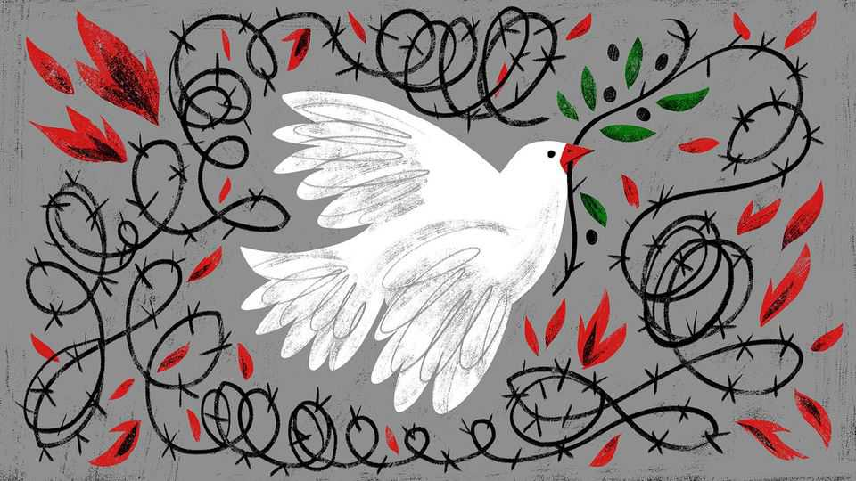

International | The Telegram
The wrong sort of peace leads to the next war
Donald Trump’s approach to peacemaking ignores crucial lessons from history
November 27th 2025

BENJAMIN FRANKLIN once wrote to a friend: “In my Opinion there never was a good war, or a bad peace.” For all his wisdom, the founding father of American diplomacy was wrong. Though the cruelties of war are never “good”, the use of force can be just. More importantly, in a moment dominated by a self-styled peacemaker, President Donald Trump, bad peace deals do exist. That explains the urgent tone of a statement by 15 leaders from

Canada, Europe and Japan on November 22nd, urging President Donald Trump to seek a “just and lasting peace” for Ukraine.

Moral and practical anxieties overlap in that appeal. America’s allies fear a peace that is so unjustly one-sided in Russia’s favour that it cannot be accepted by the Ukrainian people, and would tear at the social fabric of their already fragile democracy. They dread, too, a Trump-brokered truce that rewards President Vladimir Putin for his aggression, and that fails to deter future Russian attacks on Ukraine and its European neighbours.

Like a weathervane turned by the same prevailing winds, Mr Trump’s positions are changeable but not random. He favours shows of military force and blustery threats towards adversaries, but as a prelude to dealmaking, not war. His instincts consistently lean towards the accommodation of great powers, as when he declares that Ukraine “should never have started” a war in its defence, but instead “made a deal” with its much larger invader.

Mr Trump seemingly struggles to grasp why people might fight to defend values, scorning American veterans of foreign wars as “suckers” and “losers”, according to his former aides. His vice-president, J.D. Vance, recently explained, approvingly, how Mr Trump wonders why Ukrainians and Russians do not simply “stop killing each other and start trading with one another”, in part because “more peace in the world” is “good for American workers”.

In short, the guiding principles of Trumpian peacemaking appear to include a fondness for bluffing, a might-makes-right worldview, and the conviction that war is bad for business. Unfortunately, history abounds in examples of those same principles leading to doomed peace agreements.

For years, an academic consensus held that the Treaty of Versailles, imposed on Germany after the first world war by America, Britain, France and other victors, was too harsh, paving the way for Adolf Hitler’s rise and a second global conflict. That view was powerfully shaped by “The Economic Consequences of the Peace”, a polemical and hostile account of the Versailles peace conference by a British delegate, John Maynard Keynes. Later scholarship offers compelling counterarguments. Keynes is charged with ignoring economic realities, starting with Germany’s relative prosperity at the war’s end in 1918, compared with the economic ruin that its armies imposed on Belgium, France and Poland. Of still greater relevance to a Trumpian age,

the great powers were bluffing when they drew up the Versailles treaty. They looked the other way when German leaders told their citizens that their troops had been “stabbed in the back” by treacherous politicians, and had not been defeated in battle at all. Nor did America and Britain act when Germany stopped paying required war reparations and began to rearm.

Sincerity matters to peace deals, as does the long-term commitment of great powers. Margaret MacMillan is the author of the magisterial “Paris 1919: Six Months that Changed the World”. In an interview, she argues that political will to enforce a peace deal may matter more than other commonly cited conditions, such as the harshness of a war-ending treaty, or the presence of a losing power at armistice talks. After all, she notes, in 1945 Germany and Japan accepted extremely harsh peace deals, imposed on them without any say in the outcome. “A big difference was the beginning of the cold war”, which kept America engaged in Asia and Europe. As it strove to contain global communism, American aid to rebuild those continents “was crucial in persuading a lot of Europeans, including those on the losing side, that the United States was the benevolent power”, suggests Professor MacMillan.

History offers lessons about accommodating aggressors, and about following the principle that might makes right. To appease Hitler, Britain and France betrayed Czechoslovakia at Munich in 1938. Alas, the Nazi leader wanted war, not “peace for our time”, in the phrase of Britain’s prime minister, Neville Chamberlain (who did not believe his own words and hastened to rearm Britain).

As for putting profits ahead of principles, that third pillar of Trump peacemaking, the historical record is not encouraging. A decade ago Johannes Regenbrecht was a German diplomat working on the Minsk accords, a doomed attempt to halt Ukraine’s slow dismemberment by Russia. Those talks in 2015 were led by France and Germany, but backed by other Western powers. Foreshadowing Mr Trump’s views today, Germany saw Ukraine as a weak power unable to defend itself militarily, and hoped to expand its commercial ties with Russia. Angela Merkel, then the chancellor, had “no illusions” about Mr Putin’s capacity for deceit, the retired diplomat recalls. Her government hoped for a “frozen peace” that would limit Ukraine’s losses and stop Russia from advancing towards Moldova or NATO territory. Germany even increased its purchases of cheap Russian gas, arguing that ties of mutual dependence might calm Russia. Intellectually, German leaders saw

the risks, says Mr Regenbrecht. But they were unwilling to face the consequences of their own analysis.

Today, Europe’s big powers are putting their faith in strong alliances, in binding agreements backed by sanctions and in mightier armed forces, even if they are rearming slowly. They fear that America is on another path, that does not lead to lasting peace. ■

Subscribers to The Economist can sign up to our Opinion newsletter, which brings together the best of our leaders, columns, guest essays and reader correspondence.

This article was downloaded by zlibrary from https://www.economist.com//international/2025/11/25/the-wrong-sort-of-peace-leads-to- the-next-war

Business

The self-driving taxi revolution begins at last Why China is pulling ahead in the robotaxi race American consumers are miserable. But they keep spending Google has pierced Nvidia’s aura of invulnerability Europe is struggling to compete in the second space race Observed in the wild: office snackers and foragers From Nvidia to Nike, American firms face a margin squeeze