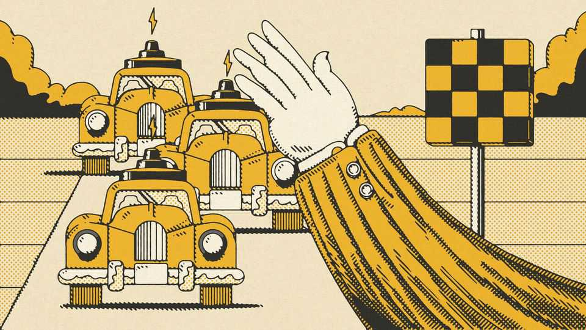
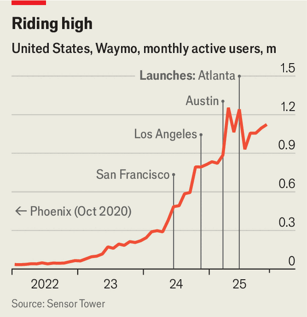
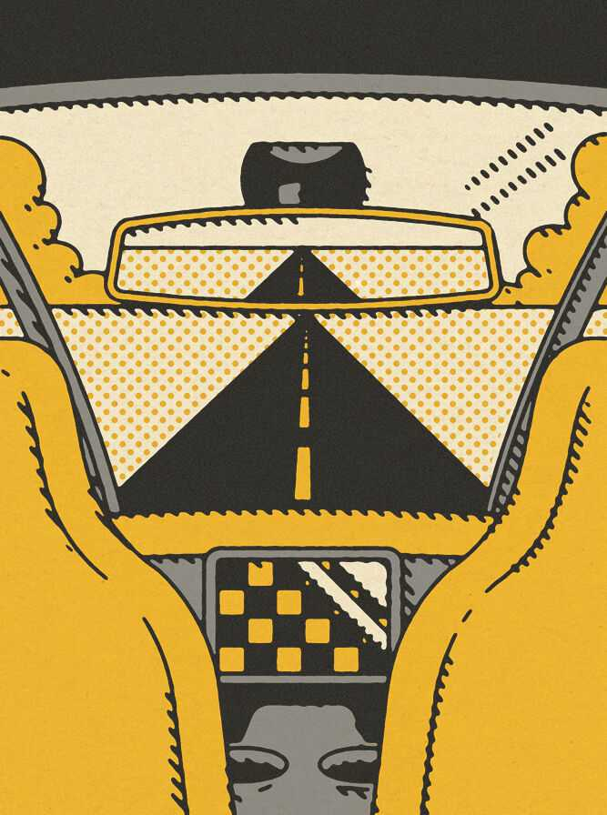

Business | Robots on the road
The self-driving taxi revolution begins at last
It’s Waymo complicated than it looks
November 27th 2025

IN 1995 RESEARCHERS from Carnegie Mellon University drove 3,000 miles from Pittsburgh to San Diego without their hands on the steering wheel. The “No Hands Across America” tour marked the start of a long road trip towards autonomous driving in America. Thirty years later you can, at last, see the fruits of that journey in the proliferation of self-driving cabs in several cities across America. Soon they will be braving the less predictable weather —and the left side of the roads—in London and Tokyo.

The number of American cities on the robotaxi roadmap is rising fast. Alphabet-owned Waymo, which has the world’s biggest fleet of 2,500 autonomous cars, provides paid rides in five places—Atlanta, Austin, Los Angeles, Phoenix and the San Francisco Bay Area—and plans to more than double that number next year. Elon Musk’s Tesla has expanded its rudimentary robotaxi service (which still has a human “safety monitor” in the car) from Austin to San Francisco. Zoox, an Amazon-owned company that has built a quirky-looking cab without a steering wheel or pedals, offers autonomous ride-hailing in Las Vegas and has just launched in parts of San Francisco. Like Doctor Dolittle’s pushmi-pullyu, it can go in both directions.

Many people still have concerns about the technology. In a recent YouGov survey, three-quarters of Americans said they had little or no trust in self- driving taxis. Yet their misgivings may be at least in part the result of unfamiliarity. Another poll by J.D. Power, a consumer-research firm, found that confidence was 56 percentage points higher among those who had ridden in a robotaxi than those who had not. What is more, the number of people who have given one a try is growing speedily. In April Waymo surpassed 1m monthly active users (MAUs), according to Sensor Tower, a data provider, more than a ten-fold increase in two years (see chart).

Waymo and its competitors are not the only companies lured in by the promise of the technology. Others looking to cash in include traditional ride-hailers such as Uber, carmakers such as Mercedes-Benz and Volkswagen, and technology suppliers such as Nvidia—not to mention the vibrant robotaxi ecosystem emerging in China.

They are betting that the market for self-driving technology will prove to be vast. Americans currently spend around $50bn a year on ride-hailing. Then there is the possibility of selling self-driving software to carmakers and manufacturers of other vehicles, such as long-haul trucks and delivery vans. Dara Khosrowshahi, Uber’s chief executive, has said that the market for self- driving technology could be worth $1trn or more in America alone. That raises two questions: when will the autonomous revolution hit full speed; and who will come out ahead?

To answer these questions, start with the technology. It is easy to forget the miracle of a self-driving car when sitting in a Waymo or a Zoox, because it quickly feels so familiar that you forget your life is in the hands of a computer on wheels. Unlike other robots that operate in clean, controlled environments such as factories, robotaxis have to deal with the messiness of everyday life— road rage, clueless pedestrians and pets, and weather conditions like snow that can be as soft as slush or hard as a brick wall.

Several innovations have combined to make that possible. Robotaxis rely on sensors such as cameras, laser-based lidars, microphones and radars to assess road conditions, judge distances and manage speed. They then use artificial intelligence both in the car and in the cloud to mimic the way human drivers process such information and react to it. And as robotaxi services have expanded, they have hoovered up ever more data, allowing them to refine

their algorithms. The rise of multi-modal generative-AI models, which weave together text, images and sounds, has also accelerated progress, including by making it easier to train autonomous systems using simulations and teach them to react to unusual situations.

For the industry, building confidence that self-driving vehicles are safe is vital. Research conducted last year by Waymo with Swiss Re, an insurance giant, showed that its robotaxis generated 88% fewer property-damage claims and 92% fewer bodily-injury claims than the average human during 25m miles of driving, a performance which has improved further since. But public trust is easily shattered. A grisly accident in 2023 involving a robotaxi operated by Cruise, a competitor to Waymo, became existential after the company failed to provide full transparency during a federal investigation. General Motors, Cruise’s owner, subsequently shut its robotaxi service down.

Such incidents risk setting back the industry’s efforts to win over policymakers. Under President Donald Trump, the Department of Transportation has said it will develop federal regulations for autonomous vehicles, including robotaxis. But there are still myriad state-by-state rules (California has two agencies that regulate robotaxis). Some cities such as Seattle put up roadblocks as well. “Everything we do today is to build trust and safety, and we can’t scale the technology without that,” says Chris Mooney, a Waymo executive.

Still, the speed at which Waymo is accelerating its city-by-city rollout suggests it is becoming increasingly confident in the safety of its service. Turning it into a profitable business, however, is another matter. Human drivers are estimated to account for 50-70% of the cost of a traditional ride- hailing service such as Uber, so stripping them out sounds like a quick way to undercut the incumbents. Yet all robotaxi services currently lose money, including Waymo. (In addition to receiving fistfuls of cash from Alphabet, the company raised $5.6bn in a share offering to outside investors last year.)

That is partly because their vehicles are expensive; they are kitted out with costly safety features and trained on pricey AI chips. And unlike ride-hailing firms such as Uber, which rely on owner-drivers, robotaxi operators have to cover the cost both of acquiring and managing their fleets, including cleaning, fuel, maintenance and parking. They also need human supervisors to monitor their vehicles in case things go wrong.

As a result, Augustin Wegsheider of BCG, a consultancy, estimates that self- driving vehicles cost about $7-9 a mile to operate, compared with $2-3 a mile for traditional ride-hailers and $1 a mile for personal cars. Cutting costs “has not been a priority of the robotaxi companies so far”, says Philipp Kampshoff of McKinsey, another consultancy. “They haven’t even scratched the surface, because mission number one was making the operation safe.” McKinsey estimates that it will take a decade to bring costs below $2 a mile.

Cheaper hardware will contribute. Estimates for the cost of Waymo’s current generation of robotaxis range from $130,000 to $200,000 each. Using the sporty Jaguar I-Pace as the starting point hasn’t helped to keep costs down. This month the company started testing the more modest Hyundai IONIQ 5, equipped with Waymo’s newer generation of self-driving technology which requires fewer sensors. The cost of those sensors is coming down, too. American-made lidars that used to cost around $100,000 are now little more than $1,000.

The economics of robotaxis can be improved in other ways. To keep utilisation of its vehicles high, Waymo’s approach to expansion has been to deploy a relatively small number of cabs in several markets, rather than trying to saturate one in particular, though the tactic has obvious limits. Instead of managing all its vehicles, it is also starting to forge alliances with fleet operators, such as Avis, a car-rental firm, to help handle day-to-day operations.

Once robotaxis prove to be sufficiently safe and no more expensive than a human-driven cab, demand may accelerate rapidly. The question then is who will conquer the market. For now, Waymo is clearly the front-runner, at least in America. Its self-driving technology has been designated as Level 4, which means that in pre-approved areas its vehicles can operate without direct human supervision, whereas Tesla’s robotaxis are between Levels 2 and 3, meaning they still need a supervisor in the car. Because of Waymo’s focus on safety, it has kitted out its cars with more expensive hardware than Tesla. For instance, its latest vehicles have 13 cameras, six radars and four lidars, whereas Tesla relies solely on eight cameras. That has helped Waymo win over regulators.

Ali Kani of Nvidia, which sells AI chips to all comers in the robotaxi race, suggests that once Waymo has proved the safety case “without hiccups”, it may be able to cut costs by shedding some of the hardware. For his part, Mr

Musk is betting that Tesla’s approach of relying solely on cameras and AI- enabled software will give it the edge as its technology improves, with less hardware making its robotaxis cheaper than Waymo’s.

For now, both Waymo and Tesla are keeping their technology close to their chests. In time, that may change. Waymo could take inspiration from another Alphabet endeavour—the Android operating system—and try to license its software to others. Mr Musk has said he may do the same with Tesla’s self- driving technology. Aicha Evans, the chief executive of Zoox, says it intends to remain a fully integrated robotaxi service. But some reckon its self-driving technology could also be used in Amazon’s logistics operations. Other firms such as Wayve, a British startup backed by Nvidia and SoftBank, a Japanese investor, have opted to focus on self-driving software, rather than offering an integrated robotaxi service with all the cost and complexity that entails. Earlier this year it announced it would start selling its technology to Nissan, a Japanese carmaker.

Robotaxi providers will also have to decide how to work with the big ride- hailing companies, particularly Uber. In 2020 it abandoned an effort to develop its own self-driving technology, but has since set its sights on becoming the preferred booking platform for robotaxis. In some cities, such as Phoenix, it already takes bookings on behalf of Waymo. Elsewhere it is hoping to compete. It has struck a deal with Lucid, an electric-vehicle maker, and Nuro, which builds self-driving systems, to roll out 20,000 robotaxis over the next six years. It also plans to enter London in partnership with Wayve and a yet-to-be-named carmaker.

Uber’s bet is that human drivers and robotaxis will co-exist for years to come. Eventually, however, robotaxis will become the cheaper option, says Sarfraz Maredia, Uber’s head of autonomy, which is why the company is manoeuvring itself into position now. Its customer base gives it a big advantage; Sensor Tower reckons Uber has 42m MAUs, dwarfing Waymo.

Then there is Nvidia. Perhaps predictably, the AI revolution’s biggest beneficiary is carving out a role for itself as an essential supplier for self- driving vehicles. Alongside Uber, it is supporting carmakers that are developing autonomous systems of their own, including Mercedes-Benz and Stellantis (whose largest shareholder, Exor, owns a stake in The Economist’s parent company). At the same time, it is selling vast numbers of graphics- processing units (GPUs) to Waymo to run its AI simulations, and sit inside its cars to process the data pouring in from their sensors and calculate how to respond. Tesla has likewise spent billions of dollars training its AI systems on 100,000 Nvidia GPUs. It won’t be an Nvidia cab that rolls up to people’s

doors. But the world’s most valuable company will be sure to take its cut of the fare. ■

To stay on top of the biggest stories in business and technology, sign up to the Bottom Line, our weekly subscriber-only newsletter.

This article was downloaded by zlibrary from https://www.economist.com//who-will-win- the-trillion-dollar-robotaxi-race